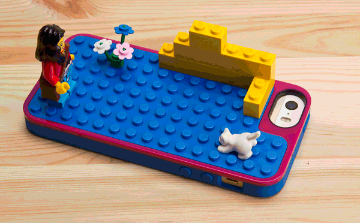
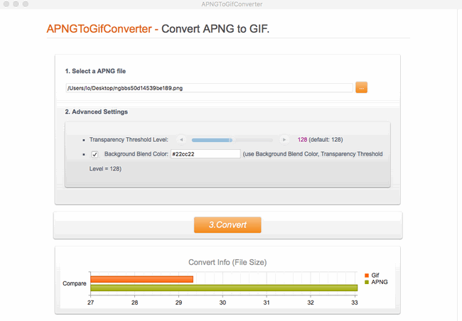

layout: guide
title: APNG to GIF Converter for Mac
keywords: convert animated PNG to GIF format on a Mac, APNG to GIF Converter for Mac, converting APNG files to GIF format on Mac OS X, convert APNG to GIF on Mac, make animated GIFs from APNG files on your Mac
description: To be able to convert animated PNG to GIF format on a Mac, you will need an APNG to GIF Converter for Mac. 
---
To be able to convert animated PNG to GIF format on a Mac, you will need an APNG to GIF Converter for Mac. In this article, we will guide you through the process of converting APNG files to GIF format on Mac OS X. 

## What is APNG?
APNG is an extension of the Portable Network Graphics (PNG) format, adding support for animated images. It is intended to be a replacement for simple animated images that have traditionally used the GIF format, while adding support for 24-bit images and 8-bit transparency. APNG is a simpler alternative to MNG, providing a spec suitable for the most common usage of animated images on the Internet.

APNG is backwards-compatible with PNG; any PNG decoder should be able to ignore the APNG-specific chunks and display a single image.

## What is GIF?
GIF files are commonly used on the internet, along with several other file formats such as JPGs and PNG. GIF is an acronym for Graphics Interchange Format which uses a lossless data compression technique that reduces the file size without quality loss. A GIF can contain a maximum of 256 colors from the 24-bit RGB color space, which — although that may sound like a lot of colors — is actually a limited palette that makes the GIF useful in some scenarios but inappropriate to others.

The GIF was first developed by CompuServe in 1987 to and is widely used on the internet due to its portability and relatively small size, making GIFs available in any browser and on any platform, and fast to load.

## How to convert APNG to GIF on Mac?
Software requirement
APNGToGifConverter

This program converts APNG animations into animated GIF format on Mac OS X 10.7(64-bit) or above, and provides flexible options for transparency threshold level and background blend color. 

Learn how to make animated GIFs from APNG files on your Mac via using <a href="https://gmagon.com/products/store/apngtogifconverter/" target="_blank" rel="nofollow me noopener noreferrer" >APNG to GIF Converter for Mac</a>. 

Do as below:
Step 1. Select and add APNG files that you want to convert into this program.  

Step 2. Set advanced settings
You are allowed to modify transparency threshold level and background blend level depending on your own request. 

Step 3. Click ‘Convert’ to start APNG to GIF conversion. When the conversion is complete, you can easily get the generated GIF files. 

Hope this helps those who are in need of a program to convert APNG animations into animated GIF format on Mac OS X. 

Also read 
<a href="https://gmagon.com/guide/convert-xls-to-csv-on-mac.html" target="_blank" rel="nofollow me noopener noreferrer" >How to convert XLS to CSV on a Mac?</a>
<a href="https://gmagon.com/guide/apngtogif/how-to-convert-apng-to-gif-mac.html" target="_blank" rel="nofollow me noopener noreferrer" >How to convert APNG to GIF on Mac?</a>
<a href="https://gmagon.com/guide/create-border-radius-css-mac.html" target="_blank" rel="nofollow me noopener noreferrer" >How to create border radius CSS code on Mac?</a>
<a href="https://gmagon.com/guide/convert-xls-on-mac-without-excel.html" target="_blank" rel="nofollow me noopener noreferrer" >Convert XLS to CSV on Mac without Excel installed</a>