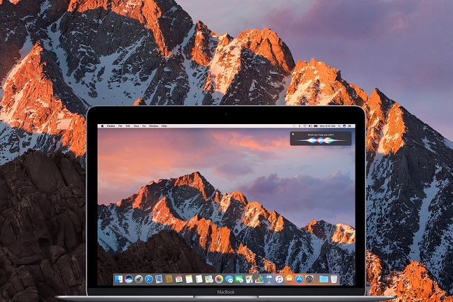

layout: guide
title: How to batch change APNG to GIF on macOS Sierra?  
keywords: batch convert APNG to GIF on macOS Sierra, batch change APNG to GIF on Sierra, APNG to GIF converter for Sierra
description: Is there a program available to batch convert APNG to GIF on macOS Sierra? If you are looking for a solution to do this, you may wish to read this post. 
---

Is there a program available to batch convert APNG to GIF on macOS Sierra? If you are looking for a solution to do this in batch mode, you may wish to read this post. 

>**How can I batch change APNG to GIF on Sierra?**
“Hi there, I am wondering how to batch change images from APNG to GIF. I know how to do them separately, but not as a large group. Can anyone kindly recommend a solution to do this if you know? Any help would be highly appreciated. Thanks in advance.” 

<a href="https://gmagon.com/products/store/apngtogifconverter/" target="_blank" rel="nofollow me noopener noreferrer" >Gmagon APNGToGifConverter</a> is a small, easy to use application that bulk converts PNG animations into animated GIF format on Mac OS X 10.7(64-bit) or above (Sierra included). It provides flexible options for transparency threshold level and background blend color. Check the guide below and learn how to use this app to batch convert APNGs to GIFs on macOS Sierra.

## How to batch change APNG to GIF on macOS Sierra? 
Software requirement
APNGToGifConverter

Download, install and run Gmagon APNGToGif on your macOS Sierra, then follow these steps: 
Step 1. Select and add APNG files that you want to convert into this program.  You can import a large group of APNG files to do batch conversion. 

Step 2. Set advanced settings
You are allowed to modify transparency threshold level and background blend level depending on your own request. 

Step 3. Click ‘Convert’ to start APNG to GIF batch conversion. When the conversion is complete, you can easily get the generated GIF files in output folder. 

Hope this article helps those who are trying to figure out a way to convert APNG animations into animated GIF format on macOS Sierra. 

Also read
<a href="https://gmagon.com/guide/apngtogif/apng-to-gif-converter-for-mac.html" target="_blank" rel="nofollow me noopener noreferrer" >APNG to GIF Converter for Mac</a>
<a href="https://gmagon.com/guide/mac-batch-convert-xls-to-csv.html" target="_blank" rel="nofollow me noopener noreferrer" >Mac batch convert XLS to CSV</a>
<a href="https://gmagon.com/guide/apngtogif/how-to-convert-apng-to-gif-mac.html" target="_blank" rel="nofollow me noopener noreferrer" >How to convert APNG to GIF on Mac?</a>
<a href="https://gmagon.com/guide/convert-xls-on-mac-without-excel.html" target="_blank" rel="nofollow me noopener noreferrer" >Convert XLS to CSV on Mac without Excel installed</a>
