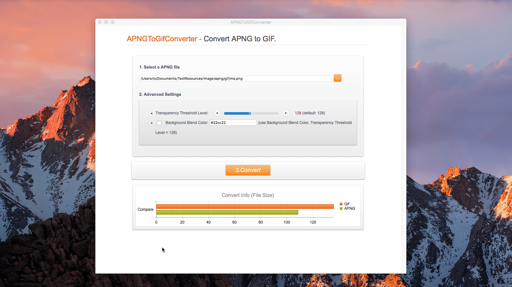

layout: guide
title: How to convert APNG to GIF on Mac?  
keywords: apng to gif converter on mac, convert apng to animated gif for mac, how to convert apng to gif, change apng to gif on mac
description: As the best APNG to GIF converter on Mac, the APNGToGifConverter aims to convert the APNG bitmap image format out there to the GIF format easily.
---

## What is APNG & GIF?
The APNG is also known as "animated PNG" which is made up of a series of PNG files of the same size that are connected as an animation. Though APNG tend to be smaller, but it support better quality images and transparency.

The full name of GIF is the Graphics Interchange Format. It is a bitmap image format that is widely used on the World Wide Web. GIFs are suitable for sharp-edged line art (such as logos, icons or avatars) with a limited number of colors. GIF’s advantages is that it is supported by practically all web browsers, can include transparent backgrounds, also supports interlacing (providing a low-resolution preview of the graphic to the viewer while it downloads), and can be used as an image map (allowing the viewer to click on the graphic as they would a regular link to another site).
 
## who need to use GIFs?
**Webmasters and Designers**: As well as small file sizes, GIFs also support transparent backgrounds and therefore can help show a professional look to a website with an animation over a different background. Besides, they have relatively small file sizes; this means that they can be used easily online as they can load quicker and still have a good quality.

**Memes Maker**: Memes are virally-transmitted cultural symbols. Memes can both be pictures and videos. Memes GIFs are popular all over the world in the Internet, and a large amount of netizen are likely to make their own unique memes. This also ties in with the fact that using GIF files can entice different, younger audiences as the children may be amused by these animations.

**Small Animations and Film Clips**: If you want to cut some episodes from an animation or a film and put them to other uses, APNG is tend to help users to enjoy the quick conversion experience delivered by our tool. Even for business, you can use GIFs to grab attention or show some personality in tweets, group chats and even emails.

 
## So, how to change APNG into GIF?
The quick and simple way to handle your files is to get a quality piece of software, such as <a href="https://gmagon.com/products/store/apngtogifconverter/" target="_blank" rel="nofollow me noopener noreferrer" >APNGToGifConverter</a>. It is not only easy-to-use, but also let you experience quick and effiient conversion process.  As you will soon realize, reaConverter will help you avoid spending countless hours trying to figure out how to convert APNGs. At the same time, you will allow to change a wide range of advanced settings.

 
Here is a GIF animation that shows you how to use this powerful tool in a Mac machine: 
 

 
Hopefully the above has given you an insight into the wonderful world of APNGToGifConverter. Now download it and give it a try.

 
Also read
<a href="https://gmagon.com/guide/mac-batch-convert-xls-to-csv.html" target="_blank" rel="nofollow me noopener noreferrer" >Mac batch convert XLS to CSV</a>
<a href="https://gmagon.com/guide/how-to-convert-a-xlsx-file-to-csv-on-mac.html" target="_blank" rel="nofollow me noopener noreferrer" >How to convert a .xlsx file to .csv on Mac?</a>
<a href="https://gmagon.com/guide/create-border-radius-css-mac.html" target="_blank" rel="nofollow me noopener noreferrer" >How to create border radius CSS code on Mac?</a>
<a href="https://gmagon.com/guide/can-i-batch-convert-xls-to-csv-mac.html" target="_blank" rel="nofollow me noopener noreferrer" >Can I batch convert XLS/XLSX to CSV in Mac?</a>
<a href="https://gmagon.com/guide/convert-xls-on-mac-without-excel.html" target="_blank" rel="nofollow me noopener noreferrer" >Convert XLS to CSV on Mac without Excel installed</a>
<a href="https://gmagon.com/guide/xlsx-to-csv-converter-for-max.html" target="_blank" rel="nofollow me noopener noreferrer" >XLSX to CSV Converter for Mac (bulk conversion supported)</a>
<a href="https://gmagon.com/guide/how-to-convert-excel-to-utf-8-or-16-csv-mac.html" target="_blank" rel="nofollow me noopener noreferrer" >How to convert Excel spreadsheets to UTF-8 or UTF-16 CSV on Mac?</a>