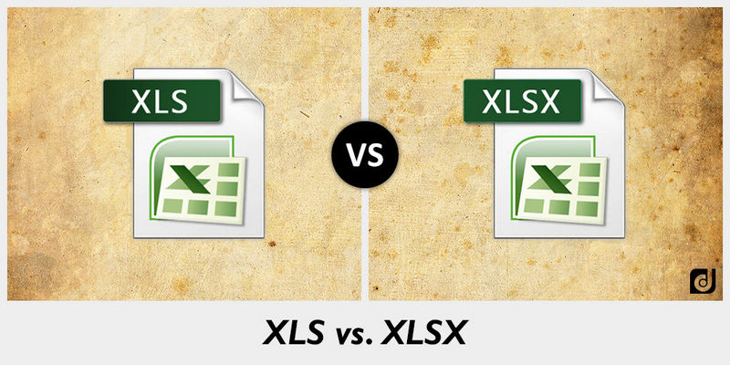
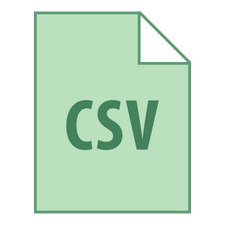

layout: guide
title: Bulk convert xls/xlsx to csv on Mac platform  
keywords: xlsx to csv converter mac, xlsx to csv converter free download mac, bulk convert xlsx files to csv on mac, convert csv from .xls for Mac, convert xlsx to csv batch file
description: How to convert XLSX files to CSV on Mac ? Using a simple and helpful XLS to CSV Converter can help Mac users solve the problem. 
---

## What are differences between XLS and XLSX?

XLS and XLSX are both file extensions that are used by the popular spreadsheet application named Microsoft Excel. Since 2003, XLS is very popular as it has been the default format for Microsoft Excel. Until the release of Microsoft Office 2007, it changed its default file format by adding an additional X in its document extensions-XLSX. Despite adopting and promoting the new XLSX format, newer versions of Excel are still able to open and save documents to the older XLS format. 

 

## Why XLSX need to be exported to CSV?
By far, Microsoft Excel is the most popular spreadsheet application used to store tabular data. While this data is stored in Excel files (.xls or .xlsx), it is generally being exported to .cvs format (comma separated values) for transmission purposes. 

CSV is an ideal format for the exchange of tabular data since it expresses it in form of textual data using delimiters, which are supported by various spreadsheet applications, or can easily be opened within simple text editors.
 
## How to convert XLS or XLSX to CSV on Mac?
While in your Mac system, it is unable for you to install an Excel as Windows does. Besides, you cannot batch convert your XLS/XLSX batch files in Excel. If you need to manipulate XLS, XLSX, or CSV file data, <a href="https://gmagon.com/products/store/xls2csv/" target="_blank" rel="nofollow me noopener noreferrer" >XLS2csv</a> converter comes in with many bells and whistles and special processes including:
>* It is 10-20 times faster than using Excel.
>* It also allows for the saving and restoring of complex 'conversion jobs'.
>* It is able to move or delete files after processing, and skip files already processed
>* The results can be previewed before conversion starts.
>* You can import and convert files in batch.
 
You can feel free to download the XLS2csv

 
### Here are simple steps of how to use XLS2csv after installation:
1. Import your Excel file or a batch of files into this converter by clicking.

 
2.  Set your output directory to put your output in the right file.

 
3.  If you want to preview the convert effects, you can see it clearly and also change its coding to CSV UTF-8, UCS-2BE, etc.

 
4. The final step is to click the convert button, you can choose to convert one file at once or convert all files at one click.

 

The <a href="https://gmagon.com/products/store/xls2csv/" target="_blank" rel="nofollow me noopener noreferrer" >XLS2csv</a> can be largely helpful if you require complicated file conversion jobs done regularly. By saving and recalling a conversion job file, XLS2csv quickly remembers all the file conversion tasks and their details. 

Hopefully the above has given you an insight into the wonderful world of Excel spreadsheet.

 
Also read
<a href="https://gmagon.com/guide/mac-batch-convert-xls-to-csv.html" target="_blank" rel="nofollow me noopener noreferrer" >Mac batch convert XLS to CSV</a>
<a href="https://gmagon.com/guide/how-to-convert-a-xlsx-file-to-csv-on-mac.html" target="_blank" rel="nofollow me noopener noreferrer" >How to convert a .xlsx file to .csv on Mac?</a>
<a href="https://gmagon.com/guide/create-border-radius-css-mac.html" target="_blank" rel="nofollow me noopener noreferrer" >How to create border radius CSS code on Mac?</a>
<a href="https://gmagon.com/guide/can-i-batch-convert-xls-to-csv-mac.html" target="_blank" rel="nofollow me noopener noreferrer" >Can I batch convert XLS/XLSX to CSV in Mac?</a>
<a href="https://gmagon.com/guide/convert-xls-on-mac-without-excel.html" target="_blank" rel="nofollow me noopener noreferrer" >Convert XLS to CSV on Mac without Excel installed</a>
<a href="https://gmagon.com/guide/xlsx-to-csv-converter-for-max.html" target="_blank" rel="nofollow me noopener noreferrer" >XLSX to CSV Converter for Mac (bulk conversion supported)</a>
<a href="https://gmagon.com/guide/how-to-convert-excel-to-utf-8-or-16-csv-mac.html" target="_blank" rel="nofollow me noopener noreferrer" >How to convert Excel spreadsheets to UTF-8 or UTF-16 CSV on Mac?</a>