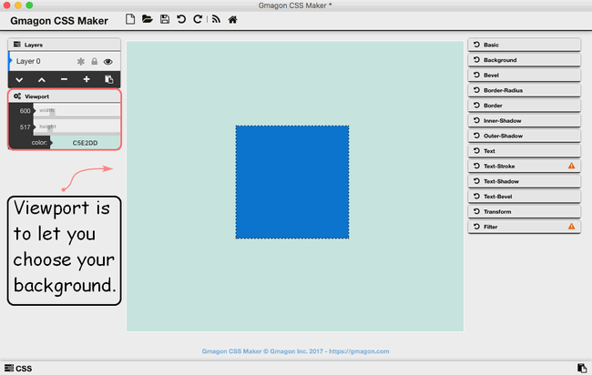
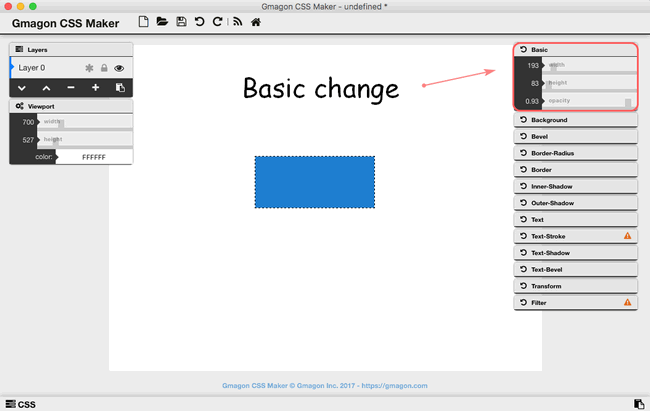
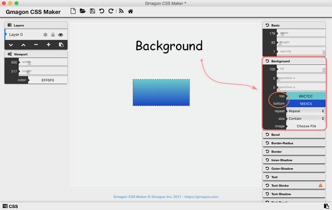
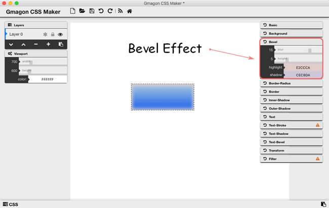
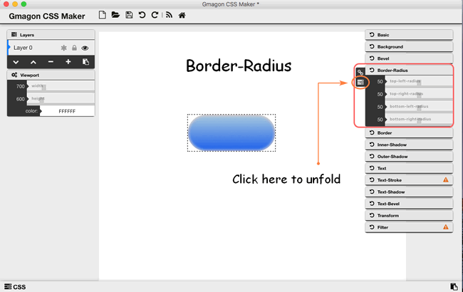
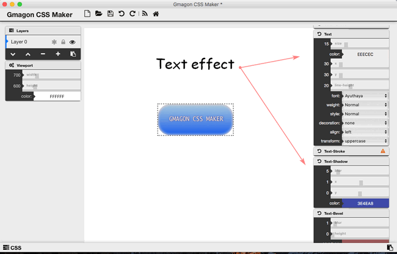
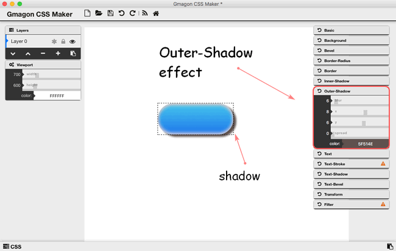

layout: guide
title: How to create buttons in CSS on Mac?  
keywords: css button generator on mac, css button design on mac, css button shadow on mac, css button effects on mac, css button text on mac, css button style on mac, css button maker on mac, css button creater on mac
description: This is the best tool dedicated to helping web authors quickly generate buttons with CSS code on Mac. 
---

Buttons are one of the most important elements on the page. Buttons are used to drive CTA (Call to Action) on most pages, so it’s important to make them stand out and inviting to users. We hope these button design inspirations will provide you with some great ideas that you can use in your websites. We will cover the usage of a powerful CSS maker on Mac machine-<a href="https://gmagon.com/products/store/gmagon_css_maker/" target="_blank" rel="noopener">Gmagon CSS Maker</a>. 

It is a powerful tool allowing web designers to create interesting and varying visual efftecs on Mac machine. As an easy-to-use CSS designer, Gmagon CSS Maker minimizes your time and efforts spent on creating complex CSS styles, especially for novice of CSS design. With this handy generator, you can easily create numerous graphic styles and immediately get your code or code of separate elements within seconds.

You can download and install Gmagon CSS Maker on you Mac machine(**macOS 10.7(64-bit)** or newer is required):

 

## How to design buttons with CSS on Mac? 
**Step 1**: Open and run the <a href="https://gmagon.com/products/store/gmagon_css_maker/" target="_blank" rel="noopener">Gmagon CSS Maker</a>, you can choose the background of your button as you wish by clicking the "Viewport" stylesheet, so that you can decide width, height, and color of background. If you do not need to change the background, leave it blank.

**Step 2**: Choose "Basic" information to change the width and height of the original content to make it suitable for the shape of a button. Besides, opacity is also for users to adjust. 

**Step 3**: Match both the top and bottom colors of the content in the "Background" stylesheet. In addition, you can also import other images here.

**Step 4**: Choose "Bevel" effects to make the edge of the content blurrer, and you can also expend the blur part by increase its height. Then choose colors for highlight and shadow. The bevel effect will make your content looks more like three-dimensional objects.

**Step 5**: Unfolding the "Border-Radius", you can cut every edge of four edges, top-left, top-right, bottom-left, and bottom-right, in order to make its shape more like a button. 

**Step 6**: If you are willing to insert some texts into the button, double-click the content itself, then type words in the little window popping up. So you can change the text style as you wish through "Text", "Text-Shadow", and "Text-Bevel".

**Step 7**: The button content can be decorated with more elements, for example, put outer-shadow on the button to makes it more vivid, or add a border around the button.  

 

Hope this article will solve your problems and make your life more convenient than ever. We'd like to receive and answer any question from you, if you are willing to communicate with us, you can join in <a href="https://gitter.im/Gmagon/support" target="_blank"> <strong>Support Center</strong> </a> to enter our community. 

Also read:
<a href="https://gmagon.com/guide/insert-text-with-css-mac.html" target="_blank" rel="noopener">Insert text with CSS on Mac</a>
<a href="https://gmagon.com/guide/create-shadow-using-css-mac.html" target="_blank" rel="noopener">How to create shadow with CSS on Mac</a>
<a href="https://gmagon.com/guide/mac-batch-convert-xls-to-csv.html" target="_blank" rel="noopener">Mac batch convert XLS to CSV</a>
<a href="https://gmagon.com/guide/convert-xls-to-csv-on-mac.html" target="_blank" rel="noopener">How to convert XLS to CSV on a Mac?</a>
<a href="https://gmagon.com/guide/create-border-radius-css-mac.html" target="_blank" rel="noopener">How to create border radius CSS code on Mac?</a>
<a href="https://gmagon.com/guide/convert-xls-on-mac-without-excel.html" target="_blank" rel="noopener">Convert XLS to CSV on Mac without Excel installed.</a>
<a href="https://gmagon.com/guide/generate-css-filter-effects.html" target="_blank" rel="noopener">How to generate css filter effects?</a>
