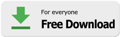
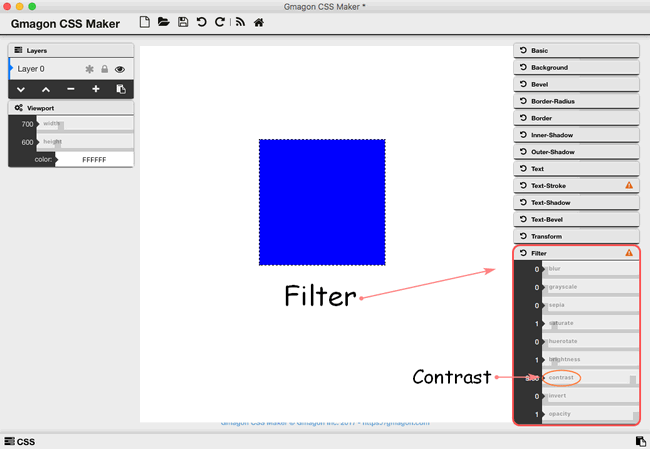

layout: guide
title: How to create buttons in CSS on Mac?  
keywords: css button generator on mac, css button design on mac, css button shadow on mac, css button effects on mac, css button text on mac, css button style on mac, css button maker on mac, css button creater on mac
description: This is the best tool dedicated to helping web authors quickly generate buttons with CSS code on Mac. 
---

Buttons are one of the most important elements on the page. Buttons are used to drive CTA (Call to Action) on most pages, so it’s important to make them stand out and inviting to users. We hope these button design inspirations will provide you with some great ideas that you can use in your websites. We will cover the usage of a powerful CSS maker on Mac machine-<a href="https://gmagon.com/products/store/gmagon_css_maker/" target="_blank" rel="noopener">Gmagon CSS Maker</a>. 

It is a powerful tool allowing web designers to create interesting and varying visual efftecs on Mac machine. As an easy-to-use CSS designer, Gmagon CSS Maker minimizes your time and efforts spent on creating complex CSS styles, especially for novice of CSS design. With this handy generator, you can easily create numerous graphic styles and immediately get your code or code of separate elements within seconds.

You can download and install Gmagon CSS Maker on you Mac machine(**macOS 10.7(64-bit)** or newer is required):

 

## How to design buttons with CSS on Mac? 
Step1: Open and run the <a href="https://gmagon.com/products/store/gmagon_css_maker/" target="_blank" rel="noopener">Gmagon CSS Maker</a>, you can choose the background of your button as you wish by clicking the "Viewport" stylesheet, so that you can decide width and height, and color of background.

Step2: Choose "Basic" information to change the width and height of the original content to make it suitable for the shape of a button. Besides, opacity is also for users to adjust.

Step3: 

4. **Saturate**: Saturate effect makes the image look more vivid. It’s a cool effect that can make photos look like posters or cartoons. The value of amount defines the proportion of the conversion. A value of 100% leaves the input unchanged. Other values are linear multipliers on the effect. This effect makes images look pretty funky.

4. **Huerotate**: By shifting the colors around, Huerotate exerts much interesting results. If you can imagine a color spectrum going from red to violet around a color wheel, then this effect takes the original color on the wheel as input and rotates it by the angle parameter to produce the color on the wheel to which it rotated as the output color value. 

4. **Brightness**: It just like brightness control in your computer screen. It adjusts the colors between completely black and the original color in proportion to the amount parameter. 

4. **Contrast**: This effect will adjust the difference between the darkest and lightest parts of the input image. If you use 0% you end up with black just like with ‘brightness’, if you hit 100%, it is the original image again.

4. **Invert**: If you applied 100%, the output looks like a photo negative back from the old film days of cameras. Using values smaller than 100% will progressively apply the invert effect.

4. **Opacity**: This filter can help your content looks semi-transparent. The 100% value is completely opaque, the output will be exactly the same as the original content. If the value is below 100%, the output image will become less opaque. While 0% means the content will totally invisible.

 

Hope this article will solve your problems and make your life more convenient than ever. We'd like to receive and answer any question from you, if you are willing to communicate with us, you can join in <a href="https://gitter.im/Gmagon/support" target="_blank"> <strong>Support Center</strong> </a> to enter our community. 

Also read:
<a href="https://gmagon.com/guide/insert-text-with-css-mac.html" target="_blank" rel="noopener">Insert text with CSS on Mac</a>
<a href="https://gmagon.com/guide/create-shadow-using-css-mac.html" target="_blank" rel="noopener">How to create shadow with CSS on Mac</a>
<a href="https://gmagon.com/guide/mac-batch-convert-xls-to-csv.html" target="_blank" rel="noopener">Mac batch convert XLS to CSV</a>
<a href="https://gmagon.com/guide/convert-xls-to-csv-on-mac.html" target="_blank" rel="noopener">How to convert XLS to CSV on a Mac?</a>
<a href="https://gmagon.com/guide/create-border-radius-css-mac.html" target="_blank" rel="noopener">How to create border radius CSS code on Mac?</a>
<a href="https://gmagon.com/guide/convert-xls-on-mac-without-excel.html" target="_blank" rel="noopener">Convert XLS to CSV on Mac without Excel installed.</a>

