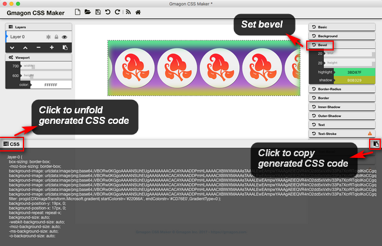

layout: guide
title: CSS Bevel Effect 
keywords: compose bevel style in CSS, CSS3 bevel effect, bevel techniques, write bevel effect in CSS style, CSS bevel
description: CSS3 is capable of easily creating a bevel effect on any element. Today we’re going to learn simple techniques on how to compose bevel effect in CSS style.
---

CSS3 is capable of easily creating a bevel effect on any element. Today we’re going to learn some really simple techniques that you can use to compose bevel effect in CSS style. 

Even though not directly mentioned in the spec, CSS3 is capable of easily creating a bevel effect on any element. Moreover, if the element has rounded corners, the bevel follows that as well. Before explaining the technique, let’s think about how a bevel actually gets drawn. It’s essentially two inner shadows, that when combined, create the illusion of a 3d appearance: a light one from the top left corner and a dark one from the bottom right corner. CSS3 includes the ability to create inner shadows, if you specify the keyword “inset” in the box-shadow declaration. Moreover, the CSS3 spec allows for multiple box shadows on the same elements.

You’ve probably seen this effect around the web. It’s often used around images to give the image a picture frame kind of look. 


```html
[cc lang=”css”]img.light {
outline: 1px solid #ddd;
border-top: 1px solid #fff;
padding: 10px;
background: #f0f0f0;
}
img.dark {
outline: 1px solid #111;
border-top: 1px solid #555;
padding: 10px;
background: #333;
}[/cc]
```
Play with the colors to match your site, and you’ll be set!

With <a href="../../../products/store/gmagon_css_maker/" target="_blank" rel="nofollow me noopener noreferrer" >Gmagon CSS Maker</a> installed, it won’t be a problem to compose bevel style in CSS even you know little about CSS knowledge. 


<p><a href="../../../products/store/gmagon_css_maker/" target="_blank" class="button padding20">Try Gmagon CSS Maker</a></p>


<link rel="stylesheet" href="./css/page.common.css">



