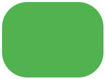
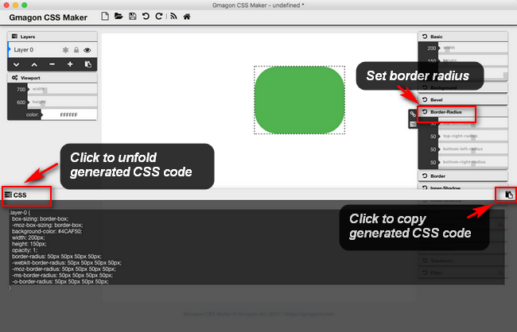

layout: guide
title: Border-Radius in CSS 
keywords: border-radius in css, border-radius CSS property, CSS rounded border corners, code border-radius in CSS
description: The border-radius CSS property allows Web authors to define how rounded border corners are.Here we explore how to code border-radius in CSS quickly and easily. 
---

The border-radius CSS property allows Web authors to define how rounded border corners are. The curve of each corner is defined using one or two radii, defining its shape: circle or ellipse. In this article, we explore how to code border-radius in CSS quickly and easily. 

### Example
Add rounded borders to a div element:
```html
div {
    border: 2px solid;
    border-radius: 25px;
}
```

## Definition and Usage
The border-radius property is used to add rounded corners to an element.

The border-radius property is a shorthand property for setting the four border-*-radius properties.

If you specify only one value for the border-radius property, this radius will be applied to all 4 corners.

However, you can specify each corner separately if you wish. Here are the rules:

- **Four values:** first value applies to top-left, second value applies to top-right, third value applies to bottom-right, and fourth value applies to bottom-left corner
- **Three values:** first value applies to top-left, second value applies to top-right and bottom-left, and third value applies to bottom-right
- **Two values:** first value applies to top-left and bottom-right corner, and the second value applies to top-right and bottom-left corner
- **One value:** all four corners are rounded equally

1. Four values - border-radius: 15px 50px 30px 5px: 


2. Three values - border-radius: 15px 50px 30px:


3. Two values - border-radius: 15px 50px:


4. One value - border-radius: 50px - all four corners are rounded equally


### Example 1
>border-radius:2em;

>is equivalent to:

>border-top-left-radius:2em;
>border-top-right-radius:2em;
>border-bottom-right-radius:2em;
>border-bottom-left-radius:2em;

### Example 2
>border-radius: 2em 1em 4em / 0.5em 3em;

>is equivalent to:

>border-top-left-radius: 2em 0.5em;
>border-top-right-radius: 1em 3em;
>border-bottom-right-radius: 4em 0.5em;
>border-bottom-left-radius: 1em 3em;

### More Examples
### Example
Three examples with rounded corners: 
```html
/* Example 1: Rounded corners for an element with background color */
#rcorners1 {
    border-radius: 25px;
    background: #73AD21;
    padding: 20px; 
    width: 200px;
    height: 150px; 
}

/* Example 2: Rounded corners for an element with a border */
#rcorners2 {
    border-radius: 25px;
    border: 2px solid #73AD21;
    padding: 20px; 
    width: 200px;
    height: 150px; 
}

/* Example 3: Rounded corners for an element with a background image */
#rcorners3 {
    border-radius: 25px;
    background: url(paper.gif);
    background-position: left top;
    background-repeat: repeat;
    padding: 20px; 
    width: 200px;
    height: 150px; 
}
```


For a CSS beginner, you may feel it’s hard and time-consuming to write border radius code in CSS manually. In this situation, we would recommend using <a href="../../../products/store/gmagon_css_maker/" target="_blank" rel="nofollow me noopener noreferrer" >Gmagon CSS Maker</a> to make things much easier. 


<p><a href="../../../products/store/gmagon_css_maker/" target="_blank" class="button padding20">Try Gmagon CSS Maker</a></p>


<link rel="stylesheet" href="./css/page.common.css">



