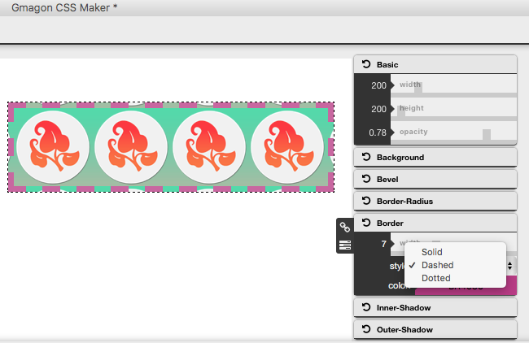
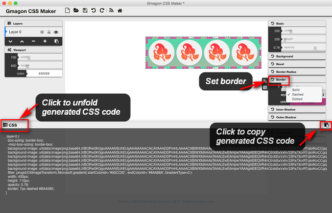

layout: guide
title: CSS Border
keywords: CSS border, code border style in CSS, CSS border generator, Mac CSS code generator app
description: In this tutorial we will explore what CSS border is and how to code border style in CSS manually or via using a CSS generator tool.
---

In this tutorial we will explore what CSS border is and how to code border style in CSS manually or via using a CSS border generator tool. 

The border CSS property is a shorthand property for setting all individual border property values at once: border-width, border-style, and border-color. As with all shorthand properties, any individual value that is not specified is set to its corresponding initial value. 

## CSS Border Properties

<div>
<div class="w3-container w3-border w3-border-black w3-margin-top">
<p>
I have borders on all sides.
</p>
</div>
</div>


<div class="w3-container w3-border-bottom w3-border-red">
<p>
I have a red bottom border
</p>
</div>

<div class="w3-container w3-border w3-round-xlarge">
<p>
I have rounded borders.
</p>
</div>

<div class="w3-container w3-pale-blue w3-leftbar w3-border-blue">
<p>
I have a blue left border.
</p>
</div>


## Border Style
The border-style property specifies what kind of border to display.
The following values are allowed:
- dotted - Defines a dotted border
- dashed - Defines a dashed border
- solid - Defines a solid border
- double - Defines a double border
- groove - Defines a 3D grooved border. The effect depends on the border-color value
- ridge - Defines a 3D ridged border. The effect depends on the border-color value
- inset - Defines a 3D inset border. The effect depends on the border-color value
- outset - Defines a 3D outset border. The effect depends on the border-color value
- none - Defines no border
- hidden - Defines a hidden border
The border-style property can have from one to four values (for the top border, right border, bottom border, and the left border).

### Example
```html
p.dotted {border-style: dotted;}
p.dashed {border-style: dashed;}
p.solid {border-style: solid;}
p.double {border-style: double;}
p.groove {border-style: groove;}
p.ridge {border-style: ridge;}
p.inset {border-style: inset;}
p.outset {border-style: outset;}
p.none {border-style: none;}
p.hidden {border-style: hidden;}
p.mix {border-style: dotted dashed solid double;}
```
Result:
<div class="w3-white w3-padding notranslate">
<p style="border-style: dotted;">A dotted border.</p>
<p style="border-style: dashed;">A dashed border.</p>
<p style="border-style: solid;">A solid border.</p>
<p style="border-style: double;">A double border.</p>
<p style="border-style: groove;">A groove border. The effect depends on the border-color value.</p>
<p style="border-style: ridge;">A ridge border. The effect depends on the border-color value.</p>
<p style="border-style: inset;">An inset border. The effect depends on the border-color value.</p>
<p style="border-style: outset;">An outset border. The effect depends on the border-color value.</p>
<p style="border-style: none;">No border.</p>
<p style="border-style: hidden;">A hidden border.</p>
<p style="border-style: dotted dashed solid double;">A mixed border.</p>
</div>

## Border Width
The border-width property specifies the width of the four borders.

The width can be set as a specific size (in px, pt, cm, em, etc) or by using one of the three pre-defined values: thin, medium, or thick.

The border-width property can have from one to four values (for the top border, right border, bottom border, and the left border).
<div style="border:5px solid black;padding:8px;">5px border-width</div>

### Example
```html
p.one {
    border-style: solid;
    border-width: 5px;
}

p.two {
    border-style: solid;
    border-width: medium;
}

p.three {
    border-style: solid;
    border-width: 2px 10px 4px 20px;
}
```

## Border Color
The border-color property is used to set the color of the four borders.
The color can be set by:
- name - specify a color name, like "red"
- Hex - specify a hex value, like "#ff0000"
- RGB - specify a RGB value, like "rgb(255,0,0)"
- transparent

The border-color property can have from one to four values (for the top border, right border, bottom border, and the left border). 

If border-color is not set, it inherits the color of the element.
<div style="border:5px solid red;padding:8px;">Red border</div>

### Example
```html
p.one {
    border-style: solid;
    border-color: red;
}

p.two {
    border-style: solid;
    border-color: green;
}

p.three {
    border-style: solid;
    border-color: red green blue yellow;
}
```

## Border - Individual Sides
From the examples above you have seen that it is possible to specify a different border for each side.
In CSS, there are also properties for specifying each of the borders (top, right, bottom, and left):
<div style="border-style: dotted solid;padding:8px;">Different Border Styles</div>

### Example
```html
p {
    border-top-style: dotted;
    border-right-style: solid;
    border-bottom-style: dotted;
    border-left-style: solid;
}
```
The example above gives the same result as this:

### Example
```html
p {
    border-style: dotted solid;
}
```

So, here is how it works:
If the border-style property has four values:
- **border-style: dotted solid double dashed;**
-- otop border is dotted
-- oright border is solid
-- obottom border is double
-- left border is dashed

If the border-style property has three values:
- **border-style: dotted solid double;**
-- otop border is dotted
-- oright and left borders are solid
-- obottom border is double

If the border-style property has two values:
- **border-style: dotted solid;**
-- top and bottom borders are dotted
-- right and left borders are solid

If the border-style property has one value:
- **border-style: dotted;**
-- all four borders are dotted

The border-style property is used in the example above. However, it also works with border-width and border-color.

## Border - Shorthand Property
As you can see from the examples above, there are many properties to consider when dealing with borders.

To shorten the code, it is also possible to specify all the individual border properties in one property.

The border property is a shorthand property for the following individual border properties:
- border-width
- border-style (required)
- border-color

### Example
```html
p {
    border: 5px solid red;
}
```
Result:
<p style="border:5px solid red;padding:2px">Some text</p>
You can also specify all the individual border properties for just one side:
<h2> Left Border </h2>
```html
p {
    border-left: 6px solid red;
    background-color: lightgrey;
}
```
Result:
<p style="border-left:6px solid red;padding:5px 5px;background-color:lightgrey">Some text</p>

## Bottom Border
```html
p {
    border-bottom: 6px solid red;
    background-color: lightgrey;
}
```
Result:
<p style="border-bottom:6px solid red;padding:5px 5px;background-color:lightgrey">Some text</p>

## Rounded Borders
The border-radius property is used to add rounded borders to an element:
<p style="border: 2px solid red;padding:2px;">Normal border</p>
<p style="border: 2px solid red;border-radius: 5px;padding:2px;">Round border</p>
<p style="border: 2px solid red;border-radius: 8px;padding:2px;">Rounder border</p>
<p style="border: 2px solid red;border-radius: 12px;padding:2px;">Roundest border</p>

### Example
```html
p {
    border: 2px solid red;
    border-radius: 5px;
}
```
**Note:** The border-radius property is not supported in IE8 and earlier versions.

## All CSS Border Properties

<table class="w3-table-all notranslate">
  <tbody><tr>
    <th style="width:25%">Property</th>
    <th>Description</th>
  </tr>
  <tr>
    <td>border</td>
    <td>Sets all the border properties in one declaration</td>
  </tr>
  <tr>
    <td>border-bottom</td>
    <td>Sets all the bottom border properties in one declaration</td>
  </tr>
  <tr>
    <td>border-bottom-color</td>
    <td>Sets the color of the bottom border</td>
  </tr>
  <tr>
    <td>border-bottom-style</td>
    <td>Sets the style of the bottom border</td>
  </tr>
  <tr>
    <td>border-bottom-width</td>
    <td>Sets the width of the bottom border</td>
  </tr>
  <tr>
    <td>border-color</td>
    <td>Sets the color of the four borders</td>
  </tr>
  <tr>
    <td>border-left</td>
    <td>Sets all the left border properties in one declaration</td>
  </tr>
  <tr>
    <td>border-left-color</td>
    <td>Sets the color of the left border</td>
  </tr>
  <tr>
    <td>border-left-style</td>
    <td>Sets the style of the left border</td>
  </tr>
  <tr>
    <td>border-left-width</td>
    <td>Sets the width of the left border</td>
  </tr>
  <tr>
    <td>border-radius</td>
    <td>Sets all the four border-*-radius properties for rounded corners</td>
  </tr>
  <tr>
    <td>border-right</td>
    <td>Sets all the right border properties in one declaration</td>
  </tr>
  <tr>
    <td>border-right-color</td>
    <td>Sets the color of the right border</td>
  </tr>
  <tr>
    <td>border-right-style</td>
    <td>Sets the style of the right border</td>
  </tr>
  <tr>
    <td>border-right-width</td>
    <td>Sets the width of the right border</td>
  </tr>
  <tr>
    <td>border-style</td>
    <td>Sets the style of the four borders</td>
  </tr>
  <tr>
    <td>border-top</td>
    <td>Sets all the top border properties in one declaration</td>
  </tr>
  <tr>
    <td>border-top-color</td>
    <td>Sets the color of the top border</td>
  </tr>
  <tr>
    <td>border-top-style</td>
    <td>Sets the style of the top border</td>
  </tr>
  <tr>
    <td>border-top-width</td>
    <td>Sets the width of the top border</td>
  </tr>
  <tr>
    <td>border-width</td>
    <td>Sets the width of the four borders</td>
  </tr>
</tbody></table>


## Use CSS generator app to create border style in CSS automatically 
For CSS newbies, it will consume lots of time if you write CSS code manually. Fortunately, <a href="../../../products/store/gmagon_css_maker/" target="_blank" rel="nofollow me noopener noreferrer" >Gmagon CSS Maker</a> is ready to do it for you now. With this Mac CSS code generator app installed, you can compose border style in CSS instantly even you are a pretty new CSS beginner. 

Custom borders of the element in Gmagon CSS Maker 



Copy and paste generated border CSS code to your stylesheet 

<p><a href="../../../products/store/gmagon_css_maker/" target="_blank" class="button padding20">Try Gmagon CSS Maker</a></p>


<link rel="stylesheet" href="./css/page.common.css">



<link rel="stylesheet" href="./css/page.border.css">


