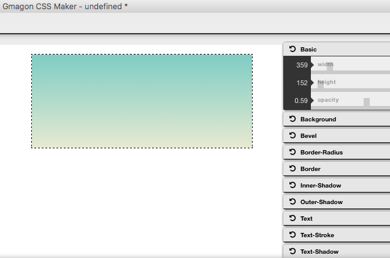
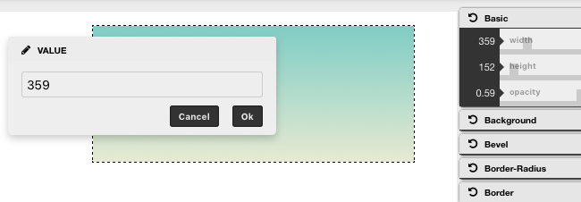

layout: guide
title: CSS Dimensions (height and width)  
keywords: code CSS dimension properties, css height and width, composing CSS dimension style, CSS generator tool for Mac 
description: Here we will show how to code CSS dimension properties. We will also explain a way of composing CSS dimension style via a simple CSS generator tool for Mac.  
---

Here we will show how to code CSS height and width dimension properties. Also, we will explain a way of composing CSS dimension style via using a simple CSS generator tool for Mac. 
## All CSS Dimension Properties


<table class="w3-table-all notranslate">
  <tr>
    <th style="width:20%">Property</th>
    <th>Description</th>
  </tr>
  <tr>
    <td>height</td>
    <td>Sets the height of an element</td>
  </tr>
  <tr>
    <td>max-height</td>
    <td>Sets the maximum height of an element</td>
  </tr>
  <tr>
    <td>max-width</td>
    <td>Sets the maximum width of an element</td>
  </tr>
  <tr>
    <td>min-height</td>
    <td>Sets the minimum height of an element</td>
  </tr>
  <tr>
    <td>min-width</td>
    <td>Sets the minimum width of an element</td>
  </tr>
  <tr>
    <td>width</td>
    <td>Sets the width of an element</td>
  </tr>
</table>


## Setting height and width
The height and width properties are used to set the height and width of an element.

The height and width  can be set to auto (this is default. Means that the browser calculates the height and width), or be specified in length values, like px, cm, etc., or in percent (%) of the containing block. 

This element has a height of 200 pixels and a width of 50%

### Example
>div {
    height: 200px;
    width: 50%;
    background-color: powderblue;
}

This element has a height of 100 pixels and a width of 500 pixels.

### Example
>div {
    height: 100px;
    width: 500px;
    background-color: powderblue;
}

**Note**: The height and width  properties do not include padding, borders, or margins; they set the height/width of the area inside the padding, border, and margin of the element!

## Setting max-width
The height and width property is used to set the maximum width of an element.
The max-width can be specified in length values, like px, cm, etc., or in percent (%) of the containing block, or set to none (this is default. Means that there is no maximum width).
The problem with the div above occurs when the browser window is smaller than the width of the element (500px). The browser then adds a horizontal scrollbar to the page.
Using max-width instead, in this situation, will improve the browser's handling of small windows.

**Tip**: Drag the browser window to smaller than 500px wide, to see the difference between the two divs!

This element has a height of 100 pixels and a max-width of 500 pixels.

**Note**: The value of the max-width property overrides width.

The following example shows a div element with a height of 100 pixels and a max-width of 500 pixels:
### Example
>div {
    max-width: 500px;
    height: 100px;
    background-color: powderblue;
}

In addition, if you are a pretty new CSS beginner, sure, it will take a lot of time if you write CSS code manually. Fortunately, a number of programs out there are doing it for you now. With <a href="../../../products/store/gmagon_css_maker/" target="_blank" rel="nofollow me noopener noreferrer" >Gmagon CSS Maker</a> installed, anyone can write CSS code on Mac instantly even you know little about CSS knowledge. Here’s a quick guide on how to code height and width in CSS via using Gmagon CSS Maker without writing CSS code manually.  

Follow these steps:
Step 1: Run Gmagon CSS Maker on your Mac. 

Step 2: In Gmagon CSS Maker, there’s a rectangle that has already been drawn, you can switch to “Basic” option to change width and height of the element (rectangle) by dragging slider bars.   

You can also double click the sliders to input specific values for width and height.  

Step 3: When finished, click “CSS” icon to unfold generated CSS code and click “Copy” to copy them to your CSS stylesheet. 

Hope this Mac CSS generator app helps code newbies who are looking for an easy way to generate CSS code on a Mac computer. 

<a href="../../../products/store/gmagon_css_maker/" target="_blank" class="button padding20">Try Gmagon CSS Maker</a>


<link rel="stylesheet" href="./css/page.common.css">

