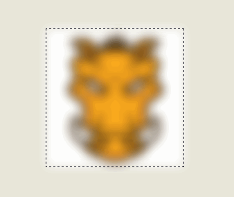
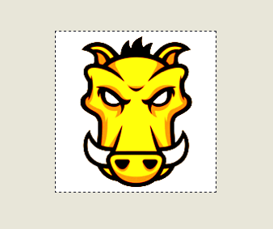

layout: guide
title: CSS-Filter?  
keywords: css filter property on mac, css filter effects generator on mac, css filter explorer on mac, css filter blur on mac, css filter grayscale on mac, css filter sepia on mac, css filter saturate on mac, css filter support on mac
description: This is the best tool dedicated to helping web authors quickly achieve varying visual effects with CSS code on Mac. 
---

In this article, you will start your journey towards generating filter effects with CSS code. The filter CSS property lets you apply graphical effects like blurring, sharpening, or color shifting to an element. Filters are commonly used to adjust the rendering of images, backgrounds, and borders.
>*The filter CSS property* helps web designers to apply graphical effects like blurring, color shifting, saturating, and contrasting, etc. It seems sort of like Photoshop filters for the browser. Filters are commonly used to adjust the rendering of images, backgrounds, and borders.

 
## How does filter works?
So what does a filter do exactly? When a browser loads a web page, styles, and perform layout need to be applied, so the web page can be rendered that there is something for visitors to look at. Just before the page is copied to the screen, filters start working. It takes s snapshot of the rendered page as a bitmap image, then perform some graphics magic on the pixels in the snapshot and then draw the result over the top of the original page image. Drawing a page with filters on it is time-consuming, but using them properly will have minimum impact on the speed of the site. Therefore, you are able to stack a number of filters one after the other to achieve all sorts of effects.

 
## Blur: 
If you want a soft edge for your content, you can add a blur. This smudges all the colors together and spreads their effects, it is sort of like your eyes are out of focus. The ‘radius’ parameter affects how many pixels on the screen blend into each other, so a larger value will create more blur. Zero of course leaves the image unchanged.
 
 
## Grayscale: 
This filter gradually converts all the colors in our images to some shade of gray. The ‘amount’ applied controls how much gray conversion is applied. A value of 0% will have no effect on our images and a value of 100% will turn them completely grayscale. Negative values are not allowed.
 

 
## Sepia: 
This gives the colors passed in a sepia tinge, looks like old photographs. The amount applied works in the same way as for the grayscale filter, that means 100% makes all the colors completely sepia toned and smaller values allow the effect to be applied in smaller proportions.

 
## Saturate: 
Saturate effect makes the image look more vivid. It’s a cool effect that can make photos look like posters or cartoons. The value of amount defines the proportion of the conversion. A value of 100% leaves the input unchanged. Other values are linear multipliers on the effect. This effect makes images look pretty funky.

 
## Huerotate: 
By shifting the colors around, Huerotate exerts much interesting results. If you can imagine a color spectrum going from red to violet around a color wheel, then this effect takes the original color on the wheel as input and rotates it by the angle parameter to produce the color on the wheel to which it rotated as the output color value. 

 
## Brightness: 
It just like brightness control in your computer screen. It adjusts the colors between completely black and the original color in proportion to the amount parameter. 

 
## Contrast: 
This effect will adjust the difference between the darkest and lightest parts of the input image. If you use 0% you end up with black just like with ‘brightness’, if you hit 100%, it is the original image again.

 
## Invert: 
If you applied 100%, the output looks like a photo negative back from the old film days of cameras. Using values smaller than 100% will progressively apply the invert effect.

 
## Opacity: 
This filter can help your content looks semi-transparent. The 100% value is completely opaque, the output will be exactly the same as the original content. If the value is below 100%, the output image will become less opaque. While 0% means the content will totally invisible.

 

<a href="https://gmagon.com/products/store/gmagon_css_maker/" target="_blank" class="button padding20">Try to make filter yourself</a>


<link rel="stylesheet" href="./css/page.common.css">


Hope this article will solve your problems and make your life more convenient than ever. We'd like to receive and answer any question from you, if you are willing to communicate with us, you can join in <a href="https://gitter.im/Gmagon/support" target="_blank"> <strong>Support Center</strong> </a> to enter our community. 

