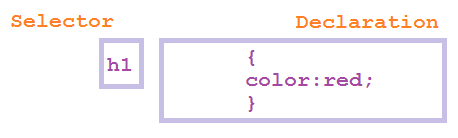
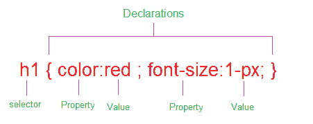
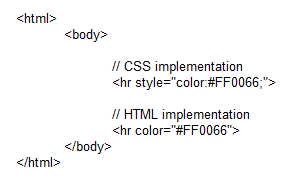

layout: guide
title: How CSS works? 
keywords: how css works, css works together with html 
description:How does CSS work? This article explains how CSS works together with HTML as a web page in the reader’s browser. 
---

Cascading Style Sheet (CSS) allows you to create great looking webpages, but how does it work? This article explains how CSS works together with HTML as a web page in the reader’s browser. 

(Cascading Style Sheet) is a completely different approach to webpage styling and layout. When a web-browser displays an HTML document , it must combine the document`s content with its style information . Actually the content of a page goes into an HTML file, and the style information goes into a style sheet. But how does all this work together to determining how a webpage should look? 

Cascading Style Sheet (CSS) works by allowing you to associate rules with the elements that appear in an HTML document. These rules govern how the content of those elements should be rendered. A rule set consists of a selector followed by a declaration block.

CSS selectors are patterns used to select the elements you want to style
h1 {color:red}  - here h1 is the selector

Declarations, which sets out how the elements referred within the selector should be styled
h1 {color:red} - here color:red is declaration
The declaration is also split into two parts, separated by a colon : property and value

Property is assigned to a selector in order to manipulate its style and Value is an assignment that a property receives
h1 {color:red} - here color is property and red is value.

Each property - value pair within a rule must be separated by a semicolon, If there is only one property-value pair in the declaration, you do not need to end it with a semicolon.

A simple example Applying CSS and HTML tags in an HTML page. 
