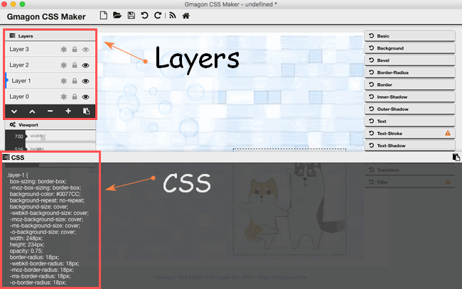

layout: guide
title: CSS-Multi-layers 
keywords: multilayer css, css layers, css multiple backgrounds, css layered backgrounds, css layer styles, css layer elements, css layer effects, css layer on top of another, css multi layer menu, css layer tutorial, css background tutorial, 	add viewport css
description: This CSS multi-layer elementary tutorial dedicate to helping beginners quickly to specify multiple background images for box elements using CSS on Mac. 
---
In this tutorial, we will concentrate on adding multiple layers or backgrounds with CSS code. With CSS, it is possible to work with layers: pieces of HTML that are placed on top of the regular page with pixel precision. With CSS3, you can apply multiple backgrounds to elements. These are layered atop one another with the first background you provide on top and the last background listed in the back. Only the last background can include a background color.
 
## Browser Compatibility
Browser support for multiple backgrounds is relatively widespread with all of the main browsers offering support, without the need for vendor prefixes.
Firefox has supported multiple backgrounds since version 3.6 (Gecko 1.9.2), Safari since version 1.3, Chrome since version 10, Opera since version 10.50 (Presto 2.5) and Internet Explorer since version 9.0.
 
## Practical Use of Layers
It's obvious that layers offer certain possibilities for precise positioning of static elements on your pages.
In reality layers are often used in more dynamic ways:

<table border="0" cellspacing="0" cellpadding="0" bgcolor="#000000" align="center"><tbody><td bgcolor="#B3C0DF"><table border="0" cellspacing="0" cellpadding="0" bgcolor="#FAFAFA" width="550"><tbody><td class="table5"><!-- perl mysql php web host -->
<li>Flying elements/banners on the page</li>
<li>Games where you move an object around</li>
<li>Menus that pop out when triggered</li>
<li>Menus that become visible when triggered</li></ul>
</td></tr></tbody></table></td></tr></tbody></table>

 
## Multiple Backgrounds
You can do this with both the shorthand background property and the individual properties thereof except for background-color. That is, the following background properties can be specified as a list, one per background: background, background-attachment, background-clip, background-image, background-origin, background-position, background-repeat, background-size.

Specifying multiple backgrounds is easy:
<pre class="brush: css line-numbers  language-css"><code class=" language-css">.myclass {
  background: background1, background 2, ..., backgroundN;
}</code></pre>

 

**Example**
In this example, three backgrounds are stacked: the full background of bricks, the image of dogs and the image of bubbles.

You can also get CSS code of every layers through: 

 

<a href="https://gmagon.com/products/store/gmagon_css_maker/" target="_blank" class="button padding20">Try to make layers yourself</a>


<link rel="stylesheet" href="./css/page.common.css">


 