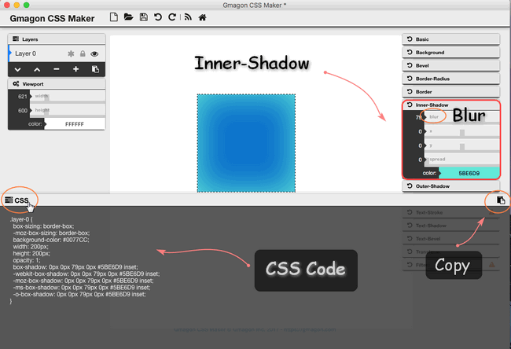

layout: guide
title: CSS-Shadow  
keywords: css shadow, text shadow, box-shadow, css shadow inset, create css shadow, add css shadow, building css shadow, css elementary tutorial shadow, css shadow tutorial for beginners
description: This CSS shadow elementary tutorial dedicate to helping beginners quickly design box and text shadow around using CSS, especially on Mac. 

 
In this tutorial we are going to learn how to use the *CSS shadow property* to create different effects with just CSS code. CSS supported to add shadow to text or elements.Shadow property has divided as follows:

 

## Box Shadow
The box-shadow property helps web designers to implement multiple drop shadows on box elements, no matter inside shadow or outside shadow, including values for size, color, blur, spread, offset. It enables users to cast a drop shadow from the frame of almost any element. Used to add shadow effects to elements, following is the example to add shadow effects to element

### Inner-Shadow
You can apply shadows to the inside of a box through various settings of blur, offset, spread radius, color,.

1. **Blur radius**: The original value of the box is zero, the higher the number you set, the more blurred it will be, so the shadow becomes bigger and lighter. The maximum value is one hundred.

2. **Offset**: There are two values to set inner-shadow offset. Offset-x specifies the horizontal distance. The positive values place the shadow to the left of the box. While offset-y specifies the vertical distance, positive values place the shadow under the box.

3. **Spread radius**: Positive values will expand the shadow, make it bigger. While negative values will make the shadow shrink. 

4. **Color**: It takes any color value, like hex, named, rgba or hsla. The default color is black when the color value is omitted.

### Outer-shadow
1. **Blur radius**: The original value of the box is zero, the higher the number you set, the more blurred it will be, so the shadow becomes bigger and lighter, and the further out the shadow will extend.

2. **Offset**: There are two values to set outer-shadow offset. Offset-x specifies the horizontal distance. The negative values place the shadow to the left of the box. While offset-y specifies the vertical distance, negative values place the shadow under the box.

3. **Spread radius**: Positive values will expand the shadow outside the box, make it bigger. While negative values will make the shadow shrink. 

4. **Color**: It takes any color value, like hex, named, rgba or hsla. The default color is black when the color value is omitted.

### Text Shadow
In "Text-Shadow" sheet, you can make your text be blur, pan its shadow vertically and horizontally, and change its color as you wish.

1. **Blur**: The original value is zero which means no blur effects. The higher the number, the blurrer it will be. The original value is zero, 

2. **Offset**: Offset-x specifies the horizental movement of text shadow. The positive values place the shadow to the right of the text. Offset-y specifies the vertical movement of text shadow, the negative values place the shadow above the text.

3. **Color**: You can choose the color of the shadow as you wish, but not text color.

<a href="http://coveloping.com/tools/css-box-shadow-generator" target="_blank" class="button">Gmagon CSS Maker</a>

