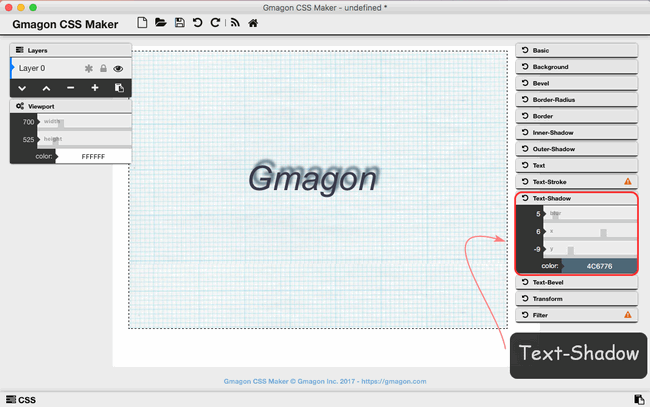

layout: guide
title: CSS-Text 
keywords: css text, text shadow, css text tutorial, css text beginner tutorial, css text elementary guide, css text decoration, text css effects
description: This CSS text elementary tutorial dedicate to helping beginners quickly insert text and create various text effects using CSS on Mac. 
---
In this tutorial, we will concentrate on adding styling text with CSS code-one of the most common things you'll do with CSS. we will cover text styling fundamentals, including setting font, color, boldness, italics, line, text bevel, drop shadows and other text features. We round off the module by looking at applying custom fonts to your page, and styling lists and links. 

>## what is CSS text?
>Text and font properties in the Cascading Style Sheets serve to set the appearance of individual characters in a word or line of text, including text color, text size, font, shadow, bevel, etc.

 
## Basic Text Setting
You can alter the size and shape of the text on a web page with a range of properties.
 
2. **Size, color & offset**: These settings allow you to expand the size you the input text, change its color, and move its vertical and horizontal position.

 
2. **Font**: There are dozens of different text fonts for users to choose. For example, Arial, Times New Roman, Comic Sans MS, etc.
  
2. **Weight & Style**: Font-weight states whether the text is bold or not. While font-style states whether the text is italic or not.

 
2. **Decoration**: Besides the utility with links, text-decoration allows you to add horizontal lines above, below, or through your text.

 
2. **Transform**: Text-transform is a quick way to modify the capitalization of your text.

 

## Text-Shadow
In "Text-Shadow" sheet, you can make your text be blur, pan its shadow vertically and horizontally, and change its color as you wish.
 
1. **Blur**: The original value is zero which means no blur effects. The higher the number, the blurrer it will be. The original value is zero, 

1. **Offset**: Offset-x specifies the horizontal movement of text shadow. The positive values place the shadow to the right of the text. Offset-y specifies the vertical movement of text shadow, the negative values place the shadow above the text.

1. **Color**: You can choose the color of the shadow as you wish, but not text color.
 

 

## Text-Bevel
Bevels are shading and artificial shadows that emulate the appearance of a 3-dimensional letter. 
 
1. **Blur**: The higher the number, the blurrer it will be. The original value is zero.

 
1. **Height offset**: The original value of the Height is zero, with the increase of the number, the bevel effect will slowly move below the text.

 
1. **Colors of Highlight & Shadow**: The Highlight changes the color of the top part of bevel, while Shadow changes the bottom color of the bevel. 

<a href="https://gmagon.com/products/store/gmagon_css_maker/" target="_blank" class="button padding20">Try to make fonts</a>


<link rel="stylesheet" href="./css/page.common.css">


In the next page, we will start explore [CSS-Transform](./transform.html).