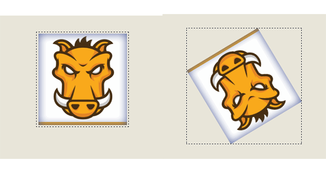
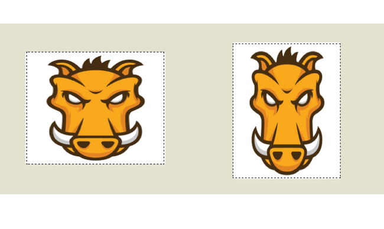

layout: guide
title: CSS-Transform 
keywords: css transform, css transform property, css transform scale, css transform translate, css transform multiple, css transform rotate, what is a css transform, css transform scale, css transform skew, css transform browser support	
description: What is CSS transform? How does it works? This CSS transform elementary tutorial dedicate to helping beginners quickly make various transformation effects using CSS on Mac. 
---
In this tutorial journey of transformation, we will concentrate on transforming properties with CSS code. The CSS transform property allows you to visually manipulate an element by skewing, rotating, or scaling. Using it, elements can be translated, rotated, scaled, and skewed.
 

<h2 id="Browser_compatibility" class="highlight-spanned">Browser compatibility<a href="/en-US/docs/Web/CSS/transform$edit#Browser_compatibility" class="" rel="nofollow, noindex"><i aria-hidden="true" class="icon-pencil"></i></a></h2>

    
    <ul>
        <li class="selected"><a>Desktop</a></li>
    </ul>

<table class="compat-table">
 <tbody>
  <tr>
   <th>Feature</th>
   <th>Chrome</th>
   <th>Edge</th>
   <th>Firefox (Gecko)</th>
   <th>Internet Explorer</th>
   <th>Opera</th>
   <th>Safari</th>
  </tr>
  <tr>
   <td>Basic support</td>
   <td>(Yes) <a href="/en-US/docs/Web/Guide/Prefixes" title="The name of this feature is prefixed with '-webkit' as this browser considers it experimental">-webkit</a> 
    36</td>
   <td>(Yes)<a href="/en-US/docs/Web/Guide/Prefixes" title="The name of this feature is prefixed with '-webkit' as this browser considers it experimental">-webkit</a> 
    (Yes)</td>
   <td><a href="/en-US/Firefox/Releases/3.5" title="Released on 2009-06-30.">3.5</a> (1.9.1)<a href="/en-US/docs/Web/Guide/Prefixes" title="The name of this feature is prefixed with '-moz' as this browser considers it experimental">-moz</a>[1] 
    <a href="/en-US/Firefox/Releases/16" title="Released on 2012-10-09.">16.0</a> (16.0)[2]</td>
   <td>9.0<a href="/en-US/docs/Web/Guide/Prefixes" title="The name of this feature is prefixed with '-ms' as this browser considers it experimental">-ms</a>[3] 
    10.0</td>
   <td>10.5<a href="/en-US/docs/Web/Guide/Prefixes" title="The name of this feature is prefixed with '-o' as this browser considers it experimental">-o</a> 
    12.10 
    15.0<a href="/en-US/docs/Web/Guide/Prefixes" title="The name of this feature is prefixed with '-webkit' as this browser considers it experimental">-webkit</a> 
    23</td>
   <td>3.1<a href="/en-US/docs/Web/Guide/Prefixes" title="The name of this feature is prefixed with '-webkit' as this browser considers it experimental">-webkit</a> 
    9.0</td>
  </tr>
  <tr>
   </td>
  </tr>
 </tbody>
</table>

<table class="compat-table">
 <tbody>
  <tr>
   <th>Feature</th>
   <th>Android</th>
   <th>Chrome for Android</th>
   <th>Edge</th>
   <th>Firefox Mobile (Gecko)</th>
   <th>IE Mobile</th>
   <th>Opera Mobile</th>
   <th>Safari Mobile</th>
  </tr>
  <tr>
   <td>Basic support</td>
   <td>2.1<a href="/en-US/docs/Web/Guide/Prefixes" title="The name of this feature is prefixed with '-webkit' as this browser considers it experimental">-webkit</a>[4]</td>
   <td>(Yes)<a href="/en-US/docs/Web/Guide/Prefixes" title="The name of this feature is prefixed with '-webkit' as this browser considers it experimental">-webkit</a></td>
   <td>(Yes)<a href="/en-US/docs/Web/Guide/Prefixes" title="The name of this feature is prefixed with '-webkit' as this browser considers it experimental">-webkit</a> 
    (Yes)</td>
   <td>(Yes)</td>
   <td>(Yes) 
    11.0<a href="/en-US/docs/Web/Guide/Prefixes" title="The name of this feature is prefixed with '-webkit' as this browser considers it experimental">-webkit</a>[5]</td>
   <td>11.5<a href="/en-US/docs/Web/Guide/Prefixes" title="The name of this feature is prefixed with '-webkit' as this browser considers it experimental">-webkit</a></td>
   <td>3.2 (Yes)<a href="/en-US/docs/Web/Guide/Prefixes" title="The name of this feature is prefixed with '-webkit' as this browser considers it experimental">-webkit</a> 
    9.0</td>
  </tr>
  <tr>
   <td>3D Support</td>
   <td>3.0<a href="/en-US/docs/Web/Guide/Prefixes" title="The name of this feature is prefixed with '-webkit' as this browser considers it experimental">-webkit</a></td>
   <td>(Yes)<a href="/en-US/docs/Web/Guide/Prefixes" title="The name of this feature is prefixed with '-webkit' as this browser considers it experimental">-webkit</a></td>
   <td>(Yes)</td>
   <td>(Yes)</td>
   <td>(Yes)</td>
   <td>22<a href="/en-US/docs/Web/Guide/Prefixes" title="The name of this feature is prefixed with '-webkit' as this browser considers it experimental">-webkit</a></td>
   <td>3.2 (Yes)<a href="/en-US/docs/Web/Guide/Prefixes" title="The name of this feature is prefixed with '-webkit' as this browser considers it experimental">-webkit</a> 
    9.0</td>
  </tr>
 </tbody>
</table>



## Rotation
This function rotates the element clockwise from its original position. whilst a negative value would rotate it in the opposite direction. Here’s a simple animated example where a square continues to rotate 360 degrees every three seconds:

## scale
The Scale value affects the size of the element. This also applies to the font-size, padding, height, and width of an element, too. It’s also a a shorthand function for the ScaleX and ScaleY functions.

## Skew
SkewX and SkewY transform functions tilt an element one way or the other. Remember: there is no shorthand property for skewing an element, so you’ll need to use both functions. In the example below, we can skew a 100px x 100px square to the left and right with skewX:

 

<a href="https://gmagon.com/products/store/gmagon_css_maker/" target="_blank" class="button padding20">Try to make transform yourself</a>


<link rel="stylesheet" href="./css/page.common.css">


In the next page, we will start explore [CSS-Filter](./filter.html).