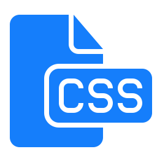

layout: guide
title: What is CSS? 
keywords: what CSS is, which benefits CSS will give you, advantages of CSS, Cascading Style Sheets, what is CSS 
description: Maybe you already heard about CSS without really knowing what it is. In this tutorial you will learn more about what CSS is and which benefits it will give you. 
---

Maybe you already heard about CSS without really knowing what it is. In this tutorial you will learn more about what CSS is and which benefits it will give you.  
## What is CSS? 
CSS is an acronym for Cascading Style Sheets. It was first developed in 1997 as a way for web developers to define the visual appearance of the web pages that they were creating.

CSS handles the look and feel part of a web page. Using CSS, you can control the color of the text, the style of fonts, the spacing between paragraphs, how columns are sized and laid out, what background images or colors are used, layout designs,variations in display for different devices and screen sizes as well as a variety of other effects.

CSS is easy to learn and understand but it provides powerful control over the presentation of an HTML document. Most commonly, CSS is combined with the markup languages HTML or XHTML.

CSS is now a widely used standard in web design and you would be hard pressed to find anyone working in the industry today who did not have at least a basic understanding of this language.

 

## Which benefits will CSS give you?
* **CSS saves time** − You can write CSS once and then reuse same sheet in multiple HTML pages. You can define a style for each HTML element and apply it to as many Web pages as you want.

* **Pages load faster** − If you are using CSS, you do not need to write HTML tag attributes every time. Just write one CSS rule of a tag and apply it to all the occurrences of that tag. So less code means faster download times.

* **Easy maintenance** − To make a global change, simply change the style, and all elements in all the web pages will be updated automatically.

* **Superior styles to HTML** − CSS has a much wider array of attributes than HTML, so you can give a far better look to your HTML page in comparison to HTML attributes.

* **Multiple Device Compatibility** − Style sheets allow content to be optimized for more than one type of device. By using the same HTML document, different versions of a website can be presented for handheld devices such as PDAs and cell phones or for printing.

* **Global web standards** − Now HTML attributes are being deprecated and it is being recommended to use CSS. So its a good idea to start using CSS in all the HTML pages to make them compatible to future browsers.

* **Offline Browsing** − CSS can store web applications locally with the help of an offline catche.Using of this, we can view offline websites.The cache also ensures faster loading and better overall performance of the website.

* **Platform Independence** − The Script offer consistent platform independence and can support latest browsers as well.

In the <a href="./why-use-css.html" target="_blank" rel="nofollow me noopener noreferrer"> next page </a>we will take a closer look at why use CSS.        

<a href="../../../products/store/gmagon_css_maker/" target="_blank" class="button padding20">Try Gmagon CSS Maker</a>


<link rel="stylesheet" href="./css/page.common.css">
