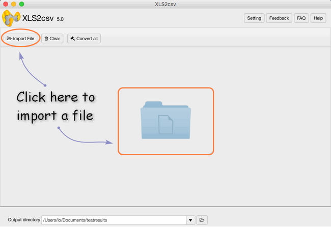
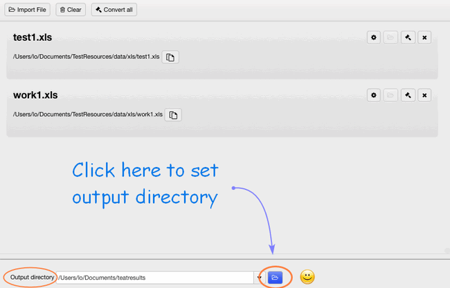
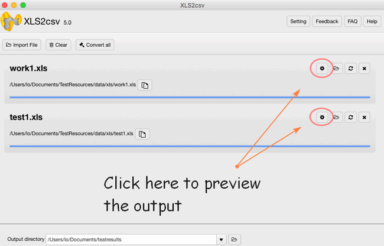
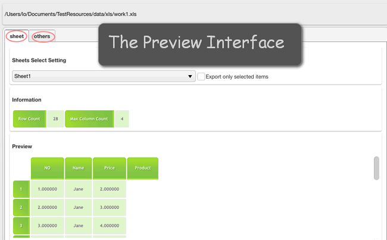
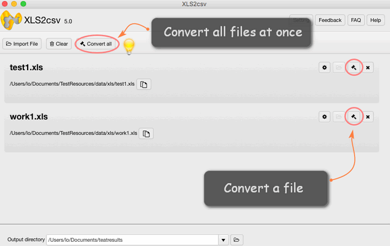

layout: guide
title: How do I convert Excel files to CSV on Mac OS X?  
keywords: convert excel files to csv on mac automatically, convert excel files to csv format on mac, export excel file to csv format on mac, excel export sheet to csv on mac, convert excel from .xls to .csv for Mac, Mac XLS to CSV Converter on mac, shift excel XLS files to CSV
description: This tutorial explains how to process Excel files to CSV conversion on Mac via using a simple and helpful XLS to CSV Converter for Mac. 
---
## What is CSV
>CSV stands for Comma-separated values, it is a widespread file format that stores tabular data (numbers and text) as plain text. Its popularity and viability are due to the fact that a large number of programs and applications support CSV files, at least as an alternative import or export format. In addition, the CSV format allows users to glance at the file and immediately diagnose the problems with data, if any, change the CSV delimiter, quoting rules, etc. All this is possible because a CSV file is plain text and an average user or even a novice can easily understand it without any learning curve.

In this tutorial, we will try to investigate quick and efficient ways to how to convert Excel to CSV and export data from Excel to CSV keeping all special characters and foreign symbols intact. The below methods work for macOS 10.7(64-bit) or newer is required.
 
## Possible Usage
**Importing and Exporting Products**: Importing your products is the fastest way to create or update products in bulk. A product import involves having all of your product information in a CSV file, which can be edited as a spreadsheet. Upon import, your column headers will be matched with their corresponding product, and the product information will be updated accordingly. Importing products has a variety of uses, such as updating products, creating new products and options, etc. 

**Importing Product Options**: Importing your options is an efficient way to handle the sometimes lengthy task of adding product options to each of your products. The following guide walks you through creating Product Options by importing a CSV file file. 

**Importing Customers**: Importing your customers is the fastest way to add or update their information in bulk. A customer import involves having all of your customer information in a CSV file, which can be edited as a spreadsheet. Upon import, your column headers will be matched with their corresponding customer fields, and the customer information will be updated accordingly.
 
## How to convert Excel file to CSV
If you need to convert an Excel file to some other application e.g. to the Outlook Address book or Access database, you can convert your Excel worksheet to CSV first and then import a .csv file in another program. Below you will find the step-by-step instructions to export an Excel workbook to the CSV format by <a href="https://gmagon.com/products/store/xls2csv/" target="_blank" rel="nofollow me noopener noreferrer" >XLS2csv</a>-an image format converter which tends to convert XLS to CSV format and it is only fit for Mac machine. 

**Step 1**: Import your Excel file or a batch of files into this converter by clicking.

**Step 2**: Set your output directory to put your output in the right file.

**Step 3**: If you want to preview the convert effects, you can see it clearly and also change its coding to CSV UTF-8, UCS-2BE, etc.

**Step 4**: The final step is to click the convert button, you can choose to convert one file at once or convert all files at one click.

You can feel free to try the powerful converter:

<a href="https://gmagon.com/products/store/xls2csv/" target="_blank" rel="nofollow me noopener noreferrer" >

Also read
<a href="https://gmagon.com/guide/mac-batch-convert-xls-to-csv.html" target="_blank" rel="nofollow me noopener noreferrer" >Mac batch convert XLS to CSV</a>
<a href="https://gmagon.com/guide/convert-xls-to-csv-on-mac.html" target="_blank" rel="nofollow me noopener noreferrer" >How to convert XLS to CSV on a Mac?</a>
<a href="https://gmagon.com/guide/create-border-radius-css-mac.html" target="_blank" rel="nofollow me noopener noreferrer" >How to create border radius CSS code on Mac?</a>
<a href="https://gmagon.com/guide/convert-xls-on-mac-without-excel.html" target="_blank" rel="nofollow me noopener noreferrer" >Convert XLS to CSV on Mac without Excel installed</a>
<a href="https://gmagon.com/guide/can-i-batch-convert-xls-to-csv-mac.html" target="_blank" rel="nofollow me noopener noreferrer" >Can I batch convert XLS/XLSX to CSV in Mac?</a>
<a href="https://gmagon.com/guide/how-to-convert-a-xlsx-file-to-csv-on-mac.html" target="_blank" rel="nofollow me noopener noreferrer" >How to convert a .xlsx file to .csv on Mac?</a>