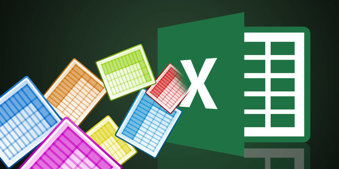

layout: guide
title: How to batch convert Excel spreadsheets to CSV on Mac?  
keywords: batch convert excel to csv mac, batch conversion excel to csv, bulk convert xlsx files to csv on mac, excel batch convert xls to csv on mac, convert excel to csv batch script on mac, convert xlsx to csv using batch file on mac
description: How to batch convert Excel spreadsheets to CSV on Mac ? Using a simple and helpful XLS to CSV Converter can help Mac users solve the problem. 
---

## What are Excel spreadsheets?
Microsoft Excel is a spreadsheet developed by Microsoft for Windows, macOS, Android and iOS. It features calculation, graphing tools, pivot tables, and a macro programming language called Visual Basic for Applications. It has been a very widely applied spreadsheet for these platforms, especially since version 5 in 1993, and it has replaced Lotus 1-2-3 as the industry standard for spreadsheets. Excel forms part of Microsoft Office.

XLS and XLSX are both extensions of Microsoft Excel. XLS is the main spreadsheet format which holds data in worksheets, charts, and macros from Excel 97 to Excel 2003. XLSX is the default XML-based file format for Excel 2010 and Excel 2007. Cannot store Microsoft Visual Basic for Applications (VBA) macro code or Microsoft Office Excel 4.0 macro sheets (.xlm).

>On some occasions, Mac users need to batch convert XLS files to CSV format for use in other program. That’s where an XLS to CSV Converter for Mac comes in. In this article, we present how to complete XLS to CSV conversion on Mac via using such an Excel format converter for Mac app.

### To process XLS to CSV conversion on Mac, do as follows:
Step 1: Install and run XLS2csv on your Mac, and click “Import File” to load XLS files that you want to convert. This Mac XLS to CSV converter supports batch conversion, so you can load multiple XLS files to do conversion at a time.

Step 2: Set output path for exported CSV files

Step 3: Click “Convert all” button to start. Once the conversion is complete, you can click “Output directory” folder to get the exported .csv files.

That’s all. Hope this XLS to CSV converter app for Apple helps those who are looking for an easy solution to handle XLS files on Mac OS X.

 
Also read
<a href="https://gmagon.com/guide/mac-batch-convert-xls-to-csv.html" target="_blank" rel="nofollow me noopener noreferrer" >Mac batch convert XLS to CSV</a>
<a href="https://gmagon.com/guide/bulk-convert-xls-to-csv-mac.html" target="_blank" rel="nofollow me noopener noreferrer" >Bulk convert xls/xlsx to csv on Mac platform</a>
<a href="https://gmagon.com/guide/create-border-radius-css-mac.html" target="_blank" rel="nofollow me noopener noreferrer" >How to create border radius CSS code on Mac?</a>
<a href="https://gmagon.com/guide/can-i-batch-convert-xls-to-csv-mac.html" target="_blank" rel="nofollow me noopener noreferrer" >Can I batch convert XLS/XLSX to CSV in Mac?</a>
<a href="https://gmagon.com/guide/convert-xls-on-mac-without-excel.html" target="_blank" rel="nofollow me noopener noreferrer" >Convert XLS to CSV on Mac without Excel installed</a>
<a href="https://gmagon.com/guide/xlsx-to-csv-converter-for-max.html" target="_blank" rel="nofollow me noopener noreferrer" >XLSX to CSV Converter for Mac (bulk conversion supported)</a>
<a href="https://gmagon.com/guide/how-to-convert-excel-to-utf-8-or-16-csv-mac.html" target="_blank" rel="nofollow me noopener noreferrer" >How to convert Excel spreadsheets to UTF-8 or UTF-16 CSV on Mac?</a>