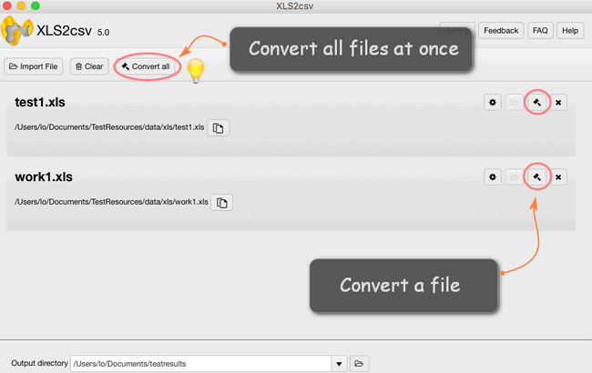

layout: guide
title: How to convert a .xlsx file to .csv on Mac?  
keywords: convert a xlsx file to csv on mac automatically, convert multiple xlsx files to csv on mac, export xlsx file to csv format on mac, convert csv from .xls for Mac, Mac XLS to CSV Converter, shift XLS files to CSV on mac
description: This tutorial explains how to convert XLSX files to CSV on Mac via using a simple and helpful XLS to CSV Converter for Mac. 
---

## What is XLSX?
XLSX is an Excel spreadsheet created with Microsoft Excel another spreadsheet program, version from 2007 and younger. All data distributed document and stored in the cells. Each cell has a unique address, which is denoted by the letters and Arabic numerals. It stores data in worksheets, which contain cells arranged in a grid of rows and columns, and may also contain charts, mathematical functions, styles, and formatting. XLSX files are commonly used to store financial data and to create simple or complex mathematical models.

## What is CSV?
CSV is a text format used for representing tabular data. Each file line is located on a separate line in the table. The values of the columns are separated by a delimiter, most often a comma. However, other symbols can be used as delimiters as well.

## How to convert a .xlsx file to .csv format?
Do you want to convert your Excel spreadsheet to a CSV format in a few easy steps? Matter of fact, if you are able to operate Excel 2007 or younger in your computer, it will be an easiest way for you, because you can just open your XLSX file and save it as CSV format. However, as for a large majority of Mac users, the situation is probably get more complex. Fortunately, you can have an easy-to-use converter-<a href="https://gmagon.com/products/store/xls2csv/" target="_blank" rel="nofollow me noopener noreferrer" >XLS2csv</a> to do your favor with its powerful functions. With this handy desktop application, you can save hours of tedious manual file conversions.

**Step 1**: Import your Excel file or a batch of files into this converter by clicking.

**Step 2**: Set your output directory to put your output in the right file.

**Step 3**: If you want to preview the convert effects, you can see it clearly and also change its coding to CSV UTF-8, UCS-2BE, etc.

**Step 4**: The final step is to click the convert button, you can choose to convert one file at once or convert all files at one click.

It is so easy that you are even able to use this option to  batch convert you multiple XLSX files it really takes the trouble out of your hands:
<a href="https://gmagon.com/products/store/xls2csv/" target="_blank" rel="nofollow me noopener noreferrer" >

Also read
<a href="https://gmagon.com/guide/mac-batch-convert-xls-to-csv.html" target="_blank" rel="nofollow me noopener noreferrer" >Mac batch convert XLS to CSV</a>
<a href="https://gmagon.com/guide/convert-xls-to-csv-on-mac.html" target="_blank" rel="nofollow me noopener noreferrer" >How to convert XLS to CSV on a Mac?</a>
<a href="https://gmagon.com/guide/create-border-radius-css-mac.html" target="_blank" rel="nofollow me noopener noreferrer" >How to create border radius CSS code on Mac?</a>
<a href="https://gmagon.com/guide/convert-xls-on-mac-without-excel.html" target="_blank" rel="nofollow me noopener noreferrer" >Convert XLS to CSV on Mac without Excel installed</a>
<a href="https://gmagon.com/guide/can-i-batch-convert-xls-to-csv-mac.html" target="_blank" rel="nofollow me noopener noreferrer" >Can I batch convert XLS/XLSX to CSV in Mac?</a>
<a href="https://gmagon.com/guide/how-do-i-convert-excel-to-csv-mac.html" target="_blank" rel="nofollow me noopener noreferrer" >How do I convert Excel files to CSV on Mac OS X?</a>