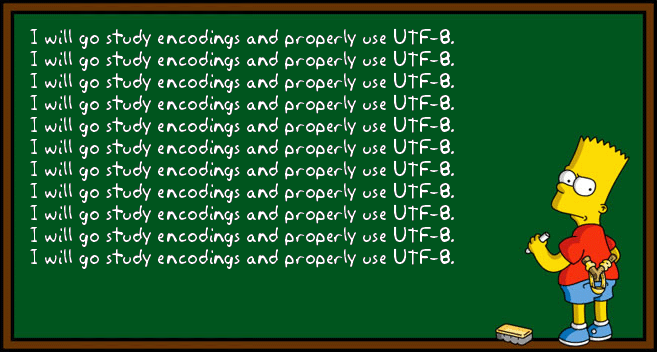
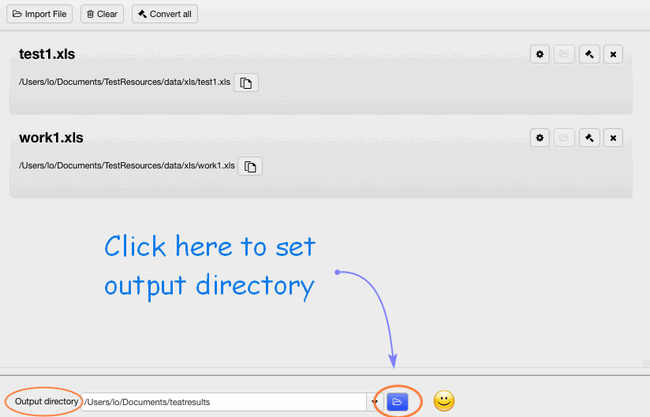

layout: guide
title: How to convert Excel spreadsheets to UTF-8 or UTF-16 CSV on Mac?   
keywords: utf-8 or utf-16 csv excel export mac, excel export as utf-8 or utf-16 csv on mac, xls to UTF-8csv or utf-16 converter mac, create utf-8 csv or utf-16 file from an excel spreadsheet, save as utf-8 csv or utf-16 excel on mac, excel utf-8 or utf-16 encoding csv import, export utf-8 csv or utf-16 from excel
description: How to export utf-8 csv from excel on Mac ? This tutorial guides you the way to convert XLS format to UTF-8 CSV or UTF-16 format on Mac machine.
---

>If there are special symbols, hieroglyphs, or foreign characters, such as tidles and accents, etc. in your Excel spreadsheets. It will not so smooth to convert Excel files to CSV like before. Encoding Excel files into a UTF format is particularly vital when working with foreign or special characters in Email Campaigns, Login/Password Actions, Email Lists, Data Import and Text and Translations. All of those features have the ability to receive CSV file uploads. 

## What is UTF-8 and UTF-16 CSV?
**UTF-8** is a more compact encoding since it uses 1 to 4 bytes for each symbol. Generally, this format is recommended if ASCII characters are most prevalent in your file because most such characters are stored in one byte each. Another advantage is that a UTF-8 file containing only ASCII characters has absolutely the same encoding as an ASCII file.

**UTF-16** uses 2 to 4 bytes to store each symbol. However, a UTF-16 file does not always require more storage than UTF-8. For example, Japanese characters take 3 to 4 bytes in UTF-8 and 2 to 4 bytes in UTF-16. So, you may want to use UTF-16 if your Excel data contains any Asian characters, including Japanese, Chinese or Korean. A noticeable disadvantage of this format is that it's not fully compatible with ASCII files and requires some Unicode-aware programs to display them. Please keep this in mind if you are going to import the resulting file somewhere outside of Excel.

## How to convert an Excel file to UTF-8 and UTF-16 CSV?
Fortunately, you can have an easy-to-use converter-<a href="https://gmagon.com/products/store/xls2csv/" target="_blank" rel="nofollow me noopener noreferrer" >XLS2csv</a> to do your favor with its powerful functions. With this handy desktop application, you can save hours of tedious manual file conversions.

**Step 1**: Import your Excel file or a batch of files into this converter by clicking.

 
**Step 2**: Set your output directory to put your output in the right file.

 
**Step 3**: If you want to preview the convert effects, you can see it clearly 

 
**Step 4**: In the Preview interface, there are "Sheet" and "Others" options for you, here is the sheet select setting:

 
**Step 5**: Clicking "others", you can easily find the coding set, then you can feel free to choose UTF-8 or UTF-16, or any other codings here. 

 
**Step 6**: The final step is to click the convert button, you can choose to convert one file at once or convert all files at one go.

 

Now download it and give it a try.

 
Also read
<a href="https://gmagon.com/guide/mac-batch-convert-xls-to-csv.html" target="_blank" rel="nofollow me noopener noreferrer" >Mac batch convert XLS to CSV</a>
<a href="https://gmagon.com/guide/how-to-convert-a-xlsx-file-to-csv-on-mac.html" target="_blank" rel="nofollow me noopener noreferrer" >How to convert a .xlsx file to .csv on Mac?</a>
<a href="https://gmagon.com/guide/create-border-radius-css-mac.html" target="_blank" rel="nofollow me noopener noreferrer" >How to create border radius CSS code on Mac?</a>
<a href="https://gmagon.com/guide/convert-xls-on-mac-without-excel.html" target="_blank" rel="nofollow me noopener noreferrer" >Convert XLS to CSV on Mac without Excel installed</a>
<a href="https://gmagon.com/guide/can-i-batch-convert-xls-to-csv-mac.html" target="_blank" rel="nofollow me noopener noreferrer" >Can I batch convert XLS/XLSX to CSV in Mac?</a>
<a href="https://gmagon.com/guide/xlsx-to-csv-converter-for-max.html" target="_blank" rel="nofollow me noopener noreferrer" >XLSX to CSV Converter for Mac (bulk conversion supported)</a>