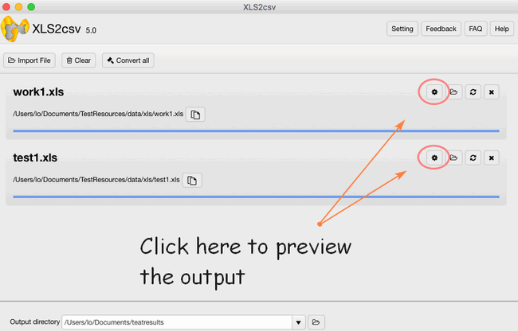

layout: guide
title: How to create UTF-8/UTF-16 CSV from XLS/XLSX on Mac?    
keywords: create utf-8/utf-16 csv from xls/xlsx mac, create utf-8/utf-16 csv from an excel spreadsheet, save CSV in UTF-8 on mac, editing a csv with utf-8/utf-16 encoding on mac, excel export as utf-8 or utf-16 csv on mac, xls to UTF-8csv or utf-16 converter mac
description: If you wonder how to create UTF-8 CSV/UTF-16 CSV from XLS/XLSX on Mac ? This tutorial will guide you the way to create UTF-8 CSV or UTF-16 CSV from XLS/XLSX format on Mac machine.
---

 
## What is UTF-8 and UTF-16 CSV?
**UTF-8** is a more compact encoding since it uses 1 to 4 bytes for each symbol. Generally, this format is recommended if ASCII characters are most prevalent in your file because most such characters are stored in one byte each. Another advantage is that a UTF-8 file containing only ASCII characters has absolutely the same encoding as an ASCII file.

**UTF-16** uses 2 to 4 bytes to store each symbol. However, a UTF-16 file does not always require more storage than UTF-8. For example, Japanese characters take 3 to 4 bytes in UTF-8 and 2 to 4 bytes in UTF-16. So, you may want to use UTF-16 if your Excel data contains any Asian characters, including Japanese, Chinese or Korean. A noticeable disadvantage of this format is that it's not fully compatible with ASCII files and requires some Unicode-aware programs to display them. Please keep this in mind if you are going to import the resulting file somewhere outside of Excel.

### Windows
If you are ready to convert XLS or XLSX files to create UTF-8 or UTF-16 CSV files on Windows. The primary choice would be Microsoft Excel. However, it is said that using Excel for exporting to CSV as it tends to create unreadable characters in CSV files. You can also use Notepad to add the .csv extension and save it as the format you want. what's more, to save CSV file as UTF-8 encoded, you can upload the file on Google Drive and easily store it as UTF-8. 

### Mac
Excel for Mac does not natively support the import or export of UTF-8 encoded files, you cannot get off the ground the same way as what you di in Windows. Microsoft Excel for Mac cannot open a CSV file with UTF-8 characters. To make matters worse, if you put UTF-8 characters into an excel file and try to save it as CSV, it will generate garbage. It just won’t write the proper UTF-8 encoding into the file.

If you spend $20 to download Numbers from the Mac App Store, it turns out that Numbers handles the UTF-8 encoding just fine, but their implementation of reading CSV files in Numbers is buggy.

Fortunately, you can try this easy-to-use converter-<a href="https://gmagon.com/products/store/xls2csv/" target="_blank" rel="nofollow me noopener noreferrer" >XLS2csv</a>. The spreadsheet tool can correctly change files in UTF-8, and it has all of the search and replace functions you need. With this handy desktop application, you can save hours of tedious manual file conversions.
 
## How to create UTF-8 and UTF-16 CSV from XLS/XLSX by XLS2csv?
**Step 1**: Import your Excel file or a batch of files into this converter by clicking.

 
**Step 2**: Set your output directory to put your output in the right file.

 
**Step 3**: If you want to preview the convert effects, you can see it clearly 

 
**Step 4**: In the Preview interface, there are "Sheet" and "Others" options for you, here is the sheet select setting:

 
**Step 5**: Clicking "others", you can easily find the coding set, then you can feel free to choose UTF-8 or UTF-16, or any other codings here. 

 
**Step 6**: The final step is to click the convert button, you can choose to convert one file at once or convert all files at one go.

 
Hopefully the above has given you an insight into the wonderful world of XLS2csv. Now download it and give it a try.

 
Also read
<a href="https://gmagon.com/guide/mac-batch-convert-xls-to-csv.html" target="_blank" rel="nofollow me noopener noreferrer" >Mac batch convert XLS to CSV</a>
<a href="https://gmagon.com/guide/how-to-convert-a-xlsx-file-to-csv-on-mac.html" target="_blank" rel="nofollow me noopener noreferrer" >How to convert a .xlsx file to .csv on Mac?</a>
<a href="https://gmagon.com/guide/create-border-radius-css-mac.html" target="_blank" rel="nofollow me noopener noreferrer" >How to create border radius CSS code on Mac?</a>
<a href="https://gmagon.com/guide/can-i-batch-convert-xls-to-csv-mac.html" target="_blank" rel="nofollow me noopener noreferrer" >Can I batch convert XLS/XLSX to CSV in Mac?</a>
<a href="https://gmagon.com/guide/convert-xls-on-mac-without-excel.html" target="_blank" rel="nofollow me noopener noreferrer" >Convert XLS to CSV on Mac without Excel installed</a>
<a href="https://gmagon.com/guide/xlsx-to-csv-converter-for-max.html" target="_blank" rel="nofollow me noopener noreferrer" >XLSX to CSV Converter for Mac (bulk conversion supported)</a>
<a href="https://gmagon.com/guide/how-to-convert-excel-to-utf-8-or-16-csv-mac.html" target="_blank" rel="nofollow me noopener noreferrer" >How to convert Excel spreadsheets to UTF-8 or UTF-16 CSV on Mac?</a>