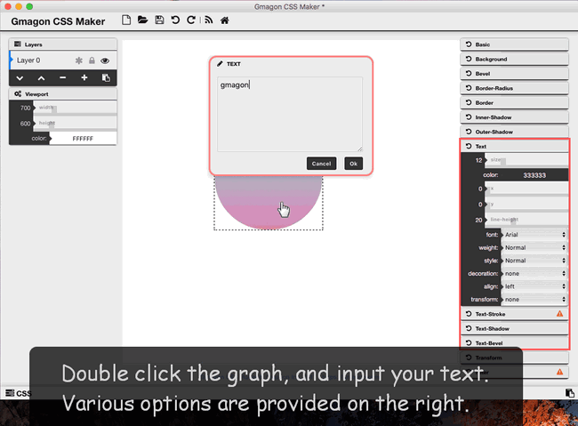
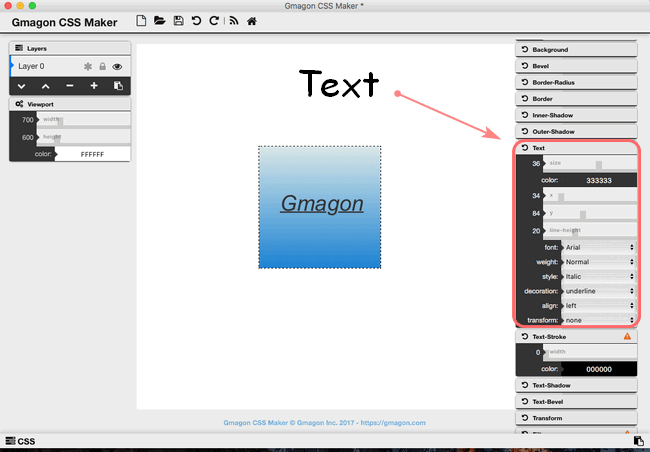
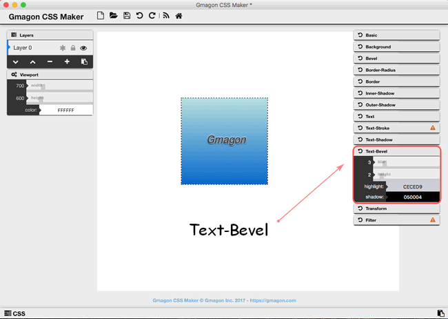

layout: guide
title: The best way to insert text using CSS code on Mac?  
keywords: text css generator on mac, add text with css on mac, create text using css, text css effects, text editor css mac, text css shadow, text css italic
description: This is the best solution dedicated to helping beginners quickly insert text into pages using CSS on Mac. 
---

In this article, you will start your journey towards adding text styling with CSS code. It is not easy for novice to generator precise CSS code, so a easy-to-use and advanced CSS generator tool is necessary to let them get rid of routine coding. <a href="https://gmagon.com/products/store/gmagon_css_maker/" target="_blank" rel="noopener">Gmagon CSS Maker</a>-a powerful and advanced CSS2/CSS3 generator on Mac that allows you creating a nice look without writing a code.

>Generating text styling with CSS is one of the powerful functions of Gmagon CSS Maker. It provides style sheet with options that you need, like text size, color, font, text-stroke, text-shadow, and text-bevel,etc. Once you click a style sheet, you will get the text preview automatically, then get the corresponding CSS code. It is such a simple and great way to create and chnage the text style in the procession of coding. If you are interested in our product, you can see more details in <a href="https://gmagon.com/products/store/gmagon_css_maker/docs.html" target="_blank" rel="noopener">here</a>

 

## what is CSS text?
 This text is styled with some of the text formatting properties. The heading uses the text-align, text-transform, and color properties. The paragraph is indented, aligned, and the space between characters is specified. The underline is removed from this colored "Try it Yourself" link.

## How to insert text with CSS on Mac?
1. You can download and install Gmagon CSS Maker on you Mac machine(**macOS 10.7(64-bit)** or newer is required):

2. Run the Gmagon CSS Maker on your Mac, click "Continue" to open it. Double click the graph and input your text.

3. Click the "Text" sheet, you can choose the size, position, font, style and transformation of the text.

4. In "Text-Shadow" sheet, you can make your text be blur, pan its shadow vertically and horizontally, and change its color as you wish.

5. When you want to add visual depth to your text, you need to use this text-bevel function. Increasing he height of bevel helps to create a 3-dimensional look to the face of your text.

Hope this article will solve your problems and make your life more convenient than ever. We'd like to receive and answer any question from you, if you are willing to communicate with us, you can join in <a href="https://gitter.im/Gmagon/support" target="_blank"> <strong>Support Center</strong> </a> to enter our community. 

Also read:
<a href="https://gmagon.com/guide/mac-batch-convert-xls-to-csv.html" target="_blank" rel="noopener">Mac batch convert XLS to CSV</a>
<a href="https://gmagon.com/guide/convert-xls-to-csv-on-mac.html" target="_blank" rel="noopener">How to convert XLS to CSV on a Mac?</a>
<a href="https://gmagon.com/guide/create-border-radius-css-mac.html" target="_blank" rel="noopener">How to create border radius CSS code on Mac?</a>
<a href="https://gmagon.com/guide/convert-xls-on-mac-without-excel.html" target="_blank" rel="noopener">Convert XLS to CSV on Mac without Excel installed.</a>
