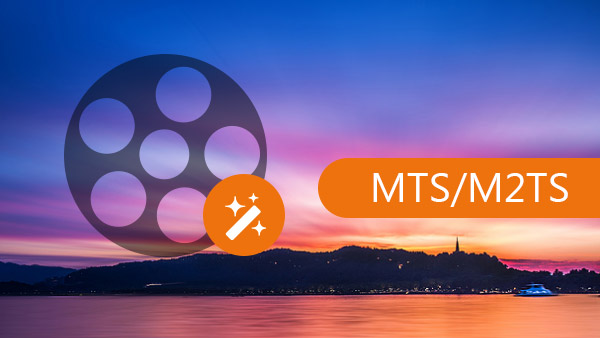

layout: guide
title: Best MTS/M2TS to MP3 converter on Mac    
keywords: best MTS/M2TS to MP3 converter Mac, extract MP3 audio from MTS/M2TS, convert MTS/M2TS to MP3 on Mac, best mac MTS/M2TS to MP3 extractor 
description: If you want to know how to convert MTS/M2TS to MP3 in high quality on Mac, then you come to the right place. 
---

 

## What is M2TS
M2TS is a filename extension used for the BDAV MPEG-2 Transport Stream container file format, for multiplexing audio, video and other streams. This container format is commonly used for high definition video on AVCHD and Blu-ray Disc. In other word, M2TS refers to the stream packaging container for Blu-ray BDMV, the file extension of which is "m2ts" having a five-digit number. The BDAV container format (.m2ts) is a standard used on Blu-ray Discs. The M2TS files on a Blu-ray Disc are placed in the subdirectory "STREAM" of "BDMV" (or "BDAV") directory, which is at the root level.
 
## MTS vs M2TS
MTS and M2TS are both file extensions for AVCHD, that is the HD digital video camera recorder format, and they both support 720p and 1080i HD video formats. They all play in great quality in 1080i direct on the PC or to a Sony TV using composite video or HDMI. MTS and M2TS files are all forms of MPEGs, Ted.

According to Wikipedia, they are slightly distinguishing. HD cameras record .mts but export as .m2ts. While the file extension of AVCHD video is MTS, if imported to computer, it will become M2TS. MTS is the format not collected by specific software, and will change into the video file with M2TS as the file extension after collection.
 
>**Supported Devices**:
M2TS files can also be played on Sony PlayStation 3s (PS3), Sony Bravia TVs, Western Digital WDTVs, Xtreamer media player, Amkette FlashTV HD Media Player and Panasonic Viera TVs supporting playback of AVCHD.

Both MTS and M2TS files can be accepted by Windows Media Player, VLC, 5KPlayer, as well as Apple's Final Cut Pro by using the AVCHD plugin in the Log and Transfer window. 
 
## Why convert MTS/M2TS to MP3
When it comes to the internet world then above all doubts the mp3 format is a de facto standard that is in use for a very long period of time now and it makes sure that the files are not only played but they are also converted without any issue and problem. It is also to be noted that the mp3 format is in use since 1993 to make sure that the users are provided with the best services and the files are played in smooth and calm manner.
 
## How to Convert MTS/M2TS to MP3 in Quick & Easy Steps
Featuring simple and intuitive interface, fast conversion speed, as well as great ability to handle almost all audio/video formats, Gmagon TryToMP3 is positioned as one of the best MTS/M2TS to MP3 Converter for Mac. Check a quick guide on how to convert MTS/M2TS to MP3 on Mac via using this app. 

Step 1: Install and run Gmagon TryToMP3 on your Mac. Click “Continue” to try it out or click “Buy” to purchase it directly.

 
Step 2: After clicking “Continue”, switch to “Convert”, and the following interface will show up. 

 
Step 3: Click “Import files” or “Import directory” to add video files that you want to extract audio from.  

 
Step 4: Click “Output directory” to set output path. When ready, click “Convert” to start.

 
Step 5: When the conversion is complete, click “Reveal in Folder” to find the generated MP3 files. 

 
With <a href="https://gmagon.com/products/store/trytomp3/" target="_blank"> the best MTS/M2TS to MP3 converter</a> installed on your Mac, you can easily extract audio tracks from multiple .mts/.m2ts files and save them as MP3. Hope this helps.  

 
Also read 
<a href="https://gmagon.com/guide/trytomp3/how-can-i-convert-flac-to-mp3.html" target="_blank" >How can I convert FLAC to MP3?</a>
<a href="https://gmagon.com/guide/trytomp3/how-can-i-convert-aac-to-mp3.html " target="_blank" >How can I convert AAC to MP3?</a>
<a href="https://gmagon.com/guide/trytomp3/trytomp3ver4.1.0.html" target="_blank" >Gmagon TryToMP3 4.1.0 has been released</a>
<a href="https://gmagon.com/guide/trytomp3/extract-audio-to-mp3-mac.html" target="_blank" >How to extract an audio from a video to MP3 on Mac?</a>
<a href="https://gmagon.com/guide/trytomp3/best-mov-to-mp3-converter.html" target="_blank" >Best MOV to MP3 converter-convert MOV to MP3 on Mac</a>
<a href="https://gmagon.com/guide/trytomp3/best-tool-to-convert-mpg-to-mp3.html" target="_blank" >Best MPG to MP3 converter-convert MPG to MP3 on Mac</a>
<a href="https://gmagon.com/guide/trytomp3/best-tool-to-convert-avi-to-mp3.html" target="_blank" >Best .avi to .mp3 converter-convert .avi to .mp3 on Mac</a>
<a href="https://gmagon.com/guide/trytomp3/best-tool-to-convert-ac3-to-mp3.html" target="_blank" >Best solutions to convert AC3 to MP3 on Mac</a>
<a href="https://gmagon.com/guide/trytomp3/best-solutions-to-convert-mka-to-mp3.html" target="_blank" >Best solutions to convert MKA to MP3 on Mac</a>
<a href="https://gmagon.com/guide/trytomp3/best-solutions-to-convert-vob-to-mp3.html" target="_blank" >Best solutions to convert VOB to MP3 on Mac</a>

