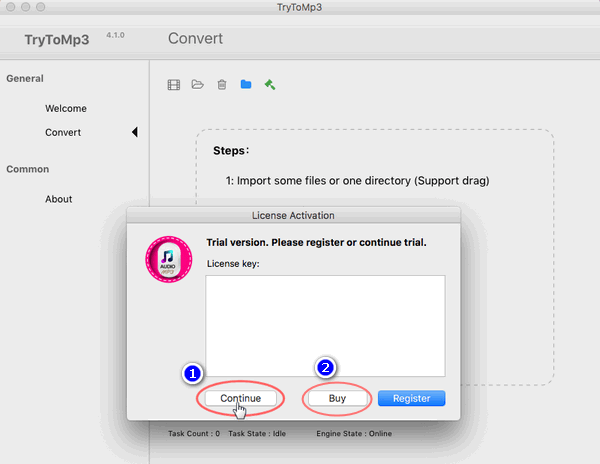

layout: guide
title: Best solutions to convert VOB to MP3 on Mac    
keywords: best VOB to MP3 converter Mac, extract MP3 audio from VOB, convert VOB to MP3 on Mac, best mac VOB to MP3 extractor 
description: Do you want to know how to convert VOB to MP3 in high quality on Mac, you can find the best solution here. 
---
Do you want to know how to convert VOB to MP3 in high quality on Mac, you can find the best solution here. 

 

>Have you downloaded an amazing music video from YouTube, captured your favorite computer game or received a DVD of a film with an Oscar-winning soundtrack? 

>Do you want to save songs, sounds, or music themes from your video for your iPod or cell phone but don’t know how to extract MP3 from MP4, VOB, or other video files?

 
If so, you come to the right place, because with the <a href="https://gmagon.com/products/store/trytomp3/" target="_blank"> the best VOB to MP3 converter</a> here for you to quickly convert VOB files to MP3 format. This tool can clear out all the above dilemmas with simple operations.

 
## What is VOB?
VOB is short for Video Object which is a container file format specifically used for DVD-Video media and it is one of the most common formats for storing video and audio streams on DVD discs. The VOB files are encoded using MPEG-2 codec standards and may contain Audio, Video, Menu and Subtitles. 

VOB files are a container, which consist of 3 things. They consist of video, audio and subtitle streams. The video stream is in MPEG-2 format, the audio however can be in various forms such AC3 - which is the most common, MPEG-2 multichannel, MPEG-1 Layer 2 dual channel or VOB format. The reason AC3 is the most common is that it offers a good compromise between quality and bitrate.

 
## What’s the best VOB to MP3 converter for Mac
Sometimes, you may have the desire to convert VOB to MP3 for playback on your Apple, Samsung, HTC, Sony or other devices, or burning to CD, etc. 

Featuring simple and intuitive interface, fast conversion speed, as well as great ability to handle almost all audio/video formats, Gmagon TryToMP3 is positioned as one of the best VOB to MP3 Converter for Mac. Check a quick guide on how to convert VOB to MP3 on Mac via using this app. 

 
## How to convert VOB to MP3 on Mac?
Step 1: Install and run Gmagon TryToMP3 on your Mac. Click “Continue” to try it out or click “Buy” to purchase it directly.

 
Step 2: After clicking “Continue”, switch to “Convert”, and the following interface will show up. 

 
Step 3: Click “Import files” or “Import directory” to add VOB video files that you want to extract audio from.  

 
Step 4: Click “Output directory” to set output path. When ready, click “Convert” to start.

 
Step 5: When the conversion is complete, click “Reveal in Folder” to find the generated MP3 files. 

 
With <a href="https://gmagon.com/products/store/trytomp3/" target="_blank"> the best VOB to MP3 converter</a> installed on your Mac, you can easily extract audio tracks from multiple VOB files and save them as MP3. Hope this helps.  

 
Also read 
<a href="https://gmagon.com/guide/trytomp3/how-can-i-convert-flac-to-mp3.html" target="_blank" >How can I convert FLAC to MP3?</a>
<a href="https://gmagon.com/guide/trytomp3/how-can-i-convert-aac-to-mp3.html " target="_blank" >How can I convert AAC to MP3?</a>
<a href="https://gmagon.com/guide/trytomp3/trytomp3ver4.1.0.html" target="_blank" >Gmagon TryToMP3 4.1.0 has been released</a>
<a href="https://gmagon.com/guide/trytomp3/extract-audio-to-mp3-mac.html" target="_blank" >How to extract an audio from a video to MP3 on Mac?</a>
<a href="https://gmagon.com/guide/trytomp3/best-mov-to-mp3-converter.html" target="_blank" >Best MOV to MP3 converter-convert MOV to MP3 on Mac</a>
<a href="https://gmagon.com/guide/trytomp3/best-tool-to-convert-mpg-to-mp3.html" target="_blank" >Best MPG to MP3 converter-convert MPG to MP3 on Mac</a>
<a href="https://gmagon.com/guide/trytomp3/best-tool-to-convert-avi-to-mp3.html" target="_blank" >Best .avi to .mp3 converter-convert .avi to .mp3 on Mac</a>
<a href="https://gmagon.com/guide/trytomp3/best-tool-to-convert-ac3-to-mp3.html" target="_blank" >Best solutions to convert AC3 to MP3 on Mac</a>
<a href="https://gmagon.com/guide/trytomp3/best-solutions-to-convert-mka-to-mp3.html" target="_blank" >Best solutions to convert MKA to MP3 on Mac</a>

