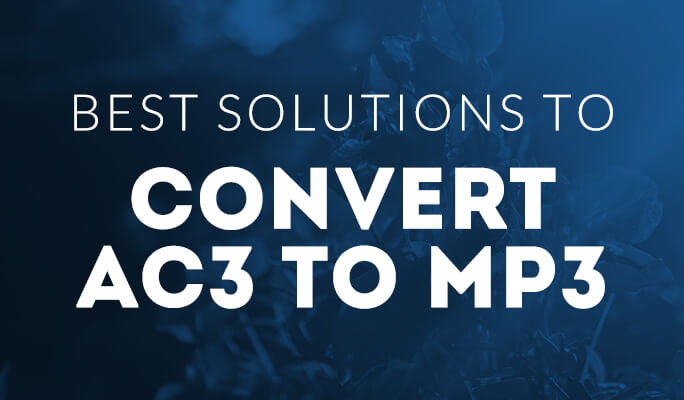

layout: guide
title: Best AC3 to MP3 converter-convert AC3 to MP3 on Mac    
keywords: best AC3 to MP3 converter Mac, extract MP3 audio from AC3, convert AC3 to MP3 on Mac, best mac AC3 to MP3 extractor 
description: If you are looking for software programs that can extract MP3 audio from AC3 on Mac, you may wish to know what the best AC3 to MP3 Converter for Mac is. 
---

 
Owning to your personal enjoyment or for professional projects, when you start downloading music files, you will need to make sure that all of the audio files are in a convenient format that is accessible from every device. As an example, in order to play on their smart phones, MP3 players, or even video game consoles, most people need their audio files to be MP3s. As conversion technology becomes more and more popular, users are now able to convert relatively any type of file into the file type that they need, including AC3 to MP3.

 
## What is AC3?

AC3 is an audio format for surround audio files used on  DVDs format. Its compression method was created by Dolby Labs for use in a Dolby Digital audio on DVD, Blu-ray and other digital video formats. AC-3 stands for Audio Coding 3. In order for the file to be correctly decoded and output, a DVD player with a Dolby Digital compatible home cinema system is required. It became the de facto standard for surround sound, and has held that position since its inception in 1992, with it coming to home cinema in 1995.

AC3 allows for separate audio to be defined for each of the 6 speakers in the standard cinema and home cinema setup. This produces the effect of surround sound to the person listening to the audio file. The six channels consist of right front, center, left front, rear right, rear left and a sub woofer.

 
## What’s the best AC3 to MP3 Converter for Mac
Sometimes, you may have the desire to convert AC3 to MP3 for playback on your Apple, Samsung, HTC, Sony or other devices, or burning to CD, etc. 

Featuring simple and intuitive interface, fast conversion speed, as well as great ability to handle almost all audio/video formats, Gmagon TryToMP3 is positioned as one of the best AC3 to MP3 Converter for Mac. Check a quick guide on how to convert AC3 to MP3 on Mac via using this app. 

 
### How to convert AC3 to MP3 on Mac?
Step 1: Install and run Gmagon TryToMP3 on your Mac. Click “Continue” to try it out or click “Buy” to purchase it directly.

 
Step 2: After clicking “Continue”, switch to “Convert”, and the following interface will show up. 

 
Step 3: Click “Import files” or “Import directory” to add AC3 video files that you want to extract audio form.  

 
Step 4: Click “Output directory” to set output path. When ready, click “Convert” to start.

 
Step 5: When the conversion is complete, click “Reveal in Folder” to find the generated MP3 files. 

 
With <a href="https://gmagon.com/products/store/trytomp3/" target="_blank"> the best AC3 to MP3 converter</a> installed on your Mac, you can easily extract audio tracks from multiple AC3 files and save them as MP3. Hope this helps.  

 
Also read 
<a href="https://gmagon.com/guide/trytomp3/how-can-i-convert-flac-to-mp3.html" target="_blank" >How can I convert FLAC to MP3?</a>
<a href="https://gmagon.com/guide/trytomp3/how-can-i-convert-aac-to-mp3.html " target="_blank" >How can I convert AAC to MP3?</a>
<a href="https://gmagon.com/guide/trytomp3/trytomp3ver4.1.0.html" target="_blank" >Gmagon TryToMP3 4.1.0 has been released</a>
<a href="https://gmagon.com/guide/trytomp3/extract-audio-to-mp3-mac.html" target="_blank" >How to extract an audio from a video to MP3 on Mac? </a>
<a href="https://gmagon.com/guide/trytomp3/best-mov-to-mp3-converter.html" target="_blank" >Best MOV to MP3 converter-convert MOV to MP3 on Mac </a>
<a href="https://gmagon.com/guide/trytomp3/best-tool-to-convert-mpg-to-mp3.html" target="_blank" >Best MPG to MP3 converter-convert MPG to MP3 on Mac </a>

