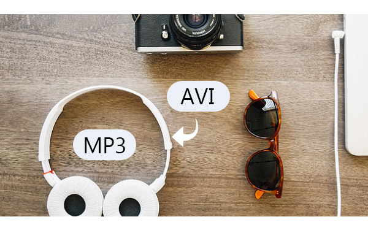

layout: guide
title: Best .avi to .mp3 converter-convert .avi to .mp3 on Mac    
keywords: best .avi to .mp3 converter Mac, extract .mp3 audio from .avi, convert .avi to .mp3 on Mac, best mac .avi to .mp3 extractor 
description: If you are looking for software programs that can extract .mp3 audio from .avi on Mac, you may wish to know what the best .avi to .mp3 Converter for Mac is. 
---

 
## What is AVI?

 

AVI is short for Audio Video Interleave which stands for a file with  the AVI file extension is a commonly used file format developed by Microsoft for storing both video and audio data in a single file.

The AVI format is based off of the Resource Interchange File Format (RIFF), a container format used to store multimedia data. AVI is typically less compressed than other, more popular formats like MOV and MPEG, meaning that an AVI file will be larger than the same file in one of those more compressed formats.

AVI combines audio and video into a single file in a standard container to allow simultaneous playback. Its advatage is a simple architecture, due to which AVI runs on a number of different systems like Windows, Mac, Linux, Unix and is supported by all of the most popular web-browsers.

 
## What’s the best AVI to MP3 Converter for Mac
Sometimes, you may have the desire to convert AVI to MP3 for playback on your Apple, Samsung, HTC, Sony or other devices, or burning to CD, etc. 

Featuring simple and intuitive interface, fast conversion speed, as well as great ability to handle almost all audio/video formats, Gmagon TryToMP3 is positioned as one of the best AVI to MP3 Converter for Mac. Check a quick guide on how to convert AVI to MP3 on Mac via using this app. 

 
### How to convert AVI to MP3 on Mac?
Step 1: Install and run Gmagon TryToMP3 on your Mac. Click “Continue” to try it out or click “Buy” to purchase it directly.

 
Step 2: After clicking “Continue”, switch to “Convert”, and the following interface will show up. 

 
Step 3: Click “Import files” or “Import directory” to add AVI video files that you want to extract audio from.  

 
Step 4: Click “Output directory” to set output path. When ready, click “Convert” to start.

 
Step 5: When the conversion is complete, click “Reveal in Folder” to find the generated MP3 files. 

 
With <a href="https://gmagon.com/products/store/trytomp3/" target="_blank"> the best AVI to MP3 converter</a> installed on your Mac, you can easily extract audio tracks from multiple AVI files and save them as MP3. Hope this helps.  

 
Also read 
<a href="https://gmagon.com/guide/trytomp3/how-can-i-convert-flac-to-mp3.html" target="_blank" >How can I convert FLAC to MP3?</a>
<a href="https://gmagon.com/guide/trytomp3/how-can-i-convert-aac-to-mp3.html " target="_blank" >How can I convert AAC to MP3?</a>
<a href="https://gmagon.com/guide/trytomp3/trytomp3ver4.1.0.html" target="_blank" >Gmagon TryToMP3 4.1.0 has been released</a>
<a href="https://gmagon.com/guide/trytomp3/extract-audio-to-mp3-mac.html" target="_blank" >How to extract an audio from a video to MP3 on Mac? </a>
<a href="https://gmagon.com/guide/trytomp3/best-mov-to-mp3-converter.html" target="_blank" >Best MOV to MP3 converter-convert MOV to MP3 on Mac </a>
<a href="https://gmagon.com/guide/trytomp3/best-tool-to-convert-mpg-to-mp3.html" target="_blank" >Best MPG to MP3 converter-convert MPG to MP3 on Mac </a>

