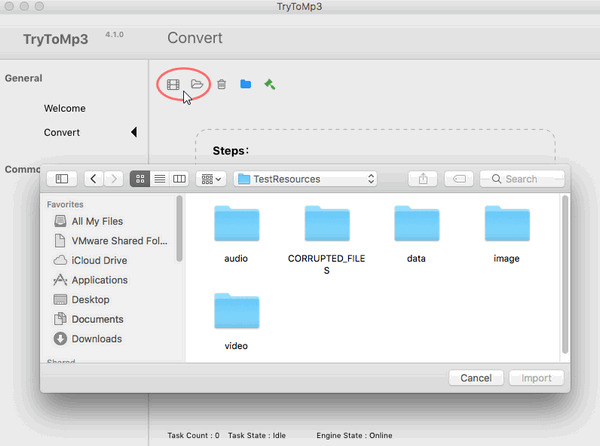
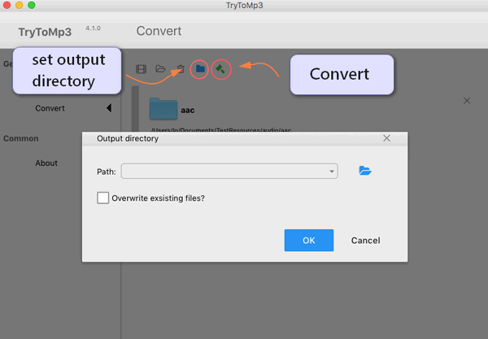

layout: guide
title: Best MPG to MP3 converter-convert MPG to MP3 on Mac    
keywords: best mpg to mp3 converter Mac, extract mp3 audio from mpg, convert mpg to mp3 on Mac, best mac mpg to mp3 extractor 
description: If you are looking for software programs that can extract MP3 audio from MPG on Mac, you may wish to know what the best MPG to MP3 Converter for Mac is. 
---

 
## What is MPG?
MPG is short for MPGing Picture Experts Group, it is a video format that combines MPEG-1 or MPEG-2 video formats as well as audio formats. MPG is designed to compress audio and video to formats that can be downloaded. MPGies with this extension are of lower sizes and greater quality, but quality differs from original VCR videos. This file format can run on Mac, Windows and other portable devices.

 
## What’s the best MPG to MP3 Converter for Mac
Sometimes, you may have the desire to convert MPEG to MP3 for playback on your Apple, Samsung, HTC, Sony or other devices, or burning to CD, etc. 

Featuring simple and intuitive interface, fast conversion speed, as well as great ability to handle almost all audio/video formats, Gmagon TryToMP3 is positioned as one of the best MPG to MP3 Converter for Mac. Check a quick guide on how to convert MPG to MP3 on Mac via using this app. 

 
### How to convert MPG to MP3 on Mac?
Step 1: Install and run Gmagon TryToMP3 on your Mac. Click “Continue” to try it out or click “Buy” to purchase it directly.

 
Step 2: After clicking “Continue”, switch to “Convert”, and the following interface will show up. 

 
Step 3: Click “Import files” or “Import directory” to add MPG video files that you want to extract audio from.  

 
Step 4: Click “Output directory” to set output path. When ready, click “Convert” to start.

 
Step 5: When the conversion is complete, click “Reveal in Folder” to find the generated MP3 files. 

 
With <a href="https://gmagon.com/products/store/trytomp3/" target="_blank"> the best MPG to MP3 converter</a> installed on your Mac, you can easily extract audio tracks from multiple MPG files and save them as MP3. Hope this helps.  

 
Also read 
<a href="https://gmagon.com/guide/trytomp3/how-can-i-convert-flac-to-mp3.html" target="_blank" >How can I convert FLAC to MP3?</a>
<a href="https://gmagon.com/guide/trytomp3/how-can-i-convert-aac-to-mp3.html " target="_blank" >How can I convert AAC to MP3?</a>
<a href="https://gmagon.com/guide/trytomp3/trytomp3ver4.1.0.html" target="_blank" >Gmagon TryToMP3 4.1.0 has been released</a>
<a href="https://gmagon.com/guide/trytomp3/extract-audio-to-mp3-mac.html" target="_blank" >How to extract an audio from a video to MP3 on Mac? </a>
<a href="https://gmagon.com/guide/trytomp3/best-mov-to-mp3-converter.html" target="_blank" >Best MOV to MP3 converter-convert MOV to MP3 on Mac </a>