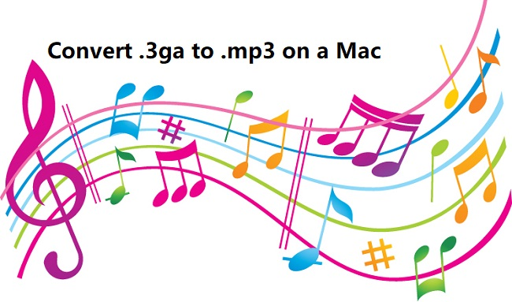

layout: guide
title: Convert 3GA to MP3 on Mac    
keywords: convert audio from .3ga to .mp3 on Mac, convert 3GA to MP3 on a Mac, open a .3ga file on my Mac, encode 3GA to MP3 on Mac, convering .3ga audio to .mp3 format on Mac 
description: How can I convert audio files from .3ga to .mp3 on Mac? If you are looking for a solution to do this, you may wish to read this article. 
---
How can I convert audio files from .3ga to .mp3 on Mac? If you are looking for a solution to do this, you may wish to read this article. It explains what 3GA is and walks you through how to convert 3GA to MP3 on a Mac machine. 

>**How can I open a .3ga file on my Mac?**
>“Hi all, my sister sent me a .3ga file from her old Samsung Galaxy S2 phone. I couldn’t open it in any of the Applications I had on my MacBook Pro. Is there any workaround to go through this? I would really appreciate any help. Thanks in advance.” 

To solve 3GA incompability issues on Mac, you’d better convert .3ga to the widely-supported .mp3, which is playable on almost all kinds of media players and mobile deivces. Gmagon TryToMP3 is a proper option to do this. Learn how to encode 3GA to MP3 on Mac via using this app. 
### How to convert 3GA to MP3 on Mac? 
Here’s what you need
Gmagon TryToMP3

To convert 3ga audio to mp3 on Mac, follow these steps:
Step 1. Install and run Gmagon TryToMP3 on your Mac. Click “Continue” to try it out or click “Buy” to purchase it directly.  

Step 2. After clicking “Continue”, switch to “Convert”, and the following interface will pop up.    
           

Step 3. Click “Import files” or “Import directory” to add audio files that you want to convert to MP3 format. More than converting .3ga files to MP3, this app can also convert various other video and audio files to MP3 format on a Mac machine.

After files loaded, click “Output directory” to set output path. When ready, click “Convert” to start. When the conversion is complete, click “Reveal in Folder” to find the generated MP3 files.
 

That’s the whole process of convering .3ga audio to .mp3 format on Mac via using Gmagon <a href="https://gmagon.com/products/store/trytomp3/" target="_blank">TryToMP3</a>. Hope it helps. 

Also read
<a href="https://gmagon.com/guide/trytomp3/convert-opus-to-mp3-mac.html" target="_blank" >How to convert Opus to MP3 on Mac?</a>
<a href="https://gmagon.com/guide/trytomp3/convert-large-mov-to-mp3-mac.html " target="_blank" >How to convert large MOV to MP3 on Mac?</a>
<a href="https://gmagon.com/guide/trytomp3/convert-amr-to-mp3-mac.html" target="_blank" >AMR to MP3 - convert .amr to .mp3 on Mac</a>
<a href="https://gmagon.com/guide/trytomp3/convert-qt-audio-to-mp3-mac.html" target="_blank" >How to convert quicktime audio to mp3 on Mac? </a>
