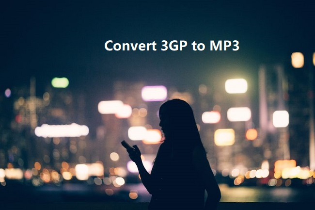

layout: guide
title: How do I convert a .3gp file to .mp3 on Mac?    
keywords: what a 3GP file is, convert .3gp files to .mp3 format on Mac, extract audio from.3gp as MP3 on Mac, encoding 3GP files to MP3 format on Mac 
description: This article explains what a 3GP file is and how to convert .3gp files to .mp3 format on Mac OS X. 
---
This article explains what a 3GP file is and how to convert .3gp files to .mp3 format on Mac OS X. If you are just right looking for such a solution, simply keep reading. 

### What is a 3GP file? 
.3gp and .3g2 are file extensions for video in 3GP format. This is a multimedia container format used by mobile phones. 3GP is a simplified version of the MP4 format and was designed to make file sizes smaller so mobile phones could support video.

There are two standards for this format: 3GPP, with the file extension .3gp, and 3GPP2, with the file extension .3g2. 3GPP and 3GPP2 stand for 3rd Generation Partnership Project and 3rd Generation Partnership Project 2 respectively. These were separate collaboration agreements between several countries standardizing mobile phone formats. 3GPP files are for GSM based phones, 3GPP2 files are for CDMA based phones.

The 3GP file format can store video streams as either MPEG-4 Part 2, H.263 or MPEG-4 Part 10 (AVC/H.264), and audio streams as AMR-NB, AMR-WB, AMR-WB+, AAC-LC, HE-AAC v1 or Enhanced aacPlus (HE-AAC v2).
### How do I convert a .3gp file to .mp3 on Mac?
>“Hello guys, is there a way to extract audio from.3gp files and save them as MP3 on my Mac? I am currently looking for a way to convert 3GP files to MP3 format so I can use them in a project. Any recommendations? Thanks.” 

With Gmagon TryToMP3 installed, you can easily and quickly convert a bundle of 3GP files to MP3 format on Mac. First of all, download a free trial of this app. 

Then follow these steps: 
Step 1. Install and run Gmagon TryToMP3 on your Mac. Click “Continue” to try it out or click “Buy” to purchase it directly.  

Step 2. After clicking “Continue”, switch to “Convert”, and the following interface will pop up.  
        

Step 3. Click “Import files” or “Import directory” to add audio files that you want to convert to MP3 format. More than converting 3GP files to MP3, this app can also convert a wide variety of other video/audio files to MP3 format on Mac.

After files loaded, click “Output directory” to set output path. When ready, click “Convert” to start. When the conversion is complete, click “Reveal in Folder” to find the generated MP3 files.
 

That’s the whole process of encoding 3GP files to MP3 format on Mac via using Gmagon <a href="https://gmagon.com/products/store/trytomp3/" target="_blank">TryToMP3</a>. Hope it helps. 

Also read
<a href="https://gmagon.com/guide/trytomp3/convert-opus-to-mp3-mac.html" target="_blank" >How to convert Opus to MP3 on Mac?</a>
<a href="https://gmagon.com/guide/trytomp3/convert-3ga-to-mp3-mac.html" target="_blank" >How to convert 3GA to MP3 on Mac?</a>
<a href="https://gmagon.com/guide/trytomp3/convert-amr-to-mp3-mac.html" target="_blank" >AMR to MP3 - convert .amr to .mp3 on Mac</a>
<a href="https://gmagon.com/guide/trytomp3/convert-qt-audio-to-mp3-mac.html" target="_blank" >How to convert quicktime audio to mp3 on Mac? </a>

