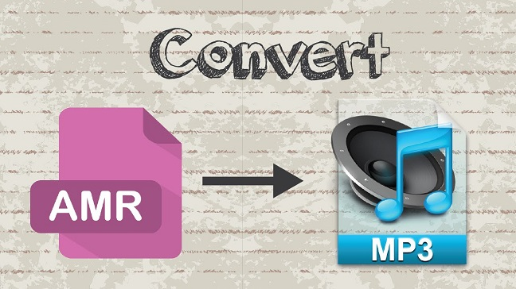

layout: guide
title: AMR to MP3 - convert .amr to .mp3 on Mac     
keywords: convert .amr files to .mp3 format on Mac, AMR to MP3 Converter for Mac, AMR to MP3 conversion on Mac, convert AMR files to MP3 on a Mac, transcode AMR to MP3 on Mac 
description: Learn how to convert .amr files to .mp3 format on Mac via using a fast and easy-to-use AMR to MP3 Converter for Mac.   
---
Learn how to convert .amr files to .mp3 format on Mac via using a fast and easy-to-use AMR to MP3 Converter for Mac. 

**User questions regarding to AMR to MP3 conversion on Mac**
Question 1: “I have a file that is .amr. I can't use it in Logic Pro. If there is a way to convert it to .mp3 or anything else compatible for Logic, please let me know.” 

Question 2: “Is there any program that allows you to convert an .amr file to an mp3 on Mac? I'm trying to get a recorded phone conversation on my computer and convert it. Can someone help me out? I tried google, but it seems like most of them are for windows. Thanks!”

Question 3: “I'm trying to import .amr audio files into an imovie 11 project. My only option under Edit>import is movie, so, when I choose "movie" and locate the file on my desktop, it is not available (grayed out). How can I convert the original file [downloaded from my cell phone (.amr)] to an MP3 audio that I can use in imovie?” 

What is an amr file? If this is the first time you are hearing about that format, keep reading to learn more.
### What is an AMR file? 
A file with the AMR file extension is an Adaptive Multi-Rate ACELP Codec file. ACELP is a human speech audio compression algorithm that stands for Algebraic Code Excited Linear Prediction.

It is mostly used in recording audio or speech on mobile devices. When you use the audio recorder of your mobile phone, the file recorded is usually saved by default of AMR. It is smaller than the size of audio file saved in MP3 format.
### How to convert AMR files to MP3 on a Mac? 
If for whatever reason you need to convert AMR files to MP3 format on Mac, I would recommend using Gmagon TryToMP3, a fast and simple audio converter app on Mac. You can download it below to have a try. It provides 30-day free trial. 

To transcode AMR to MP3 on Mac, follow these steps:
Step 1. Install and run Gmagon TryToMP3 on your Mac. Click “Continue” to try it out or click “Buy” to purchase it directly.  

Step 2. After clicking “Continue”, switch to “Convert”, and the following interface will pop up.  

Step 3. Click “Import files” or “Import directory” to add audio files that you want to convert to MP3 format. More than converting audio files to MP3, this app can also extract audio tracks from various videos and save them as MP3.

After files loaded, click “Output directory” to set output path. When ready, click “Convert” to start. When the conversion is complete, click “Reveal in Folder” to find the generated MP3 files.

That’s all. Hope this will help those who are looking for a software program to <a href="https://gmagon.com/products/store/trytomp3/" target="_blank">transcode AMR files to MP3 on Mac</a>. 

Also read
<a href="https://gmagon.com/guide/trytomp3/convert-ape-to-mp3-mac.html" target="_blank" >How do I convert APE to MP3 on Mac?</a>
<a href="https://gmagon.com/guide/trytomp3/extract-mkv-audio-to-mp3-mac.html" target="_blank" >Extract soundtracks from MKV to MP3 on Mac</a>
<a href="https://gmagon.com/guide/trytomp3/convert-audio-to-mp3-mac.html" target="_blank" >How to convert a song to MP3 format on Mac?</a>
<a href="https://gmagon.com/guide/trytomp3/best-mov-to-mp3-converter.html" target="_blank" >Best MOV to MP3 converter-convert MOV to MP3 on Mac</a>
