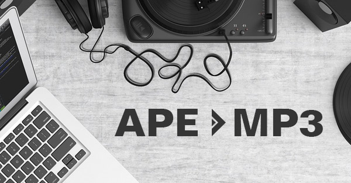

layout: guide
title: How do I convert APE to MP3 on Mac?     
keywords: converting APE files to MP3 format on Mac, convert APE to MP3 prior, converting APE to MP3 on Mac in batch, encode APE files to MP3 on Mac 
description: This article has been written to display the process of converting APE files to MP3 format on Mac OS X. 
---
This article has been written to display the process of converting APE files to MP3 format on Mac OS X. 

APE format (also known as Monkey's Audio) is an algorithm and file format for lossless audio data compression, which is freely available to users with plug-ins for playback on most popular media players. However, the lack of cross-platform support makes it more limited for use.

APE files can not be played by all modern audio players. If you want to transfer your APE files to your iPod, iPhone, iPad, Android tablet, or smart phone, use a good audio converter to convert APE to MP3 prior. 

If you want something converted quickly, without a lot of fuss and bother, then <a href="https://gmagon.com/products/store/trytomp3/" target="_blank">Gmagon TryToMP3</a> is what you need. This little software does a fantastic job at converting APE to MP3 on Mac in batch mode.      
### How to convert APE to MP3 on Mac via using Gmagon TryToMP3? 
First of all, download a free trial of Gmagon TryToMP3

Then do as below: 
Step 1. Install and run Gmagon TryToMP3 on your Mac. Click “Continue” to try it out or click “Buy” to purchase it directly.  

Step 2. After clicking “Continue”, switch to “Convert”, and the following interface will pop up. 

Step 3. Click “Import files” or “Import directory” to add audio files that you want to convert to MP3 format. More than converting audio files to MP3, this app can also extract audio tracks from various videos and save them as MP3. 

After files loaded, click “Output directory” to set output path. When ready, click “Convert” to start. When the conversion is complete, click “Reveal in Folder” to find the generated MP3 files.  

That’s all. Hope this will help those who are looking for a solution to encode APE files to MP3 on Mac. 

Also read
<a href="https://gmagon.com/guide/trytomp3/convert-flv-to-mp3.html" target="_blank" >How to convert FLV to MP3 on Mac?</a>
<a href="https://gmagon.com/guide/trytomp3/extract-mkv-audio-to-mp3-mac.html" target="_blank" >Extract soundtracks from MKV to MP3 on Mac</a>
<a href="https://gmagon.com/guide/trytomp3/convert-audio-to-mp3-mac.html" target="_blank" >How to convert a song to MP3 format on Mac?</a>
<a href="https://gmagon.com/guide/trytomp3/best-mov-to-mp3-converter.html" target="_blank" >Best MOV to MP3 converter-convert MOV to MP3 on Mac</a>