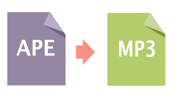
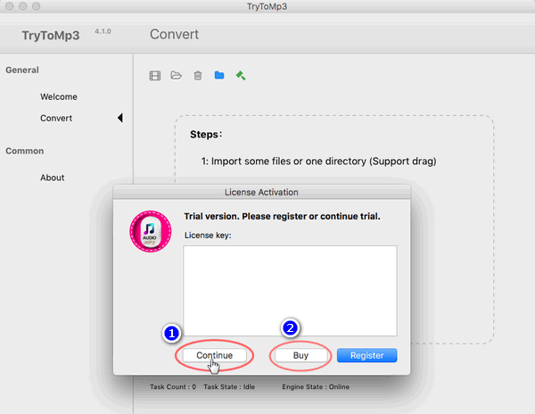
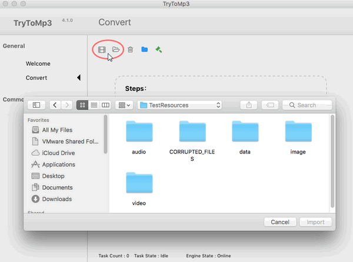
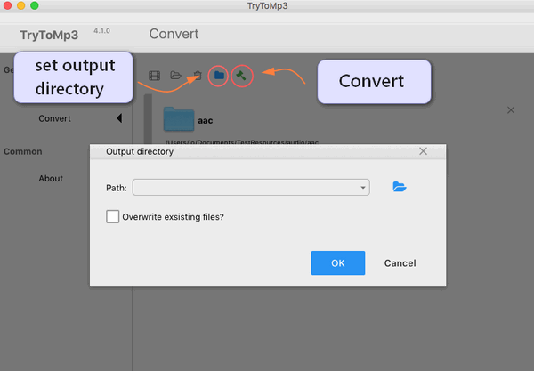
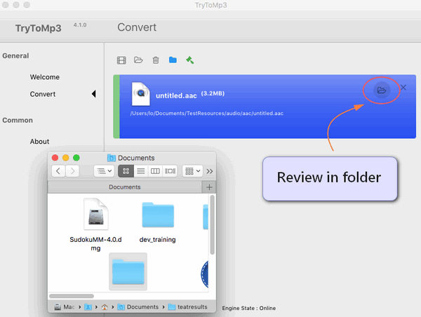

layout: guide
title: How to convert APE to MP3 on Mac?     
keywords: Does anyone know a Mac app that extracts MP3 audio tracks from APE video files? 
description: If you are willing to convert APE files to MP3 format, you are in the right place. 
---

 
>I have got some .ape format files. How to convert them to mp3 format? So I can add them to my iTunes.

>Can anybody tell me how can I convert APE to WAV? Then it's easy to play them on Windows Media Player.

>Is there a way to convert the CUE & APE file into the individual component songs?

 
If so, you come to the right place, because with the <a href="https://gmagon.com/products/store/trytomp3/" target="_blank"> the best APE to MP3 converter</a> here for you to quickly convert APE files to MP3 format. This tool can clear out all the above dilemmas with simple operations.

 
## What is APE
APE audio format is also referred to as the Monkey's audio format. It is a popular lossless compression format supported by various Windows-based media players. Many prefer to use Monkey Audio's main competitor FLAC which offers more features and hardware support. Most modern media players do not support the APE format and a number of users look to convert into more freely available formats such as MP3 and FLAC. A

PE achieves high quality with a 50% file size reduction compared to many popular lossy formats. Meanwhile, this format allows you to create excellent copies of your CD tracks with zero detriment to sound quality.

 
## What’s the best APE to MP3 converter for Mac
Sometimes, you may have the desire to convert APE to MP3 for playback on your Apple, Samsung, HTC, Sony or other devices, etc. 

Featuring simple and intuitive interface, fast conversion speed, as well as great ability to handle almost all audio/video formats, Gmagon TryToMP3 is positioned as one of the best APE to MP3 Converter for Mac. Check a quick guide on how to convert APE to MP3 on Mac via using this app. 

 
## How to convert APE to MP3 on Mac?
Step 1: Install and run Gmagon TryToMP3 on your Mac. Click “Continue” to try it out or click “Buy” to purchase it directly.

 
Step 2: After clicking “Continue”, switch to “Convert”, and the following interface will show up. 

 
Step 3: Click “Import files” or “Import directory” to add APE video files that you want to extract audio from.  

 
Step 4: Click “Output directory” to set output path. When ready, click “Convert” to start.

 
Step 5: When the conversion is complete, click “Reveal in Folder” to find the generated MP3 files. 

 
With <a href="https://gmagon.com/products/store/trytomp3/" target="_blank"> the best APE to MP3 converter</a> installed on your Mac, you can easily extract audio tracks from multiple APE files and save them as MP3. Hope this helps.  

 
Also read 
<a href="https://gmagon.com/guide/trytomp3/extract-audio-to-mp3-mac.html" target="_blank" >How to extract an audio from a video to MP3 on Mac?</a>
<a href="https://gmagon.com/guide/trytomp3/best-mov-to-mp3-converter.html" target="_blank" >Best MOV to MP3 converter-convert MOV to MP3 on Mac</a>
<a href="https://gmagon.com/guide/trytomp3/best-tool-to-convert-mpg-to-mp3.html" target="_blank" >Best MPG to MP3 converter-convert MPG to MP3 on Mac</a>
<a href="https://gmagon.com/guide/trytomp3/best-tool-to-convert-avi-to-mp3.html" target="_blank" >Best .avi to .mp3 converter-convert .avi to .mp3 on Mac</a>
<a href="https://gmagon.com/guide/trytomp3/best-tool-to-convert-ac3-to-mp3.html" target="_blank" >Best solutions to convert AC3 to MP3 on Mac</a>
<a href="https://gmagon.com/guide/trytomp3/best-solutions-to-convert-mka-to-mp3.html" target="_blank" >Best solutions to convert MKA to MP3 on Mac</a>

