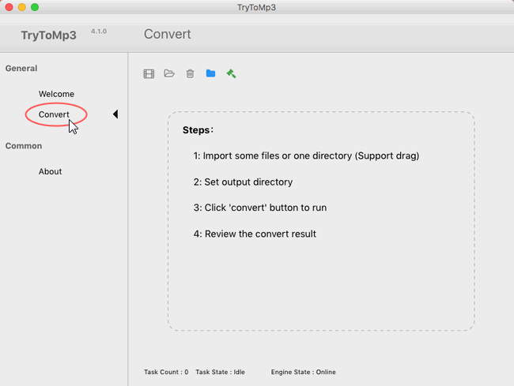

layout: guide
title: How to convert a song to MP3 format on Mac?      
keywords: convert a song to MP3 on Mac, convert audio to MP3 on Mac, convert music to MP3 format on my Mac   
description: Learn how to convert a song or a audio file to MP3 format on a Mac.
---
Learn how to convert a song or a audio file to MP3 format on a Mac. 

### Why should I convert audio to MP3 on Mac? 
One particular advantage of MP3 is that it is playable on almost any popular portable player, such as Apple iPod, iPhone, iPad, and various Android devices. In addition, MP3 will play on most new home and car stereos, and are also compatible with most computer software, as well as the older devices. 

If you want your music to play any time, any where, on any equipment, then you should convert your music to the MP3 format. 

### How can I convert music to MP3 format on my Mac? 
Gmagon TryToMP3 is a proper option to convet music files to MP3 format on Mac OS X. When you convert a file with this app, the original file remains unchanged in the same location. TryToMP3 creates the converted file from a copy of the original. Learn how to convert a song or a audio file to MP3 format on a Mac via uisng Gmagon TryToMP3. 

First of all, download a free trial of Gmagon MP3 (30-day free trial)

To convert audio files to mp3 format on Mac, follow these steps:
Step 1. Install and run Gmagon TryToMP3 on your Mac. Click “Continue” to try it out or click “Buy” to purchase it directly. 

Step 2. After clicking “Continue”, switch to “Convert”, and the following interface will pop up. 

Step 3. Click “Import files” or “Import directory” to add audio files that you want to convert to MP3 format. More than converting audio to MP3, this app can also extract audio tracks from various videos and save them as MP3. 

After files loaded, click “Output directory” to set output path. When ready, click “Convert” to start. When the conversion is complete, click “Reveal in Folder” to find the generated MP3 files.  

That’s all. I hope this will help!

Also read
<a href="https://gmagon.com/guide/trytomp3/best-tool-to-convert-mpg-to-mp3.html" target="_blank" >Best MPG to MP3 converter-convert MPG to MP3 on Mac</a>
<a href="https://gmagon.com/guide/trytomp3/best-tool-to-convert-avi-to-mp3.html" target="_blank" >Best .avi to .mp3 converter-convert .avi to .mp3 on Mac</a>
<a href="https://gmagon.com/guide/trytomp3/best-tool-to-convert-ac3-to-mp3.html" target="_blank" >Best solutions to convert AC3 to MP3 on Mac</a>
<a href="https://gmagon.com/guide/trytomp3/best-solutions-to-convert-mka-to-mp3.html" target="_blank" >Best solutions to convert MKA to MP3 on Mac</a>
