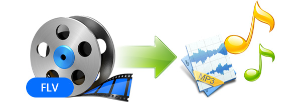

layout: guide
title: How to convert FLV to MP3 on Mac?     
keywords: Does anyone know a Mac app that extracts MP3 audio tracks from FLV video files? 
description: If you are looking for an easy solution to extract audio tracks from MKV movies and save them as MP3 on a Mac, you are in the right place. 
---
Does anyone know a Mac app that extracts MP3 audio tracks from FLV video files? If you are looking for such a solution, you are in the right place. This article explains how to convert FLV to MP3 on Mac via using a useful FLV to MP3 converter app. 

> **Need a program to convert FLV files to MP3 on my MackBook Pro**
“Hi all, I changed my Windows PC to a MackBook Pro last month. I’ve been searching for a Mac app that lets me convert FLV files to MP3 format. I know of some that work on Windows, but I can’t seem to find any that works on Mac at all. Any recommendations? I would really appreciate any advice. Thanks in advance.” 

With Gmagon TryToMP3 installed, it won’t be a problem to convert the flv to an mp3 on a Mac. Here’s how. 

### How to convert FLV to MP3 on Mac using Gmagon TryToMP3?
Here’s what you need
Gmagon TryToMP3

Note that this app requires Mac OS X 10.11 or later. It provides 30-day free trial. 

Follow these steps: 
Step 1: Install and run Gmagon TryToMP3 on your Mac. Click “Continue” to try it out or click “Buy” to purchase it directly. 

 

Step 2: After clicking “Continue”, switch to “Convert”, and the following interface will show up. 

 

Step 3: Click “Import files” or “Import directory” to add FLV video files that you want to convert to mp3.  

After files loaded, click “Output directory” to set output path. When ready, click “Convert” to start. When the conversion is complete, click “Reveal in Folder” to find the generated MP3 files.  
 

With <a href="https://gmagon.com/products/store/trytomp3/" target="_blank"> Gmagon TryToMP3 </a> installed on your Mac, you can easily batch convert FLV files to MP3. Hope this helps.  

Also read 
<a href="https://gmagon.com/guide/trytomp3/how-can-i-convert-flac-to-mp3.html" target="_blank" >How can I convert FLAC to MP3?</a>
<a href="https://gmagon.com/guide/trytomp3/how-can%20i-convert-aac-to-mp3.html " target="_blank" >How can I convert AAC to MP3?</a>
<a href="https://gmagon.com/guide/trytomp3/best-mov-to-mp3-converter.html" target="_blank" >Best MOV to MP3 converter-convert MOV to MP3 on Mac</a>
<a href="https://gmagon.com/guide/trytomp3/extract-audio-to-mp3-mac.html" target="_blank" >How to extract an audio from a video to MP3 on Mac? </a>

