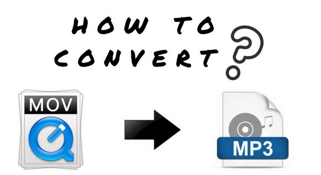

layout: guide
title: How to convert large MOV to MP3 on Mac?    
keywords: extract audio tracks from large MOV to MP3, large MOV to MP3 conversion on Mac, convert big MOV files to MP3 format on MacBook Pro, transcode big MOV to MP3 on Mac, transcode big MOV files to MP3 on Mac
description: If you are searching for a way to extract audio tracks from large MOV movies to MP3 on a Mac computer, you may wish to read this article.   
---
If you are searching for a way to extract audio tracks from large MOV movies to MP3 on a Mac computer, you may wish to read this article. It displays how to process large MOV to MP3 conversion on Mac via using a helpful converter app. 

>**How can I convert big MOV files to MP3 format on MacBook Pro?**
>“Hi, guys, I have some big .mov video files on my MacBook Pro that I would like to convert them from .mov to .mp3 as any other songs I have on iTunes. I dragged them to iTunes and I tried to convert them to mp3 but iTunes just keep giving me an error message so I guess iTunes has issues handling big MOV files. A bit annoying. How can I do it? If someone can give me a better idea to do it quickly, I would be deeply thankful. Thanks in advance.” 

Use Gmagon TryToMP3. It lets you get big MOV movies to export as MP3 on Mac, best of all, it can work with batches, and it provides 30-day free trial. Learn how to convert big MOV to MP3 on Mac via using this app.
### How to extract audio from large MOV and save as MP3 on Mac? 
Here’s what you need
Gmagon TryToMP3

To transcode big MOV to MP3 on Mac, follow these steps:
Step 1. Install and run Gmagon TryToMP3 on your Mac. Click “Continue” to try it out or click “Buy” to purchase it directly.  

Step 2. After clicking “Continue”, switch to “Convert”, and the following interface will pop up.   
        

Step 3. Click “Import files” or “Import directory” to add audio files that you want to convert to MP3 format. More than converting .mov files to MP3, this app can also convert various other video files and audio files to MP3 on Mac.

After files loaded, click “Output directory” to set output path. When ready, click “Convert” to start. When the conversion is complete, click “Reveal in Folder” to find the generated MP3 files.    

That’s all. Hope this will help those who are looking for a software program to <a href="https://gmagon.com/products/store/trytomp3/" target="_blank">transcode big MOV files to MP3 on Mac</a>. 

Also read
<a href="https://gmagon.com/guide/trytomp3/convert-ape-to-mp3-mac.html" target="_blank" >How do I convert APE to MP3 on Mac?</a>
<a href="https://gmagon.com/guide/trytomp3/extract-mkv-audio-to-mp3-mac.html" target="_blank" >Extract soundtracks from MKV to MP3 on Mac</a>
<a href="https://gmagon.com/guide/trytomp3/convert-audio-to-mp3-mac.html" target="_blank" >How to convert a song to MP3 format on Mac?</a>
<a href="https://gmagon.com/guide/trytomp3/best-mov-to-mp3-converter.html" target="_blank" >Best MOV to MP3 converter-convert MOV to MP3 on Mac</a>