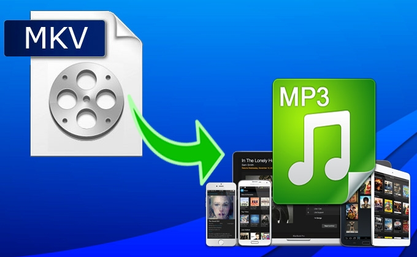

layout: guide
title: The easiest way to convert MKV to MP3 on a Mac    
keywords: extract audio tracks from MKV to MP3 on Mac, MKV to MP3 extractor for Mac, easiest way to convert MKV to MP3 on a Mac
description: If you are looking for an easy solution to extract audio tracks from MKV movies and save them as MP3 on a Mac, you are in the right place. 
---
If you are looking for an easy solution to extract audio tracks from MKV movies and save them as MP3 on a Mac, you are in the right place. This article explains how to do this via using a useful MKV to MP3 extractor for Mac. 

The app we will use is called Gmagon TryToMP3. It is capable of extracting audio tracks from movies or music videos and save them as MP3 files fit for different uses. More than extracting audio files from videos, this program can also convert audio files in a wide variety of formats to mp3 in a batch. Keep reading to learn how to convert MKV to MP3 on a Mac easliy and efficiently via using Gmagon TryToMP3. 

### The easiest way to convert MKV to MP3 on a Mac
Here’s what you need
Gmagon TryToMP3

Note that this app requires Mac OS X 10.11 or later. It provides 30-day free trial. 

Follow these steps: 
Step 1: Install and run Gmagon TryToMP3 on your Mac. Click “Continue” to try it out or click “Buy” to purchase it directly. 

 

Step 2: After clicking “Continue”, switch to “Convert”, and the following interface will show up. 

 

Step 3: Click “Import files” or “Import directory” to add MKV video files that you want to extract audio from.  

After files loaded, click “Output directory” to set output path. When ready, click “Convert” to start. When the conversion is complete, click “Reveal in Folder” to find the generated MP3 files.  
 

With <a href="https://gmagon.com/products/store/trytomp3/" target="_blank"> Gmagon TryToMP3 </a> installed on you Mac, you can easily extrat audio tracks from multiple MKV files and save them as MP3. Hope this helps.  

Also read 
<a href="https://gmagon.com/guide/trytomp3/trytomp3ver4.1.0.html" target="_blank" >Gmagon TryToMP3 4.1.0 has been released</a>
<a href="https://gmagon.com/guide/trytomp3/extract-audio-to-mp3-mac.html" target="_blank" >How to extract an audio from a video to MP3 on Mac? </a>
<a href="https://gmagon.com/guide/trytomp3/how-can-i-convert-flac-to-mp3.html" target="_blank" >How can I convert FLAC to MP3?</a>
<a href="https://gmagon.com/guide/trytomp3/how-can%20i-convert-aac-to-mp3.html " target="_blank" >How can I convert AAC to MP3?</a>
