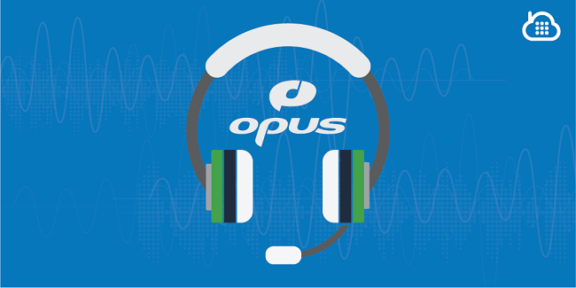

layout: guide
title: How to convert Opus to MP3 on Mac?      
keywords: convert Opus audio files to MP3 format on Mac, Mac Opus to MP3 Conerter app, easiest Mac Opus to MP3 Converter, convert opus music files to mp3 on a Mac 
description: Learn how to convert Opus audio files to MP3 format on Mac via using a simple Mac Opus to MP3 Conerter app. 
---
Learn how to convert Opus audio files to MP3 format on Mac via using a simple Mac Opus to MP3 Conerter app. 
### What is Opus? 
OPUS is one of the most versatile audio codecs designed for high-speed online media data transmission. Having scrutinized MP3, which is still the most popular audio format, specialists from Mozilla Corporation and Skype Technologies S. A. joined efforts to produce an ultimate audio codec, which would inherit the advantages of MP3 yet use a compression scheme that would help files retain original sound quality. The biggest pluses of OPUS are low coding delay, multichannel sound and high compression levels. OPUS files combine SILK codec (Skype Technologies) and CELT codec (Mozilla Corporation).

### How can I convert opus music files to mp3 on a Mac? 
What to do if your favorite player doesn’t play Opus files? Convert them to the widely-accepted MP3 format first!!! The following guide presents how to do this via using Gmagon TryToMP3, a helpful Opus to MP3 Converter for Mac. 

Download Gmagon TryToMP3 (You can use it for free 30 days.) 

To convert opus audio to mp3 on Mac, follow these steps:
Step 1. Install and run Gmagon TryToMP3 on your Mac. Click “Continue” to try it out or click “Buy” to purchase it directly.  

Step 2. After clicking “Continue”, switch to “Convert”, and the following interface will pop up.      
      

Step 3. Click “Import files” or “Import directory” to add audio files that you want to convert to MP3 format. More than converting opus files to MP3, this app can also convert various other audio/video files to MP3 on Mac.

After files loaded, click “Output directory” to set output path. When ready, click “Convert” to start. When the conversion is complete, click “Reveal in Folder” to find the generated MP3 files.   
 

That’s all. Hope this will help those who are looking for a solution to <a href="https://gmagon.com/products/store/trytomp3/" target="_blank">convert opus audio to mp3 on Mac</a>. 

Also read
<a href="https://gmagon.com/guide/trytomp3/convert-ape-to-mp3-mac.html" target="_blank" >How do I convert APE to MP3 on Mac?</a>
<a href="https://gmagon.com/guide/trytomp3/extract-mkv-audio-to-mp3-mac.html" target="_blank" >Extract soundtracks from MKV to MP3 on Mac</a>
<a href="https://gmagon.com/guide/trytomp3/convert-audio-to-mp3-mac.html" target="_blank" >How to convert a song to MP3 format on Mac?</a>
<a href="https://gmagon.com/guide/trytomp3/mac-aiff-to-mp3-converter.html" target="_blank" >AIFF to MP3 converter-convert AIFF to MP3 on Mac</a>