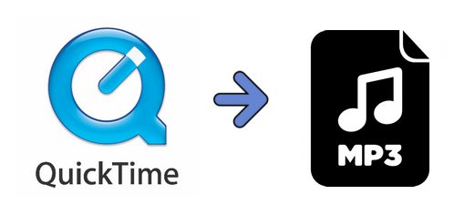

layout: guide
title: How to convert quicktime audio to mp3 on Mac?     
keywords: extract an audio track from a video and save it as MP3 on Mac, convert videos files to mp3 format on Mac, Mac MP3 music creator app
description: This article guides you throug the process of extracting audio tracks from QuickTime movies and save them as MP3 format on Mac.    
---
How do you convert QuikTime audio to MP3 format on a Mac? This article guides you throug the process of extracting audio tracks from QuickTime movies and save them as MP3 format on Mac. 

>**How can I convert a Quicktime MOV to MP3 on my iMac?**
>“Hi all, I need some help with something. I was wondering if there is a way to take the audio out of a quicktime mov and just have the audio as a MP3 file? Is there any way that I could do it? Thanks for any advice.” .

There are some times when you want to convert QuickTime video files to pure MP3 audio on a Mac. That’s where Gmagon TryToMP3 comes in. With this app installed, you can easily convert QT .mov files to mp3 audio on your Mac. Batch conversion is supported. Learn how to convert quicktime audio to mp3 on Mac via using Gmagon TryToMP3. 
### How to convert quicktime audio to mp3 on Mac? 
Here’s what you need
Gmagon TryToMP3

To convert quicktime audio to mp3 on Mac, follow these steps:
Step 1. Install and run Gmagon TryToMP3 on your Mac. Click “Continue” to try it out or click “Buy” to purchase it directly.  

Step 2. After clicking “Continue”, switch to “Convert”, and the following interface will pop up.  

Step 3. Click “Import files” or “Import directory” to add audio files that you want to convert to MP3 format. More than converting .mov files to MP3, this app can also convert various other video files and audio files to MP3 on Mac.

After files loaded, click “Output directory” to set output path. When ready, click “Convert” to start. When the conversion is complete, click “Reveal in Folder” to find the generated MP3 files.

That’s all. Hope this will help those who are looking for a solution to <a href="https://gmagon.com/products/store/trytomp3/" target="_blank">convert quicktime audio to mp3 on Mac</a>. 

Also read
<a href="https://gmagon.com/guide/trytomp3/convert-ape-to-mp3-mac.html" target="_blank" >How do I convert APE to MP3 on Mac?</a>
<a href="https://gmagon.com/guide/trytomp3/extract-mkv-audio-to-mp3-mac.html" target="_blank" >Extract soundtracks from MKV to MP3 on Mac</a>
<a href="https://gmagon.com/guide/trytomp3/convert-audio-to-mp3-mac.html" target="_blank" >How to convert a song to MP3 format on Mac?</a>
<a href="https://gmagon.com/guide/trytomp3/convert-amr-to-mp3-mac.html" target="_blank" >AMR to MP3 - convert .amr to .mp3 on Mac</a>