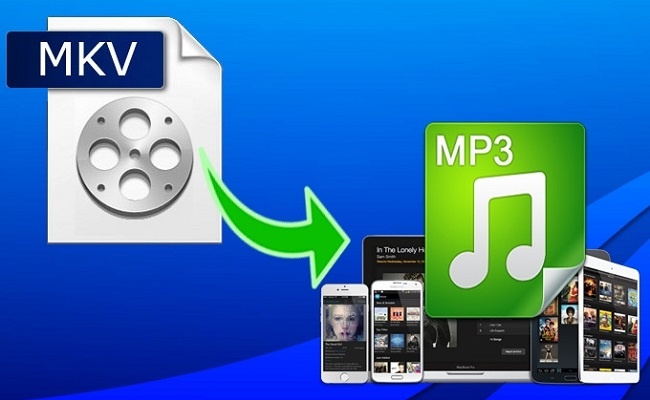

layout: guide
title: Extract soundtracks from MKV to MP3 on Mac   
keywords: extract soundtracks from MKV to MP3 on Mac, MKV to MP3 converter for Mac, convert MKV to MP3 on Mac
description: Learn how to extract soundtracks from MKV movies and save them as MP3 audio on a Mac.    
---
If you are attempting to extract soundtracks from MKV movies and save them as MP3 audio on a Mac, you may wish to read this article. It presents how to do this via using a helpful MKV to MP3 converter for Mac. 

MP3 files can be played by many types of devices such as Apple iPod, iPhone, iPad and Android tablets & smart phones . You can also play MP3 files with media players such as QuickTime and VLC. 

If you want to save a particular sone from a MKV movie to MP3 format, you can give Gmagon TryToMP3 a shot. This app allows you to extrat an audio track from a video and save it as MP3. Learn how to extract soundtracks from MKV to MP3 on Mac via using this app.

### How to convert MKV to MP3 on Mac? 
Here’s what you need
Gmagon TryToMP3

To extract audiotrack in MKV to MP3 format on Mac, follow these steps:
Step 1. Install and run Gmagon TryToMP3 on your Mac. Click “Continue” to try it out or click “Buy” to purchase it directly. 

Step 2. After clicking “Continue”, switch to “Convert”, and the following interface will pop up. 

Step 3. 3.Click “Import files” or “Import directory” to add MKV movies that you want to extract audio to mp3.  

After files loaded, click “Output directory” to set output path. When ready, click “Convert” to start. When the conversion is complete, click “Reveal in Folder” to find the generated MP3 files.  

Also read 
<a href="https://gmagon.com/guide/trytomp3/how-can-i-convert-flac-to-mp3.html" target="_blank" >How can I convert FLAC to MP3?</a>
<a href="https://gmagon.com/guide/trytomp3/how-can-i-convert-aac-to-mp3.html " target="_blank" >How can I convert AAC to MP3?</a>
<a href="https://gmagon.com/guide/trytomp3/convert-audio-to-mp3-mac.html" target="_blank" >How to convert a song to MP3 format on Mac?  </a>
<a href="https://gmagon.com/guide/trytomp3/extract-audio-to-mp3-mac.html" target="_blank" >How to extract an audio from a video to MP3 on Mac? </a>