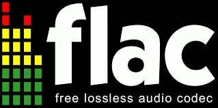

layout: guide
title: How can I convert FLAC to MP3?    
keywords: flac to mp3 converter, flac to mp3 mac, flac to mp3 audio converter mac, convert a flac to mp3, change a flac to mp3, flac to mp3 batch, flac to mp3 conversion, flac to mp3 batch converter mac
description: Is it possible to convert FLAC files to MP3 format on a Mac? If you are trying to figure out a way to do this, you are in the right place.   
---

 
## What is FLAC?
FLAC is short for Free Lossless Audio Codec, it is a musical encoding format that maintains the same quality as the original source despite often being less than 50 percent of the original file size. 

The files are free and distributed to users under an open-source license, hence the “Free” and “Lossless” terminology, but typically surpass common audio formats such as AAC and MP3 when it comes to sheer audio fidelity. Simply put, they sound better and require less space.  Because it's lossless, it is popular today.

Not like MP3 is nearly supported by all audio devices and multimedia players, FLAC is only supported by a handful of them. What's more, it usually cannot be played on your MP3 players. Thus, you need other ways to help you to convert Flac to MP3. Thankfully, there are <a href="https://gmagon.com/products/store/trytomp3/" target="_blank"> TryToMP3 </a> for you, if you favor convenience over audio quality. 

 
## How to convert FLAC to MP3 by Gmagon TryToMP3?

1. Download a free trial of Gmagon TryToMP3

Note that this app requires Mac OS X 10.11 or later. It provides 30-day free trial. 
 
2. Install and run Gmagon TryToMP3 on your Mac. Click “Continue” to try it out or click “Buy” to purchase it directly. 

 

3. After clicking “Continue”, switch to “Convert”, and the following interface will show up. 

 

4. Click “Import files” or “Import directory” to add video files that you want to extract audio from. More than extrating audio from a video, this app can also convert various audio files to MP3 format. 

After files loaded, click “Output directory” to set output path. When ready, click “Convert” to start. When the conversion is complete, click “Reveal in Folder” to find the generated MP3 files. 

 
 

>As you can see above, with <a href="https://gmagon.com/products/store/trytomp3/" target="_blank">Gmagon TryToMP3 installed</a>, you can easily extrat audio tracks from multiple video files and save them as MP3.  

 
Also read
<a href="https://gmagon.com/guide/trytomp3/trytomp3ver4.1.0.html " target="_blank" >Gmagon TryToMP3 4.1.0 has been released</a>

<a href="https://gmagon.com/guide/trytomp3/extract-audio-to-mp3-mac.html " target="_blank" >How to extract an audio from a video to MP3 on Mac?</a>
