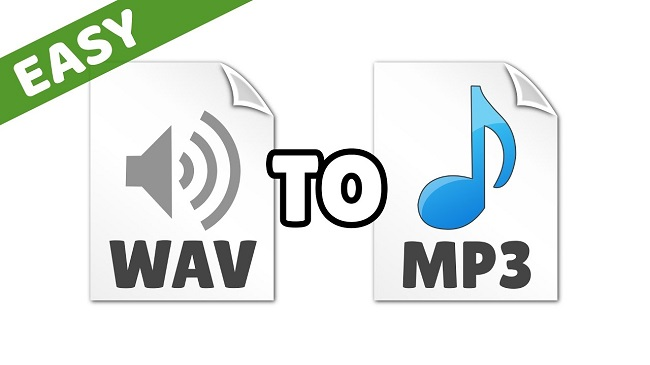

layout: guide
title: How can I convert WAV to MP3 on Mac?    
keywords: wav to mp3 converter, wav to mp3 mac, wav to mp3 audio converter mac, convert a wav to mp3, change a wav to mp3, wav to mp3 batch, wav to mp3 conversion, wav to mp3 batch converter mac
description: Trying to convert WAV files to MP3 on a Mac? This article explains how to encode audio files from WAV format to MP3 format on Mac.  
---
Trying to convert WAV files to MP3 on a Mac? Then you may wish to read this article. It explains how to encode audio files from WAV format to MP3 format on Mac. 

 
## What is WAV?
WAV is short for Waveform Audio File Format (WAVE), it is a Microsoft and IBM audio file format standard for storing an audio bitstream on PCs. 

WAV files are audio files playable via multimedia playback software such as Windows Media Player and other software available for your operating system. These files contain any sounds such as sound effects, music or spoken words. WAV files are large in size and with the advent of MP3 and MP4 WAV files are becoming less popular and less common. They were created and developed by IBM and Microsoft but unlike MP3 and MP4 the WAV file format does not use a form of lossy compression so file sizes are therefore much bigger and now less popular.

The highest quality of WAV being th 16-bit at 44,100 HZ, this highest level is the sampling rate of an audio CD and uses 88KB of storage per second. All general sounds in Windows, such as when you log in, are in the .WAV format. The default content of a WAV file is uncompressed (although they can be used to store compressed formats such as MP3), pulse code modulated (PCM) digital samples derived from the analog source.

 
## How to convert WAV to MP3?
If you need to convert WAV to MP3 format, you will need a powerful audio converter to help you. Thankfully, there is <a href="https://gmagon.com/products/store/trytomp3/" target="_blank"> TryToMP3 </a> for you.  

1. Download a free trial of Gmagon TryToMP3

Note that this app requires Mac OS X 10.11 or later. It provides 30-day free trial. 
 
2. Install and run Gmagon TryToMP3 on your Mac. Click “Continue” to try it out or click “Buy” to purchase it directly. 

 

3. After clicking “Continue”, switch to “Convert”, and the following interface will show up. 

 

4. Click “Import files” or “Import directory” to add WAV files that you want to convert to MP3. More than converting audio files to MP3, this app can also extrati audio tracks from various video files and save them as MP3.

After files loaded, click “Output directory” to set output path. When ready, click “Convert” to start. When the conversion is complete, click “Reveal in Folder” to find the generated MP3 files. 

 
 

>As you can see above, with <a href="https://gmagon.com/products/store/trytomp3/" target="_blank">Gmagon TryToMP3 installed</a>, you can easily convert WAV files to MP3 on a Mac Machine.  

 
Also read
<a href="https://gmagon.com/guide/trytomp3/trytomp3ver4.1.0.html " target="_blank" >Gmagon TryToMP3 4.1.0 has been released</a>
<a href="https://gmagon.com/guide/trytomp3/extract-audio-to-mp3-mac.html " target="_blank" >How to extract an audio from a video to MP3 on Mac?</a>
<a href="https://gmagon.com/guide/trytomp3/how-can-i-convert-flac-to-mp3.html " target="_blank" >How can I convert FLAC to MP3?</a>
<a href="https://gmagon.com/guide/trytomp3/how-can-i-convert-aac-to-mp3.html " target="_blank" >How can I convert AAC to MP3?</a>

