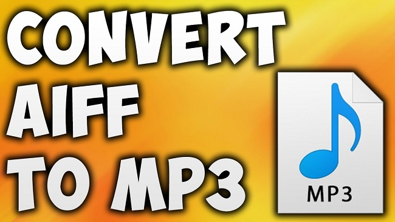
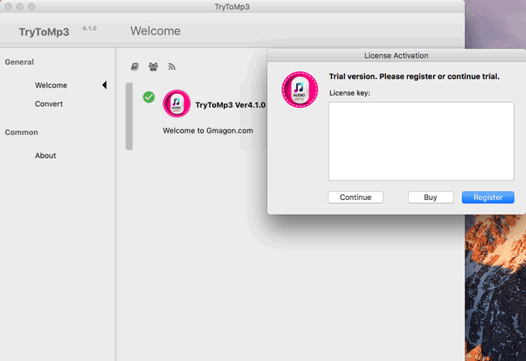
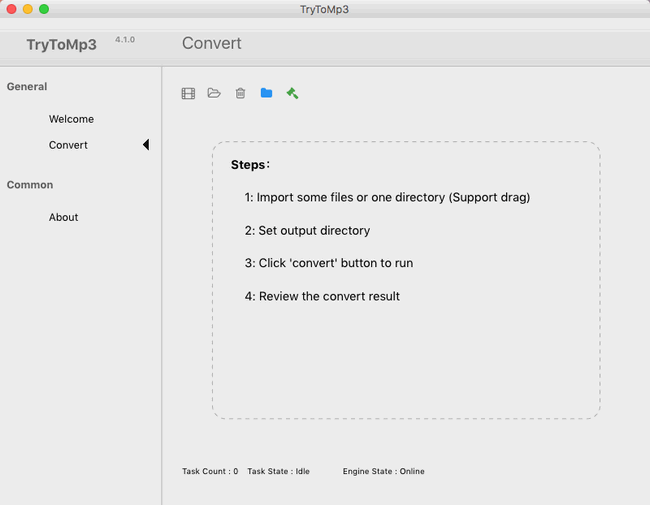
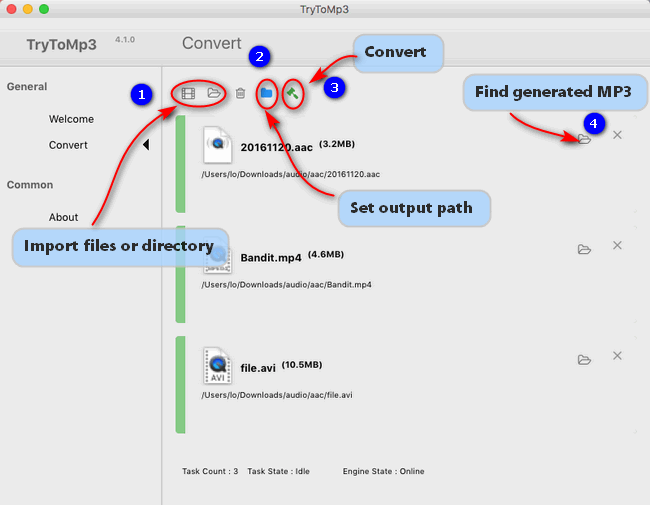

layout: guide
title: Mac AIFF to MP3 converter-convert AIFF to MP3 on Mac    
keywords: Mac AIFF to MP3 Converter, simply convert AIFF files to MP3 format on Mac, transcode AIFF to MP3 on Mac, encoding AIFF to MP3 on Mac
description: Learn how to use Mac AIFF to MP3 Converter to quickly and simply convert AIFF files to MP3 format on Mac.    
---
    
Learn how to use Mac AIFF to MP3 Converter to quickly and simply convert AIFF files to MP3 format on Mac. 

### What is AIFF? 
AIFF is short for Audio Interchange File Format, which is an audio format initially created by Apple Computer for storing and transmitting high-quality sampled audio data. It supports a variety of bit resolutions, sample rates, and channels of audio. This format is quite popular upon Apple platforms, and is commonly adopted in professional programs that handle digital audio waveforms.

AIFF files are uncompressed, making the files quite large compared to the ubiquitous MP3 format. AIFF files are comparable to Microsoft's wave files, because they are high quality they are excellent for burning to CD. There is also a compressed variant of AIFF known as AIFF-C or AIFC, with various defined compression codecs. Though AIFF files are popular among Macintosh users and audio professionals, PC users tend to use wave files instead.

The file extension for the standard AIFF format is .aiff or .aif. For the compressed variants it is supposed to be .aifc, but .aiff or .aif are accepted as well by audio applications supporting the format.  

### How to convert AIFF to MP3 on Mac? 
If for whatever reason you need to convert AIFF audio files to MP3 format on Mac, you may give Gmagon TryToMP3 a shot. It lets you quickly and simply convert AIFF audio files to MP3 format on Mac OS X. Learn the process of encoding AIFF to MP3 on Mac. 

Here’s what you need
Gmagon TryToMP3 (You can try it for free 30 days.)

To transcode AIFF to MP3 on Mac, follow these steps:
Step 1. Install and run Gmagon TryToMP3 on your Mac. Click “Continue” to try it out or click “Buy” to purchase it directly.  

Step 2. After clicking “Continue”, switch to “Convert”, and the following interface will pop up.               

Step 3. Click “Import files” or “Import directory” to add audio files that you want to convert to MP3 format. More than converting audio files to MP3, this app can also extract audio tracks from various videos and save them as MP3. 

Step 4. After files loaded, click “Output directory” to set output path. When ready, click “Convert” to start. When the conversion is complete, click “Reveal in Folder” to find the generated MP3 files.   

That’s all. Hope this will help those who are looking for a software program to <a href="https://gmagon.com/products/store/trytomp3/" target="_blank">transcode AIFF files to MP3 on Mac</a>. 

Also read
<a href="https://gmagon.com/guide/trytomp3/convert-ape-to-mp3-mac.html" target="_blank" >How do I convert APE to MP3 on Mac?</a>
<a href="https://gmagon.com/guide/trytomp3/extract-mkv-audio-to-mp3-mac.html" target="_blank" >Extract soundtracks from MKV to MP3 on Mac</a>
<a href="https://gmagon.com/guide/trytomp3/convert-audio-to-mp3-mac.html" target="_blank" >How to convert a song to MP3 format on Mac?</a>
<a href="https://gmagon.com/guide/trytomp3/best-mov-to-mp3-converter.html" target="_blank" >Best MOV to MP3 converter-convert MOV to MP3 on Mac</a>