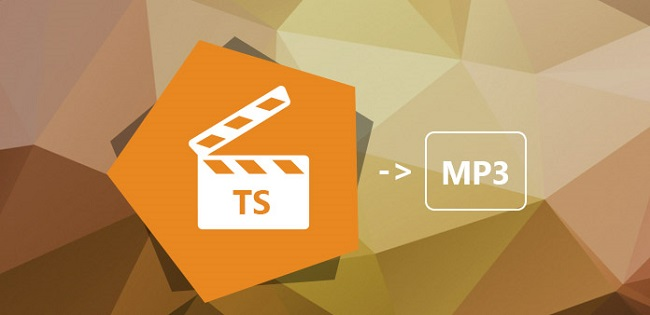

layout: guide
title: Mac TS to MP3 Converter-convert TS files to MP3 on Mac    
keywords: convert TS files to MP3 on Mac, Mac TS to MP3 converter, extract audio tracks from TS as MP3 on Mac, transcoding TS files to MP3 format on Mac 
description: To be able to convert TS files to MP3 on Mac, you will need a Mac TS to MP3 converter. 
---
To be able to convert TS files to MP3 on Mac, you will need a Mac TS to MP3 converter. Read this article to learn how to extract audio tracks from TS files and save them as MP3 on Mac via using such an App. 

### What is TS file format? 
TS is a video stream file format that is used for storing video on DVDs. TS stands for Transport Stream. TS files can also store audio and data information. TS files are specified for MPEG-2 part 1 systems, which compresses the video data. TS files hold multiple pieces of data in a container-format. It allows for simultaneous streaming of audio, video, and data output. The audio tracks in TS files can be extracted as MP3 files by using Gmagon TryToMP3, a handy and professional TS to MP3 Converter for Mac.
### How to convert TS files to MP3 on Mac via using Gmagon TryToMP3? 
Software requirement
Gmagon TryToMP3

Then follow these steps: 
Step 1. Install and run Gmagon TryToMP3 on your Mac. Click “Continue” to try it out or click “Buy” to purchase it directly.  

Step 2. After clicking “Continue”, switch to “Convert”, and the following interface will pop up. 

Step 3. Click “Import files” or “Import directory” to add TS files that you want to convert to MP3 format. More than converting TS files to MP3, this app can also convert a wide variety of other video/audio files to MP3 format on Mac.

After files loaded, click “Output directory” to set output path. When ready, click “Convert” to start. When the conversion is complete, click “Reveal in Folder” to find the generated MP3 files.

That’s the whole process of transcoding TS files to MP3 format on Mac via using Gmagon <a href="https://gmagon.com/products/store/trytomp3/" target="_blank">TryToMP3</a>. Hope it helps. 

Also read
<a href="https://gmagon.com/guide/trytomp3/convert-opus-to-mp3-mac.html" target="_blank" >How to convert Opus to MP3 on Mac?</a>
<a href="https://gmagon.com/guide/trytomp3/convert-3ga-to-mp3-mac.html" target="_blank" >How to convert 3GA to MP3 on Mac?</a>
<a href="https://gmagon.com/guide/trytomp3/convert-amr-to-mp3-mac.html" target="_blank" >AMR to MP3 - convert .amr to .mp3 on Mac</a>
<a href="https://gmagon.com/guide/trytomp3/convert-qt-audio-to-mp3-mac.html" target="_blank" >How to convert quicktime audio to mp3 on Mac? </a>