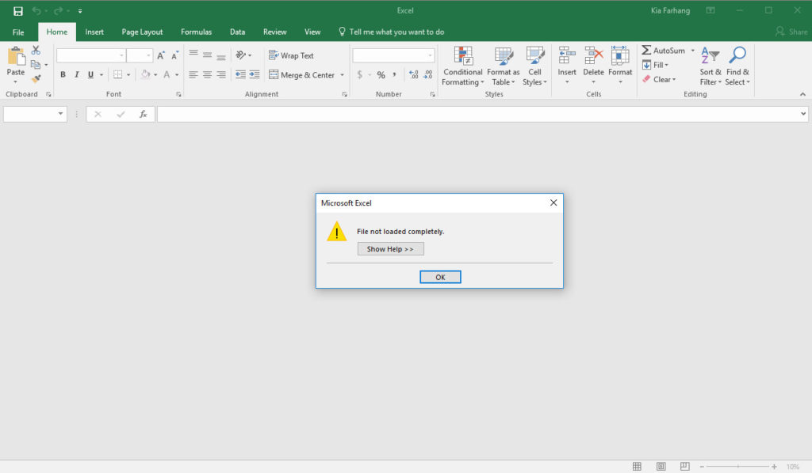
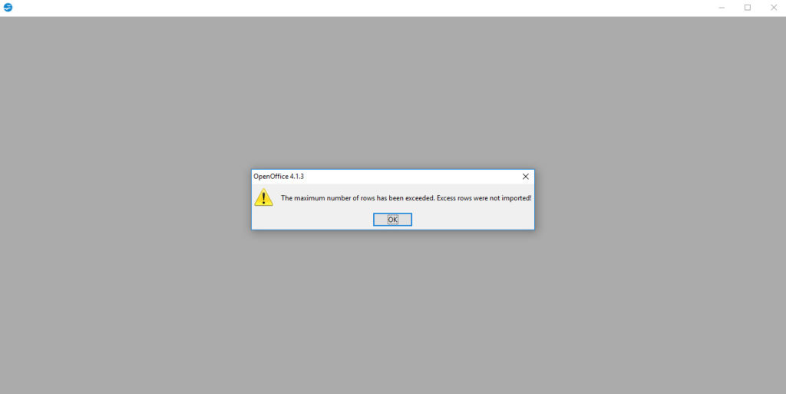
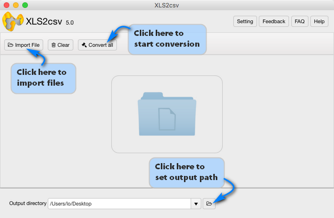

layout: guide
title: Big CSV - How to get large delimited CSV files.   
keywords: big csv file, convert big csv, big csv file editor, big csv reader, open a big csv file, large csv excel, large csv generator
description: Is it possible to convert large Excel files to big CSV? To achieve the expected result, users sometimes require specialized software. 
---

CSV files are chunks of text used to move data between spreadsheets, databases, and programming language. If we move beyond 10 rows of product data, data analysis would be much easier. However, users often find themselves with hundreds of thousands of data points or more. Typically, producing large CSV files requires specialized software, because spreadsheet programs can't handle them. Like Excel, spreadsheet software can have a difficult time opening very large CSVs.

## The Problem With Spreadsheets
Most popular spreadsheet software simply doesn't have the muscle to open or convert large CSV files. Excel is limited to opening CSVs that fit within your computer’s RAM. For most modern computers, that means a limit of about 60,000 to 200,000 rows. For example, here what we see when opening our traffic violation data with Microsoft Excel: 

We run into a similar issue opening the flat file with OpenOffice. The program tells us it couldn’t pull in all the data...

## <a href="https://gmagon.com/products/store/xls2csv/" target="_blank" rel="nofollow me noopener noreferrer" >XLS2csv</a>
Fortunately, a powerful and easy-to-use tool-<a href="https://gmagon.com/products/store/xls2csv/" target="_blank" rel="nofollow me noopener noreferrer" >XLS2csv</a> is able to convert enormous Excel data sets to CSV format with large size.

Software requirement
Gmagon XLS2csv

**Note**: XLS2csv runs on Mac only, Mac OS X 10.7(64-bit) or above is required.

Hope this helps those who are looking for an easy solution to convert Excel files to CSV with large size. 

Also read
<a href="https://gmagon.com/guide/xls2csv/export-to-csv-from-xls.html
" target="_blank" rel="nofollow me noopener noreferrer" >Export to CSV - exporting csv from xls files</a>
<a href="https://gmagon.com/guide/convert-xls-to-csv-on-mac.html" target="_blank" rel="nofollow me noopener noreferrer" >How to convert XLS to CSV on a Mac?</a>
<a href="https://gmagon.com/guide/convert-xls-on-mac-without-excel.html" target="_blank" rel="nofollow me noopener noreferrer" >Convert XLS to CSV on Mac without Excel installed</a>
<a href="https://gmagon.com/guide/apngtogif/batch-change-apng-to-gif-sierra.html" target="_blank" rel="nofollow me noopener noreferrer" >How to batch change APNG to GIF on macOS Sierra?</a>
 

