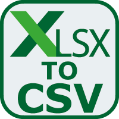

layout: guide
title: To CSV - how do I change a .xlsx to a .csv?    
keywords: difference between XLSX and CSV, change a .xlsx file to CSV format on a Mac, change a .xlsx to a .csv, Mac XLSX to CSV converter 
description: Learn a simple explanation of the difference between XLSX and CSV. And learn how to change a .xlsx file to CSV format on a Mac machine.  
---

What’s the difference between XLSX and CSV? 
A .xlsx is the typical file format for Excel, just as .docx for words. In a .xlsx you can save the formulas, graphs, pivots, etc in the file. Although Excel can read the fileformat and you can use formulas in it, you cannot save the formulas in the sheet. Excel will only save the result of the calculation.

In addition, XLSX does not allow you to store macros, as a security precaution. If you need macros in the file you have to use the XLSM file format.

A CSV is NOT a "spreadsheet" file format, but just a flat text file that uses a delimiter to separated the fields, e.g.
Header_1,Header_2
A,1
B,2

CSV is a simple, industry standard file format for exporting text only data from one system to be imported into another system. The importing system can be Excel or a "true database".

Where an Excel workbook can have more sheets, a CSV has only one sheet. When you open a .xlsx with a text editor you will see unreadable content, while a CSV is readable. 
How do I change a .xlsx to a .csv? 
If for some reason you need to convert XLSX files to CSV format on a Mac computer, you may give Gmagon XLS2csv a shot. Here’s how.

First of all, download Gmagon XLS2csv 

**Note**: XLS2csv runs on Mac only, Mac OS X 10.7(64-bit) or above is required. 

Then follow these steps:
Step 1: Install and run XLS2csv on your Mac, and click “Import File” to load XLSX files that you want to convert. This Mac XLSX to CSV converter supports batch conversion, so you can load multiple XLSX files to do conversion at a time. 

Step 2: Set output path for exported CSV files 

Step 3: Click “Convert all” button to start. Once the conversion is complete, you can get the exported .csv files in output folder. 

Hope this XLSX to CSV converter app helps those who are in search of a solution to export CSV text files from XLS files on a Mac computer. 

Also read
 <a href="https://gmagon.com/guide/mac-batch-convert-xls-to-csv.html" target="_blank" rel="nofollow me noopener noreferrer" >Mac batch convert XLS to CSV</a>
<a href="https://gmagon.com/guide/convert-xls-to-csv-on-mac.html" target="_blank" rel="nofollow me noopener noreferrer" >How to convert XLS to CSV on a Mac?</a>
<a href="https://gmagon.com/guide/create-border-radius-css-mac.html" target="_blank" rel="nofollow me noopener noreferrer" >How to create border radius CSS code on Mac?</a>
<a href="https://gmagon.com/guide/how-do-i-convert-excel-to-csv-mac.html" target="_blank" rel="nofollow me noopener noreferrer" >How do I convert Excel to CSV on Mac?</a>
<a href="https://gmagon.com/guide/convert-xls-on-mac-without-excel.html" target="_blank" rel="nofollow me noopener noreferrer" >Convert XLS to CSV on Mac without Excel installed</a>
<a href="https://gmagon.com/guide/how-to-create-utf-8-csv-from-xls-mac.html" target="_blank" rel="nofollow me noopener noreferrer" >How to create UTF-8/UTF-16 CSV from XLS/XLSX on Mac?</a>