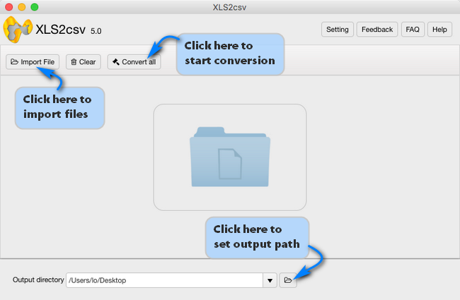

layout: guide
title: How to convert big XLSX files to CSV format?    
keywords: convert big XLSX files to CSV format on a Mac, big XLSX to CSV conversion on Mac, excel converter app for Mac, convert a bundle of big .xlsx files to .csv, get big xlsx files to export as CSV 
description: Learn how to process big XLSX to CSV conversion on Mac via using a helpful excel converter app for Mac.  
---
In search of a solution to convert big XLSX files to CSV format on a Mac? If so, you may wish to read this article. It explains how to process big XLSX to CSV conversion on Mac via using a helpful excel converter app for Mac. 

>**How to convert a bundle of big .xlsx files to .csv?**
>“Hi guys, I'm trying to convert a set of big Excel .xlsx files to .csv format on my iMac. I copied them from one of my clients, and l’d like to convert them to csv format so that I can work with them on my iMac without having Excel installed. What's the easiest way to get my big xlsx files to export as CSV files for using on a Mac machine? Thanks for any advice.” 

With Gmagon XLS2csv installed, you will be able to change large XLSX files to CSV format quickly in a batch, without unexpected errors. Learn how to  convert big XLSX files to CSV format using this Mac app. 
## How to convert big XLSX files to CSV format on Mac?
Here’s what you need   
Gmagon XLS2csv (You can try it for free 30 days.)

To convert large XLSX to CSV on Mac, follow these steps:
Step 1: Install and run XLSX2csv on your Mac, and click “Import File” to load XLSX files that you want to convert. This Mac XLSX to CSV converter supports batch conversion, so you can load multiple XLSX files to do conversion at a time. 

Step 2: Set output path for exported CSV files 

Step 3: Click “Convert all” button to start. Once the conversion is complete, you can get the exported .csv files in output folder. 

Hope this Mac XLSX2CSV converter app helps those who are looking for a solution to <a href="https://gmagon.com/products/store/xls2csv/" target="_blank" rel="nofollow me noopener noreferrer" >convert big XLSX files to CSV format on a Mac</a>. 

Also read 
 <a href="https://gmagon.com/guide/mac-batch-convert-xls-to-csv.html" target="_blank" rel="nofollow me noopener noreferrer" >Mac batch convert XLS to CSV</a>
<a href="https://gmagon.com/guide/convert-xls-to-csv-on-mac.html" target="_blank" rel="nofollow me noopener noreferrer" >How to convert XLS to CSV on a Mac?</a>
<a href="https://gmagon.com/guide/xls2csv/csv-utf8.html" target="_blank" rel="nofollow me noopener noreferrer" >CSV UTF8 - Excel XLS to CSV with UTF-8 encoding</a>
<a href="https://gmagon.com/guide/how-do-i-convert-excel-to-csv-mac.html" target="_blank" rel="nofollow me noopener noreferrer" >How do I convert Excel to CSV on Mac?</a>