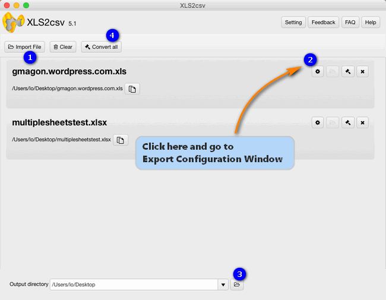

layout: guide
title: Convert Excel files to comma delimited CSV on Mac    
keywords: create comma delimited .csv from excel spreadsheet mac, excel converter app, convert Excel files to comma delimited CSV on Mac, specify CSV delimiters  
description: How do I create a comma delimited .csv file from an excel spreadsheet on my Mac? This article displays how to do this via using a third party excel converter app.  
---
How do I create a comma delimited .csv file from an excel spreadsheet on my Mac? If you are trying to figure out an answer to this question, you may wish to read this article. It displays how to do this via using a third party excel converter app. 

## What is a CSV file? 
A CSV file contains different values separated by a delimiter (often comma), which acts as a database table or an intermediate form of a database table. In other words, a CSV file file is a set of database rows and columns stored in a text file such that the rows are separated by a new line while the columns are separated by a semicolon or a comma. A CSV file is primarily used to transport data between two databases of different formats through a computer program.

CSV is processed by almost all existing applications and features good compatibility across platforms and applications. To be able to work with Excel spreadsheets on a Mac machine flawlessly, users sometimes need to convert Excel files to comma delimited CSV prior. That’s where an Excel to comma delimited CSV converter comes in. Here’s a quick guide explainning how to do this in detail. 
## How to convert Excel files to comma delimited CSV on Mac? 
Software requirement

Note: Gmagon XLS2csv runs on Mac only, Mac OS X 10.7(64-bit) or above is required. 

Follow these steps:
Step 1: Install and run Gmagon XLS2csv on your Mac, and click “Import File” to load Excel (.xls/.xlsx) files that you want to convert. This Mac XLSX to CSV converter supports batch conversion, so you can load multiple XLSX files to do conversion at a time. 

Step 2: Go to Export Configuration Window
By default, this app generates CSV files with comma delimiters. If you’d like to specify other characters as delimiter, you can go to Export Configuration Window to do this. 

Step 3: Set output path for exported CSV files 

Step 4: Click “Convert all” button to start. Once the conversion is complete, you can get the exported .csv files in output folder. 

Hope this article helps those who need to convert Excel files to comma delimited CSV on Mac. 

Also read
<a href="https://gmagon.com/guide/convert-xls-to-csv-on-mac.html" target="_blank" rel="nofollow me noopener noreferrer" >How to convert XLS to CSV on a Mac?</a>
<a href="http://gmagon.com/guide/xls2csv/newly-released-xls2csv-v5.1.html" target="_blank" rel="nofollow me noopener noreferrer" >The newly released Gmagon XLS2csv 5.1</a>
<a href="https://gmagon.com/guide/xls2csv/change-xlsx-to-csv.html
" target="_blank" rel="nofollow me noopener noreferrer" >To CSV - how do I change a .xlsx to a .csv? </a>
<a href="https://gmagon.com/guide/xls2csv/xlsx-2-csv-converter.html
" target="_blank" rel="nofollow me noopener noreferrer" >xlsx2csv Converter-convert multiple xlsx files to csv</a>