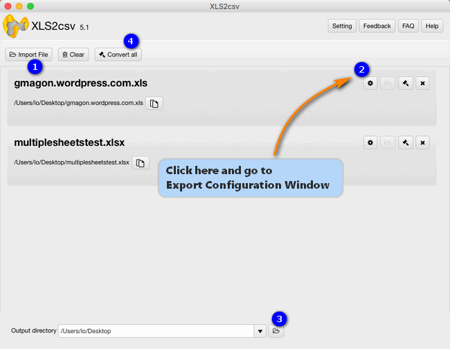
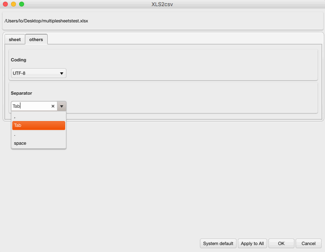

layout: Convert Excel spreadsheets to tab delimited CSV
title: Convert Excel files to comma delimited CSV on Mac    
keywords: convert Excel spreadsheets to tab delimited CSV, save an Excel spreadsheet as a tab delimited CSV, create tab delimited CSV files from Excel spreadsheets  
description: We write this article to help those who are looking for a way to convert Excel spreadsheets to tab delimited CSV files.   
---
We write this article to help those who are looking for a way to convert Excel spreadsheets to tab delimited CSV files. 

>**How can I save an Excel spreadsheet as a tab delimited CSV file?**
>“Hi there, I would like to save an Excel spreadsheet as a tab delimited CSV file on my Mac. Unfortunatly, I could’t figure out a way to do that. Is there a way I can get a tab delimited CSV file? I would really appreciate any help. Thanks in advance.” 

With Gmagon <a href="https://gmagon.com/products/store/xls2csv/" target="_blank" rel="nofollow me noopener noreferrer" >XLS2csv</a> installed, it won’t be a problem to create tab delimited CSV files from Excel spreadsheets. This Mac app allows you to customize delimiters in CSV as comma, semicolon, space, tab, etc. Check a guide on how to do this in detail.   
## How to convert Excel spreadsheets to tab delimited CSV? 
Here’s what you need 
Gmagon XLS2csv

Note: Gmagon XLS2csv runs on Mac only, Mac OS X 10.7(64-bit) or above is required. 

Follow these steps:  
Step 1: Install and run Gmagon XLS2csv on your Mac, and click “Import File” to load Excel (.xls/.xlsx) files that you want to convert. This Mac Excel to CSV converter supports batch conversion, so you can load multiple XLS/XLSX files to do conversion at a time. 

Step 2: Go to Export Configuration Window
By default, this app generates CSV files with comma delimiters. If you’d like to specify Tab as delimiter, simply go to Export Configuration Window to do this. 

Step 3: Set output path for exported CSV files 

Step 4: Click “Convert all” button to start. Once the conversion is complete, you can get the exported .csv files in output folder. 

Hope this article helps those who are in search of a way to convert Excel spreadsheets to tab delimited CSV on a Mac. 

Also read
<a href="https://gmagon.com/guide/convert-xls-to-csv-on-mac.html" target="_blank" rel="nofollow me noopener noreferrer" >How to convert XLS to CSV on a Mac?</a>
<a href="http://gmagon.com/guide/xls2csv/newly-released-xls2csv-v5.1.html" target="_blank" rel="nofollow me noopener noreferrer" >The newly released Gmagon XLS2csv 5.1</a>
<a href="https://gmagon.com/guide/xls2csv/change-xlsx-to-csv.html
" target="_blank" rel="nofollow me noopener noreferrer" >To CSV - how do I change a .xlsx to a .csv? </a>
<a href="http://gmagon.com/guide/xls2csv/convert-excel-files-to-comma-csv.html" target="_blank" rel="nofollow me noopener noreferrer" >Convert Excel files to comma delimited CSV on Mac</a>