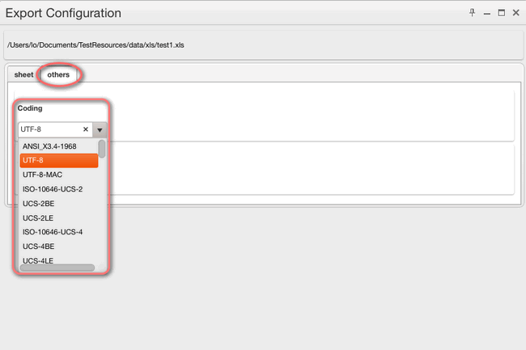

layout: guide
title: CSV-encoding - How to get encoding CSV file.   
keywords: csv encoding excel, csv encoding utf-8, encoding Excel files into a UTF-8 CSV, excel csv encoding, csv encoding converter, csv encoding format
description: Is it possible to convert Excel XLS files to CSV with UTF-8 encoding? To achieve the expected result, users sometimes need to change XLS to UTF-8 encoded CSV format. 
---

If you have an Excel file that has some foreign characters (tildes, etc.) that you need to convert to a CSV file. However, when you do Save As CSV it mangles the "special" foreign characters that aren't ASCII characters. This is a very annoying Excel limitation. Thus you will need encoding.

##　What's the encoding I should use for my CSV file?

UTF-8 encoding, also referred to as "Unicode - UTF8"

* UTF-8 encoded CSV files will work well with Accompa whether they contain just English characters, or also contain non-English characters such as é, ç, ü.

ANSI encoding
* ANSI encoded CSV files will work well with Accompa when they contain just English characters.

## The limitation of encoding in Excel
The biggest problem is not CSV itself, but that the primary tool used to interact with it is Excel. Excel handles CSV encodings badly.

Creating a new document in Excel and saving as ”Comma Separated Values (.csv)” it uses your locale’s Windows or Mac codepage. Win-1252 and MacRoman respectively in America. If your codepage doesn’t support a character in your document, it will be silently replaced with an underscore character. 

Because it uses codepages and not a Unicode encoding, it makes processing a painful chore. There is no way to tell the difference between different 8-bit codepages programatically.

Besides, the Mac version can only read your locales Windows codepage If you had any extended characters when you saved, even if they’re in your Mac codepage they are scrambled when you reopen it. This problem has persisted in every version of Mac Excel up to the current Excel 2016.

## How to solve all those problems?
Fortunately, I have found the <a href="https://gmagon.com/products/store/xls2csv/" target="_blank" rel="nofollow me noopener noreferrer" >XLS2csv</a>, which aims to convert XLS/XLSX files to CSV format, you can choose the encoding type as you want, for example, utf-8, utf-16, ANSI, etc. 

 
## How to create encoding CSV from XLS/XLSX by XLS2csv?
**Step 1**: Import your Excel file or a batch of files into this converter by clicking.

 
**Step 2**: Set your output directory to put your output in the right file.

 
**Step 3**: If you want to preview the convert effects, you can see it clearly 

 
**Step 4**: In the Preview interface, there are "Sheet" and "Others" options for you, here is the sheet select setting:

 
**Step 5**: Clicking "others", you can easily find the coding set, then you can feel free to choose UTF-8 or UTF-16, or any other codings here. 

 
**Step 6**: The final step is to click the convert button, you can choose to convert one file at once or convert all files at one go.

 
Hopefully the above has given you an insight into the wonderful world of XLS2csv. Now download it and give it a try.

 
Also read
<a href="https://gmagon.com/guide/mac-batch-convert-xls-to-csv.html" target="_blank" rel="nofollow me noopener noreferrer" >Mac batch convert XLS to CSV</a>
<a href="https://gmagon.com/guide/how-to-convert-a-xlsx-file-to-csv-on-mac.html" target="_blank" rel="nofollow me noopener noreferrer" >How to convert a .xlsx file to .csv on Mac?</a>
<a href="https://gmagon.com/guide/create-border-radius-css-mac.html" target="_blank" rel="nofollow me noopener noreferrer" >How to create border radius CSS code on Mac?</a>
<a href="https://gmagon.com/guide/convert-xls-on-mac-without-excel.html" target="_blank" rel="nofollow me noopener noreferrer" >Convert XLS to CSV on Mac without Excel installed</a>
<a href="https://gmagon.com/guide/can-i-batch-convert-xls-to-csv-mac.html" target="_blank" rel="nofollow me noopener noreferrer" >Can I batch convert XLS/XLSX to CSV in Mac?</a>
